---
title: "INTRODUCCIÓ A LLIUREX"
author: [Creat per José A. Múrcia, Àngels Piera i Albert Fletes \newline Adaptat per Alfredo Vicente]
date: "2021-02-24"
subject: "Proxmox"
keywords: [Xarxa, Instal·lació]
subtitle: "Introducció a conceptes bàsics de LliureX"
lang: "es"
page-background: "background10.pdf"
titlepage: true,
titlepage-rule-color: "360049"
titlepage-background: "background10.pdf"
colorlinks: true
header-includes:
- |
  ```{=latex}
  \usepackage{awesomebox}
  \usepackage{caption}
  \usepackage{array}
  \usepackage{tabularx}
  \usepackage{ragged2e}
  \usepackage{multirow}


  ```
pandoc-latex-environment:
  noteblock: [note]
  tipblock: [tip]
  warningblock: [warning]
  cautionblock: [caution]
  importantblock: [important]
...


# Què és LliureX

*LliureX* és la distribució GNU/Linux desenvolupada per la Generalitat Valenciana per tal de facilitar l'accés a les TIC a la comunitat educativa.

El projecte LliureX va nàixer el 2004, i actualment es troba present a tots els centres públics del País valencià, en més de 120.000 equips i servidors. L'any 2019 va rebre el premi *Open Awards* a la innovació tecnològica en el camp de l'educació[^1], i s'ha convertit en un referent respecte a distribucions educatives basades en *programari lliure* a escala mundial.

[^1]: https://portal.edu.gva.es/lliurex/?p=1433

## Programari lliure?

Quan parlem de *programari lliure*, fem referència a tot aquell *programari* del qual podem estudiar-ne el *codi font*, modificar-lo, utilitzar-lo amb qualsevol finalitat i redistribuïr-lo.

Per entendre millor aquests conceptes, podem fer un símil amb el món de la cuina. El programari o *software* en anglès, podria ser un plat, i el *codi font* seria la recepta per elaborar aquest. Amb aquestes premisses, podem tindre dues visions de què seria la cuina:

* Aquella que guarda en secret la recepta, per tal que ningú la puga *copiar* i mantenir-ne l'exclusivitat del plat, o bé
* Aquella que publica els ingredients i el procediment pe fer-la, de manera que nosaltres la podem cuinar a casa, la podem adaptar o modificar al nostre gust, i la podem redistribuir per tal de fer-la arribar a altres per tal que la tasten o milloren. A més, com que tenim la llista d'ingredients, podem saber si hi ha algun al·lergen present.

Tornant al món del programari, la primera visió seria aquella que es correspon al programari propietari, del que no en coneixem el codi font, i del que no podem saber com treballa ni què fa amb les nostres dades personals. El segon punt de vista seria el que es correspondria al programari lliure, on tot el codi és públic i obert, de manera que sabem com treballa, què fa amb les nostres dades, i podem aplicar-li qualsevol millora o adaptació.

> **Les quatre llibertats del programari lliure** 
>
> Tot programari és lliure si ens aporta les següents *llibertats*:
> 
> * Llibertat d'utilitzar el programari amb qualsevol finalitat,
> * Llibertat d'estudiar el codi font i modificar-lo per adaptar-lo a les pròpies necessitats,
> * Llibertat per distribuir-lo com i a qui vullguem,
> * Llibertat per fer millores i fer-les públiques, de manera que es beneficie tota la comunitat.

## Què aporta LliureX

LliureX és una variant del sistema operatiu GNU/Linux Ubuntu, modificada, millorada i adaptada a l'ecosistema educatiu valencià. LliureX és codi lliure, i a més del sistema operatiu de base, incorpora una gran varietat d'aplicacions educatives, adaptacions i desenvolupaments propis, per tal de facilitar la tasca docent, de manteniment i d'administració d'equips als docents.

D'entre les principals característiques que aporta LliureX, podem destacar:

* És fàcil d'utilitzar i configurar, 
* Suporta diversos idiomes, amb el valencià com a llengua destacada. En aquest punt, cal dir que a més de la traducció al valencià del mateix sistema s'ha col·laborat amb la traducció de parts d'Ubuntu, s'ha treballat conjuntament amb Softvalencià per a la traducció de diverses aplicacions, entre elles LibreOffice, i s'ha col·laborat també amb institucions com ARASAAC, en la traducció del banc de pictogrames i la futura web.
* Inclou una bona col·lecció d'aplicacions educatives organitzades per nivells i per a tots els àmbits.
* Inclou recursos educatius: activitats jclic, html, etc.
* Incorpora eines de creació d'Objectes Digitals Educatius (ODE): per a crear activitats amb diferents formats.
* Estalvia els costos de les llicències de programari i moltes hores de manteniment, al ser un sistema menys vulnerable a malware i pirates informàtics,
* Optimitza de la dotació informàtica de centre, i ens pot aprofitar per reutilitzar equips vells, ja que està dissenyat per consumir menys recursos que altres sistemes operatius propietaris
* A més del sistema operatiu per equips individuals, aporta tot un model d'aula i de centre, de manera que centralitza en servidors totes les dades del centre, i facilita la gestió remota dels equips.

## Versions i sabors de LliureX

LliureX llença actualitzacions completes del sistema aproximadament cada dos anys, basant-se en l'última versió LTS (*Long Term Support* d'Ubuntu). L'última versió completa, basada en Ubuntu 18.04 és LliureX 19. A més, els anys que no s'actualitza completament el sistema de base, es realitza una actualització completa del programari, i s'afegeixen millores, però sense canviar aquest sistema de base. L'última versió, LliureX 20, utilitza doncs la mateixa base que LliureX 19, però amb moltes millores afegides.

Per altra banda, cada versió té diferents *Sabors*. Podem dir que els *sabors* són adaptacions de LliureX als diferents contextos educatius en què es vagen a implantar. Així, els diferents sabors que presenta LliureX són:

* **LliureX Escriptori**: Pensada per a ordinadors autònoms (no connectats a cap servidor), i amb un subconjunt d'aplicacions orientades principalment a secundària i batxillerat.
* **LliureX Infantil**: Pensada també per a ordinadors autònoms, però amb una selecció de programari per defecte més orientada a alumnes d'infantil i els primers cursos de primària.
* **LliureX Música**: Versió d'escriptori pensada per als ordinadors de l'aula de música, amb programari específic per al tractament, l'edició i la composició d'àudio.
* **LliureX Pime**: Versió d'escriptori reduïda, sense aplicacions educatives, i pensada per a xicotetes i mitjanes empreses que desitgen introduir-se al món del programari lliure.
* **LliureX Servidor**: Pensada per als servidors del centre, que centralitzen la gestió, donen suport a clients lleugers (com els ordinadors de la biblioteca), i emmagatzemen la informació dels usuaris del centre.
* **Client**: Versió d'escriptori que depèn d'un servidor, de manera que es connecta a aquest per tal de validar els usuaris i guardar en ell les dades. La versió Servidor i Client estan pensades per implantar-se al model de centre, on es dependrà d'un o diversos servidors centrals, i la resta d'ordinadors del centre seran clients. D'aquesta manera, ens connectem des d'on ens connectem, tenim disponibles les nostres dades.
* **FP**: Des de la versió de LliureX 19.07 (Juliol 2020) també es disposa d'un sabor pensat per a cicles formatius, sense les aplicacions educatives orientades a primària i secundària, i amb una selecció de programari de gestió empresarial.

En aquest curs, utilitzarem la versió d'Escriptori, i si hem d'utilitzar programari preinstal·lat en altre sabor, veurem com fer-ho a la nostra instal·lació.

## 1.4. LliureX i la inclusió

Des dels seus inicis fins al dia d'avui, LliureX ha acompanyat els centres en la seua transformació digital, i tenint en especial consideració aquella part de l'alumnat que presenta necessitats educatives especials o dificultats d'aprenentatge. 

Amb la finalitat d'acostar les Tecnologies de la Informació i la Comunicació a l'alumnat amb necessitats educatives especials, i convertir-les en un element integrador i innovador, la Conselleria d'Educació, a través de la D.G. d'Innovació Tecnològica Educativa, va posar en marxa el pla INTEGRA-TIC entre els anys 2008-2010. Aquest pla contemplava dotar les aules dels centres d'Educació Especial de pissarra digital, canó projector i ordinador amb LliureX. Les dimensions de la pissarra, faciliten el treball als alumnes amb problemes motors o dificultats grafomotrius, o bé alumnes que per les seues característiques cognitives, no saben utilitzar el ratolí. A més, la PDI també presentava moltes possibilitats de treball: des de les rutines diàries, fins activitats d'aprenentatge més actives i participatives.

LliureX va estar present durant tot aquest procés amb l'adaptació i millora d'eines per al treball amb pissarres digitals com el Notebook o el desenvolupament d'aplicacions pròpies d'accessibilitat com l'eina MiniScreen per al control de la PDI per part d'alumnes amb problemes de mobilitat.

Tot i aportar una gran millora, el sistema no era perfecte. Amb el temps, s'ha hagut de millorar i adaptar a les noves circumstàncies amb l'aplicació del model de centre i han aparegut nous reptes, com la integració de les tauletes digitals a l'aula.

Ara com ara, les possibilitats que ofereix LliureX pel que fa al món de la inclusió es poden resumir en:

* Aplicacions del sistema i de tercers adaptades i incloses a LliureX:
    * Entorn d'escriptori Accessible,
    * Eina *Eviacam* per controlar el ratolí amb el moviment del cap,
    * *AraSuite*, que inclou l'AraWord i el Tico, amb els pictogrames d'ARASAAC

* Eines desenvolupades específicament per a LliureX:
    * *LliureX Miniscreen*, per al control de la PDI per a alumnes amb mobilitat reduïda,
    * *Casimir Editor*, editor de text per a alumnes amb dificultats d'aprenentatge com la dislèxia,
    * *ClassJam*, o l'*Assemblea d'aula*, per treballar l'Assemblea de l'aula amb la PDI
    * *CloudBook*, per realitzar tota mena de recurs educatiu, 

* A més, s'ha col·laborat amb altres projectes, entre ells:
    * *Portal Aragonès de Comunicació Alternativa i Augmentativa* (*ARASAAC*), amb l'adaptació al valencià del seu banc de pictogrames i el lloc web,
    * *joComunico*, de Joan Pahisa, un comunicador pictogràfic que processa el llenguatge de forma natural,

Actualment, el principal repte és millorar l'ús conjunt de les tauletes digitals amb LliureX.

## Recursos en línia

Per tal de conéixer una miqueta millor el projecte, tenim al nostre abast diferents recursos en línia que podem consultar, a través de la pàgina web del projecte [https://portal.edu.gva.es/lliurex/](https://portal.edu.gva.es/lliurex/), des d'on podreu conéixer les últimes notícies, la història i les motivacions del projecte, i accedir a:

* La pàgina de **Descàrregues**, des d'on podreu descarregar-vos diferents versions i sabors de LliureX,
* **Recursos**, com explicacions del model de centre o accés al material de diferents cursos de formació, 
* El **Fòrum** de LliureX, que suposa una gran base de coneixement de dubtes que han plantejat altres companys i que us permet preguntar qualevol dubte que tingueu a l'equip,
* La **Wiki de LliureX**, que podeu accedir també a través de l'adreça web [https://wiki.edu.gva.es/lliurex/tiki-index.php](https://wiki.edu.gva.es/lliurex/tiki-index.php), i on podeu trobar moltíssima informació sobre les aplicacions incloses a LliureX, el model de centre, etc.

# Obtenció i instal·lació de LliureX

La millor forma de treballar amb LliureX és tindre'l instal·lat a l'ordinador, ja que aprofitem tots els recursos d'aquest. Des de la versió 19.07 de LliureX (juliol 2020), també tenim disponible LliuWin, un instal·lador de LliureX com si  es tractara d'una aplicació per a Windows. Una altra opció, tot i que amb les limitacions esperables de compartir els recursos de l'ordinador és fer ús de màquines virtuals.

Per tal de realitzar aquest curs, necessitareu una instal·lació de LliureX als vostres ordinadors. Anem a veure les diferents opcions que teniu al vostre abast perquè escolliu la que més us convinga.

## Instal·lació de LliureX a l'ordinador

Com hem comentat, la millor manera de treballar amb LliureX és tindre'l instal·lat al nostre ordinador. El procés general per a això serà el següent:

1. Obtenció d'una *imatge ISO* de LliureX des de la web
2. Creació d'un USB d'arrencada amb LliureX
3. Arrencada des d'USB i instal·lació del sistema

Cal tindre en compte que si volem instal·lar LliureX a un ordinador que ja té un sistema operatiu prèviament instal·lat, com puga ser Windows, ens haurem d'assegurar de tindre espai suficient en disc per instal·lar LliureX. Tot i que una instal·lació neta ocupa uns 13 GB, sería convenient disposar d'un mínim de 20-30 GB lliures al disc.

### Obtenció de la ISO de LliureX

Per tal de descarregar LliureX, accedirem a la secció de descàrregues de la pàgina web de LliureX:

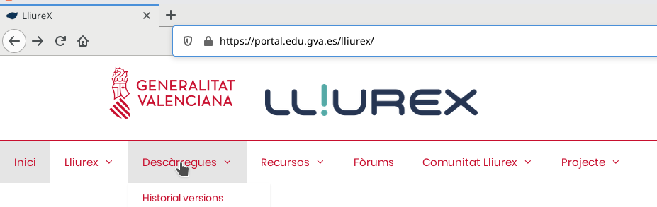{ width=450px }

En aquesta pàgina, veurem que podem descarregar qualsevol *Sabor* de les diferents versions de LliureX.

Per descarregar la versió d'escriptori, obrirem el desplegale corresponen al sabor (la barra amb el text *Escriptori* i el signe *+*), i després en el botó de decàrrega del sistema en 64 bits:

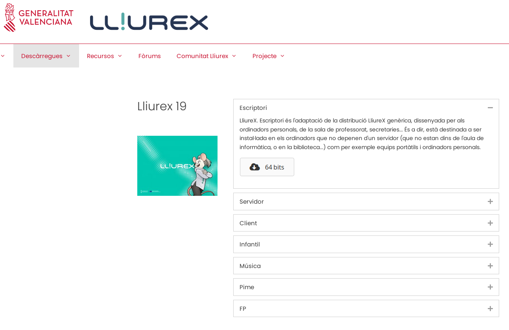{ width=450px }

Una vegada fem clic, s'iniciarà la descàrrega al nostre ordinador. Això pot tardar un temps, ja que es tracta d'un fitxer d'un pes considerable.

El fitxer descarregat, serà un fitxer amb extensió *.iso*, que haurem de bolcar sobre una memòria USB amb espai suficient, per arrancar el nostre ordinador amb ell.

### Creació d'un USB d'arrencada

Una vegada disposem de la imatge *.iso* descarregada, haurem de bolcar-la a un dispositiu de memòria USB. Com que aquest fitxer ocupa 3.3 Gb, amb una memòria USB de 4 GB deuria ser suficient, però podem utilitzar-ne una de major capacitat. **Cal tindre en compte que aquesta memòria USB s'utilitzarà de forma exclussiva per al bolcat de la imatge, pel que qualsevol fitxer que continga serà esborrat.**

Als següents punts, anem a veure com generar aquest USB d'arrencada tant des de LliureX com des de Windows.

**Creació de l'USB d'arrencada amb LliureX/Ubuntu**

Si volem crear l'USB d'arrencada des d'un ordinador amb LliureX o Ubuntu, ho farem a través de l'eina *Startup Disk Creator*. A la [wiki de LliureX](https://wiki.edu.gva.es/lliurex/tiki-index.php?page=Creaci%C3%B3+d%27un+USB+d%27arrancada) tenim descrit aquest procés. 

El que haurem de fer és buscar aquesta aplicació des del menú d'inici (*Sistema* > *Startup Disk Creator*) i executar-la:

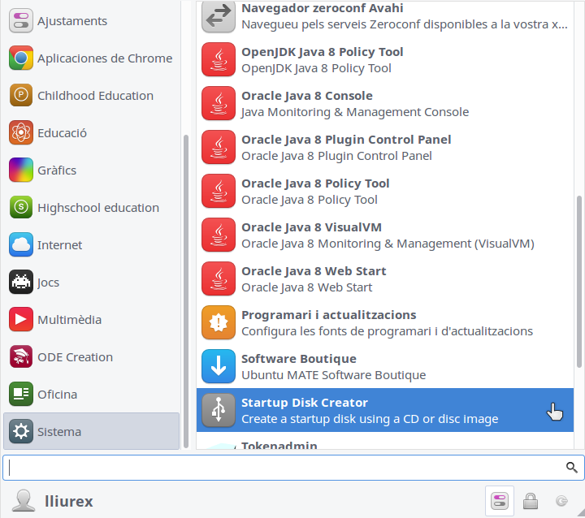{ width=400px }

La pantalla principal d'aquesta aplicació ens mostra dos seccions: la part superior, amb la llista d'imatges *iso* que coneix l'aplicació (*Imatge de Disc Font*), i la part inferior (*Disc a utilitzar*), amb la llista de memòries USB connectades en eixe moment. Per tal de crear l'USB d'arrencada, haurem de tindre'l connectat abans d'iniciar l'aplicació per a què aquesta el detecte.

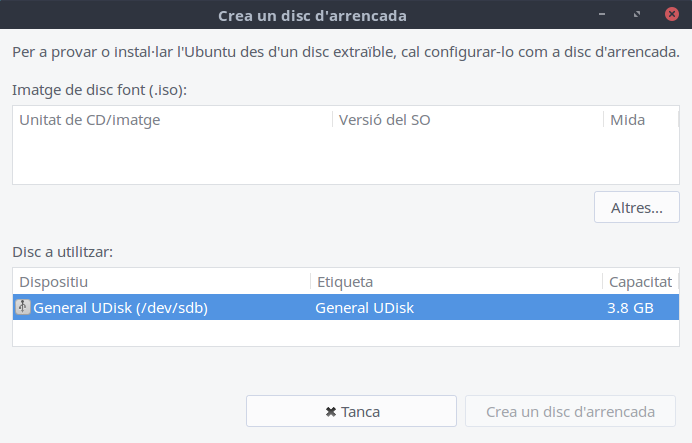{ width=450px }

Inicialment, si no ens apareix el fitxer *.iso* que hem descarregat en la llista superior, farem clic en *Altres*, i buscarem dins el nostre ordinador la imatge que hem descarregat (generalment a la carpeta de *Descàrregues*).

Fet açò, ens haurem d'assegurar que tenim a la part superior seleccionada la imatge de LliureX que hem descarregat, i a la part inferior seleccionat el dispositiu sobre el què volem crear la imarge. Si tot és correcte, haurem de fer clic al botó *Crea un disc d'arrencada* per iniciar el procés.

En aquest moment, després d'un possible misstge advertint de la pèrdua de dades de la memòria USB, se'ns mostrarà una barra amb el progrés de la creació. Quan estiga finalitzant, és possible que hajam d'introduïr la contrassenya de l'usuari administrador, per tal de fer l'USB arrancable.

Finalment, ens mostrarà la següent finestra indicant que ha finalitzat el procés.

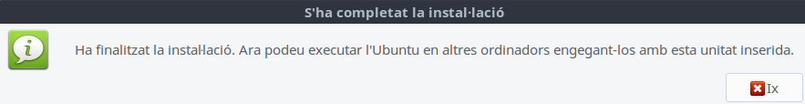{ width=350px }

Amb això ja tindrem l'USB preparat per arrancar l'ordinador amb un sistema *live* de LliureX. 

A l'article de la wiki se'ns comenta també, com a alternativa, com realitzar aquest procés des de la línia d'ordres. Aquest procés es basa en ordre des de la terminal, i requereix d'alguns coneixements més avançats, però en ocasions, pot ser-nos útil en casos en què la creació de l'usb de forma gràfica dóne problemes (bé pel format d'algunes imatges *iso*, o bé per qüestions d'espai a la memòria).

**Creació de l'USB d'arrencada des de Windows o Mac**

Per tal de crear el disc d'arrencada USB des d'altres sistemes, com Windows, MacOS, o fins i tot GNU/Linux (si no volem utilitzar l'Startup Disc Creator), farem ús de l'eina *Etcher*.

Per a això, el primer que haurem de fer és accedir a la seua web https://www.balena.io/etcher/, i descarregar-lo per al nostre sistema.

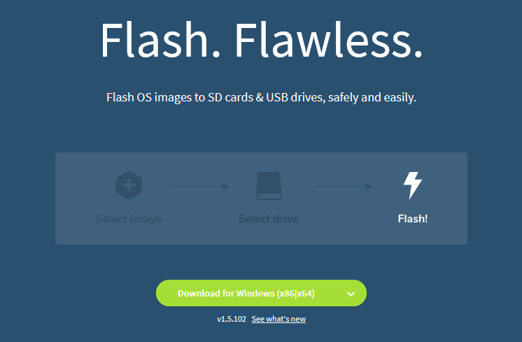{ width=300px }

Una vegada descarregat, excutem l'instal·lador, acceptem la llicència i en breu tindrem l'accés directe a Etche al nostre escriptori.

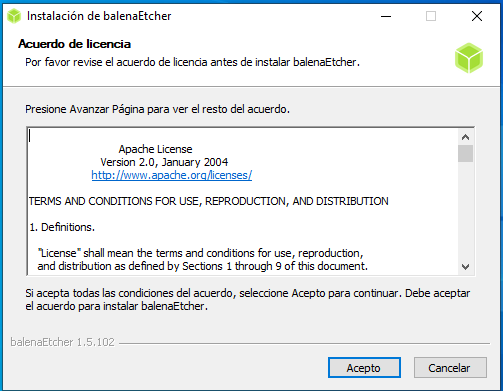{ width=300px }

L'ús d'aquesta eina és bastant senzill, i consta de tres senzills passos:

1. Fem clic a la prmiera icona *Flash from image* i seleccionem el fitxer *.iso* que hem descarregat.

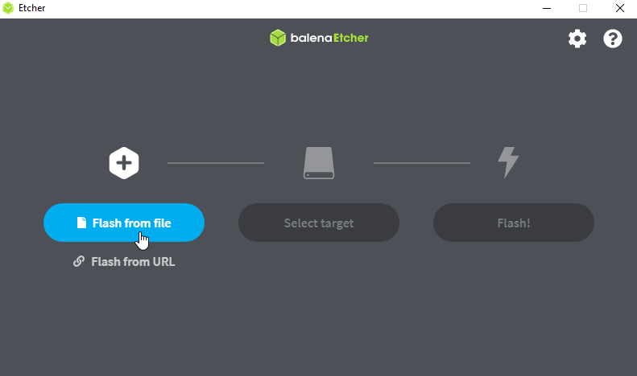{ width=300px }

2. Fem clic sobre *Select Drive*, per tal d'escollir el dispositiu USB sobre el que volem bolcar la imatge.

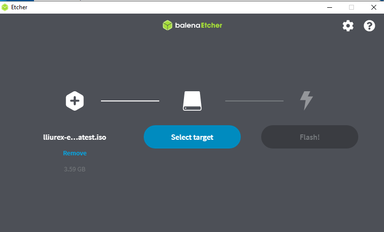{ width=300px }

3. Finalment fem clic al botó *Flash* per fer bolcar la imatge que hem seleccionat sobre el dispositiu escollit.

Amb això, ja tindrem un dispositiu USB preparat per arrancar en mode Live i provar o instal·lar LliureX amb ell.

### Arranc des de l'USB i instal·lació de LliureX

El següent pas és arrancar el nostre ordinador des del dispositiu USB què hem creat. Per a això haurem d'engegar el nostre ordinador amb la memporia USB connectada, i accedir al menú d'arrencada del sistema.

Cada fabricant utilitza una tecla diferent per tal d'accedir al menú d'arrencada. A la següent taula es mostren les tecles més habituals per tal d'accedir al menú d'arrencada per a diferents fabricants:

| Marca de l'ordinador | Tecla Boot Menu |
|-------------------------|-----------------------------------|
| Acer | F12 |
| Asus | Esc o F8, segons models |
| Dell | F12 |
| Fujitsu | F12 |
| Gateway | F12 |
| HP | Esc |
| Huawei | F12 |
| Intel NUC | F10 |
| Lenonvo | F12 |
| Samsung | Esc |
| Sony | F11, Esc, F10 segons models |
| Toshiba | F12 | 
 
Quan reiniciem l'ordinador i premem la tecla corresponent al nostre equip, se'ns mostrarà un menú similar al següent, al què haurem d'indicar que volem arrancar des de l'USB que hem creat:

{ width=300px }

Una vegada seleccionada l'opció, arrancarem des de l'USB, que ens carregarà una versió *Live* de LliureX per tal de poder provar-lo i instal·lar-lo.

Veiem a continuació les diferents pantalles que se'ns presenten i les diferents opcions d'instal·lació que tenim:

1. **Pantalla d'arrancada de LliureX Live:** En aquesta primera pantalla quan arranquem des de l'USB haurem de prémer una tecla per tal d'iniciar la sessió Live de LliureX. Si no polsem cap tecla, el sistema s'iniciarà des del disc dur de l'ordinador.

{ width=350px }


2. **Menú d'inici del sistema Live**, amb diferents opcions, com fer un testeig de memòria o comproar si el CD/USB d'instal·lació té defectes. Triarem l'opció **Proveu LliureX sense instal·lar-lo**, per iniciar el mode live i des d'ell començar la instal·lació.

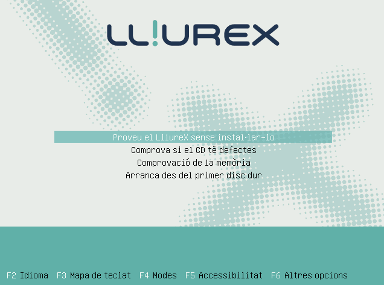{ width=350px }

En cas que tinguem el mode UEFI activat al nostre ordinador, és possible que aquestes opcions d'arrencada canvien, donant opció a iniciar LliureX Live en mode UEFI o bé a instal·lar directament el sistema. En aquest cas, podem bé llançar directament l'instal·lador o bé arrancar la sessió Live, i des d'aquesta instal·lar LliureX directament. Disposeu d'un [extens article](https://wiki.edu.gva.es/lliurex/tiki-index.php?page=UEFI) a la wiki de LliureX sobre què és UEFI i com activar-lo i desactivar-lo a l'ordinador.

3. **LliureX Live**: S'iniciarà LliureX en mode Live des de l'USB, i a partir d'aci podrem iniciar la instal·lació. Per a això **farem doble clic a la icona *Instal·la la versió LliureX*** que apareix a l'escrptori. 

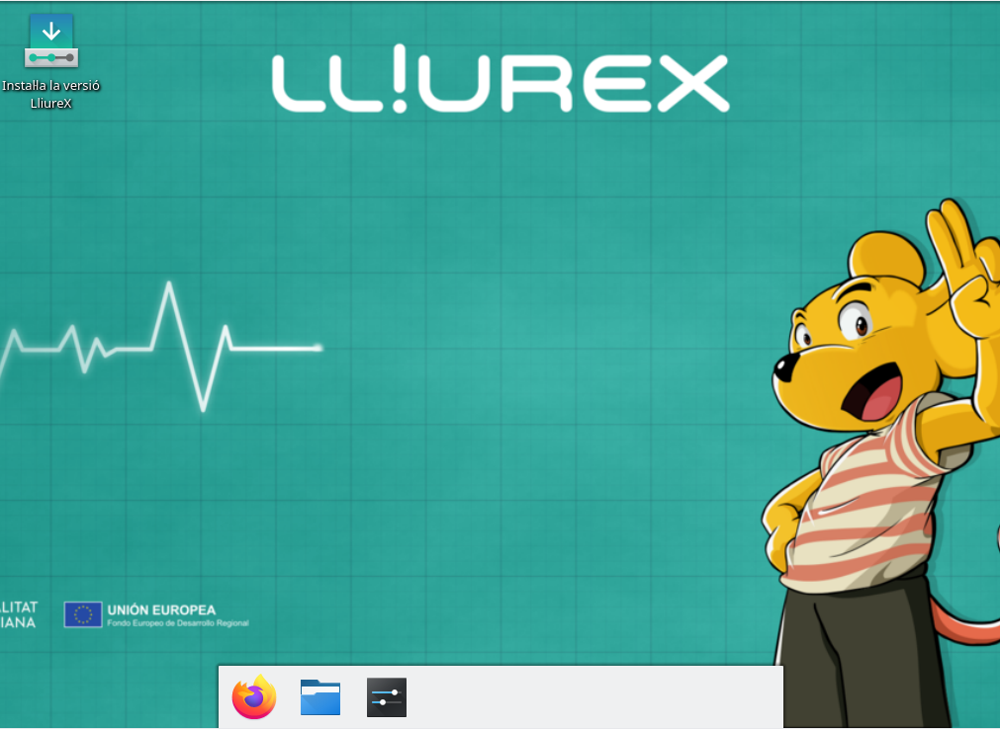{ width=350px }

4. **Instal·lador de LliureX**: Ara s'iniciarà l'instal·lador de LliureX. La primera finestra d'aquest assistent d'instal·lació ens demanarà quin idioma desitgem per a la instal·lació i el sistema.

{ width=350px }

5. **Selecció de la distribució del teclat**, en aquest cas, triarem la Disposició en *Espanyol* i la variant del català per tindre habilitat el punt volat (el de la ela geminada *l·l*).

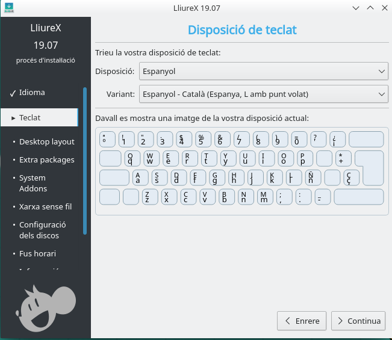{ width=350px }

6. **Selecció de la distribució de l'escriptori**, on podrem triar quina aparença volem donar-li al nostre escriptori LliureX. Tenim dues opcions. La primer és la *distribució per defecte* (*Default Layout*), amb una barra superior i el *dock* a la part inferior, tal i com s'ha estat treballant a les últimes versions de LliureX. La segona opció és una distribució més clàssica (*Classic Layout*) amb una única barra a la part inferior. **En principi escollirem la distribució per defecte**.

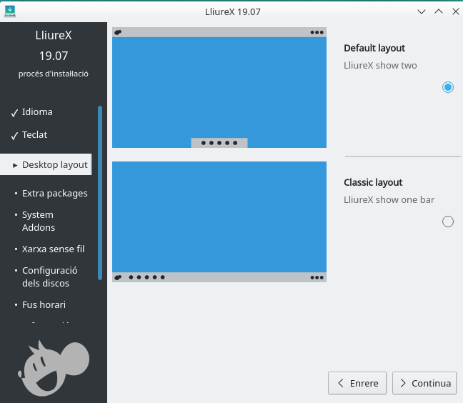{ width=350px }

7. **Tria de programari addicional**, en principi no haurem d'instal·lar aquest programari per defecte, pel que **no marcarem res i polsarem en Continua**.

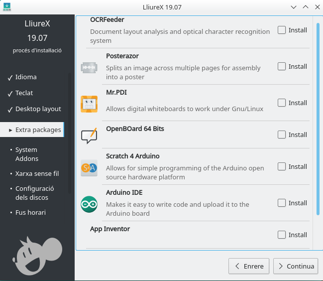{ width=350px }

8. **Complements del sistema**, des d'on podrem habilitar el suport de flash, així com l'enviament d'estadístiques d'ús de LliureX de forma anònima i el servei d'inventari, per recollir informació del maquinari. Al nostre cas, deixarem marcat el suport de flash i l'ús d'estadítiques.

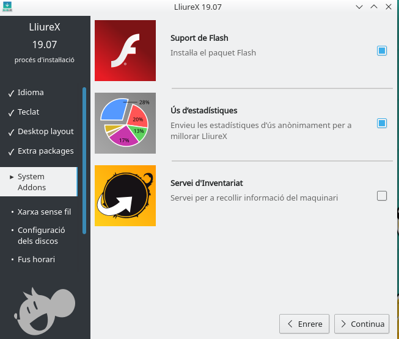{ width=350px }

9. **Tipus d'instal·lació**. Aquest és un dels punts més delicats de la instal·lació, i és on decidirem la part de disc dur que anem a dedicar a LliureX. El propi particionador ja ens suggerirà la distribució que considere més adequada segons l'espai que trobe disponible al disc dur baix l'opció de *particionament guiat*.

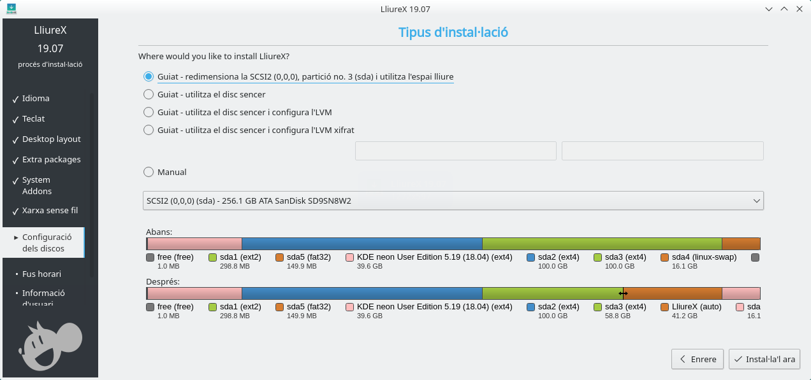{ width=500px }

Quan parlem de *particions* fem referència a les parts en què dividim, de forma lògica un disc dur, de manera que és com si tinguérem tants discs durs com particions. Cada sistema operatiu necessita ubicar el seu sistema de fitxers en una d'aquestes particions. En aquesta finestra de *Tipus d'instal·lació* tenim diverses opcions per tal de fer aquestes particions:

* *Guiat - redimensiona disc i utilitza l'espai lliure*, que serà l'opció recomanada, sempre que el particionador trobe espai suficient al disc com per fer la instal·lació. A la instal·lació d'exemple que estem fent s'ha utilitzat aquest sistema, sobre un disc que ja tenia diverses particions. El sistema ha detectat la partició on més espai disponible hi havia i ens ha suggerit reduir aquesta i crear-ne una nova per instal·lar LliureX. Com veiem a la imatge, se'ns mostra l'estat actual del disc, i com quedaria després de fer la nova partició. En aquesta barra de baix, fixeu-vos que apareix una fletxa doble entre la partició que anem a redimensionar i la nova per si volem ajustar els espais. Si desitgeu ajustar l'espai, recordeu-vos de deixar uns 20GB per a la partició amb LliureX.

* *Guiat - utilitza el disc sencer*. En aquest cas, s'esborraria tot el contingut que tinguérem al disc, i l'utilitzaria completament per a LliureX.

* *Guiat - utilitza el disc sencer i configura LVM*, és semblant a l'anterior però utilitzant volums lògics ( *LVM, Logical Volume Manager*), que gestiona diverses particions com si es tractara d'una.

* *Guiat - utilitza el disc sencer i configura LVM xifrat*, que seria com l'anterior, però xifrant el disc.

* *Manual*, és l'opció més versàtil i potent, ja que ens permet gestionar les particions al nostre gust, i per tant, la més perillosa si no sabem ben bé què estem fent.

El més recomanable, serà doncs, seguir el mode guiat que ens suggereix el reparticionament del disc.

Una vegada triem el tipus d'instal·lació ens mostrarà el següent missatge advertint que es van a fer canvis al disc, i demanant confirmació:

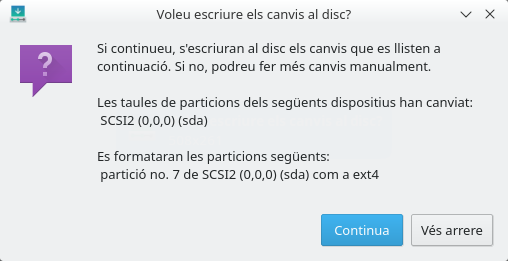{ width=300px }

Una vegada li donem a *Continuar* el sistema començarà a instal·lar-se, mentre segueix l'assistent per tal de configurar el sistema.

10. **Selecció de la ubicació**. La següent finestra ens pregunta la regió on estem, per tal d'establir el fus horari correctament. A la part inferior de la finestra, podrem veure el progrés de la instal·lació.

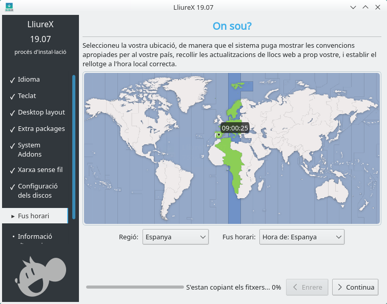{ width=350px }

11. **Configuració de l'usuari primari**. En la següent finestra configurarem el nom de l'usuari primari (que tindrà permís d'administrador), la seua contrasenya i així com el nom del sistema. A més, determinarem si cal una contrassenya per entrar a l'ordinador. Indicarem el nostre nom, el nom d'usuari que utilitzarem, la nostra contrasenya (dues vegades) i que sí que volem una contrasenya per entrar.

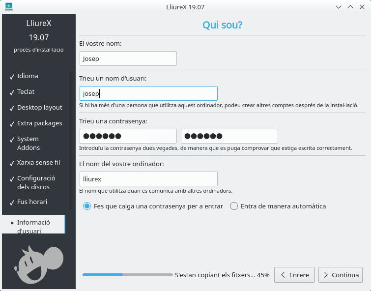{ width=350px }

12 . **Últims passos de la instal·lació**. Una vegada configurat el sistema, aquest segueix amb la seua instal·lació. Mentre ho fa, ens mostra les principals novetats de la versió. Ara haurem d'esperar una estona per tal que el sistema estiga instal·lat per complet.

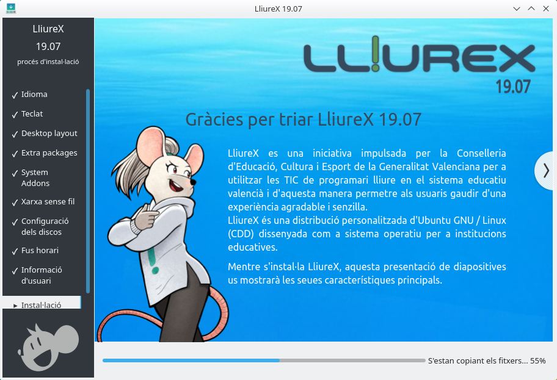{ width=350px }

13. Quan finalitza la instal·lació per complet, ens mostra la següent finestra informant-nos, i demanant-nos si volem reiniciar l'equip o seguir amb la prova. Triem l'opció de reiniciar, i llevem l'USB quan ens diga el sistema. Quan l'ordinador s'inicie de nou, ens mostrarà el menú d'inici, al qual podrem triar quin sistema operatiu iniciar.

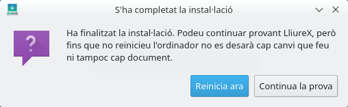{ width=300px }

* Pàgina de la wiki de LliureX sobre la instal·lació:
https://wiki.edu.gva.es/lliurex/tiki-index.php?page=Instal%C2%B7laci%C3%B3+de+LliureX+16&highlight=instal%C2%B7laci%C3%B3+lliurex


## Instal·lació de LliureX sobre Windows: LliuWin

Si no desitgem dedicar una partició del disc a LliureX, des de LliureX 19.07 podem fer ús de LliuWin. 

LliuWin és un instal·lador de LliureX per a Windows, de manera que es puga provar sense córrer el risc de perdre informació durant el formatat o particionament. La idea és instal·lar LliureX i poder desinstal·lar-lo com si es tractés d'una aplicació més de Windows. Per a això fa ús d'una imatge de LliureX ubicada com a un fitxer sobre el mateix sistema de fitxers de Windows. No es tracta per tant d'una virtualització de LliureX, sinò d'una instal·lació en sí, amb la diferència que en lloc de dedicar una partició del disc, aquesta s'instal·la sobre un fitxer de Windows, i és aquest qui s'encarrega d'engegar-la o d'engegar Windows. La principal diferència pel que fa al rendiment enfront d'un sistema instal·lat és que aquest últim descansa sobre el sistema de fitxers de Windows, el que fa que no siga òptim.

El procés d'instal·lació de LliuWin consta de dos passos genèrics:

1. Descàrrega i instal·lació de *LliuWin Installer*
2. Execució de *LliuWin Installer* per descarregar la imatge de LliureX

### Descàrrega i instal·lació de LliuWin

Per tal d'obtenir l'instal·lador de *LliuWin*, haurem d'accedir a la [seua pàgina a Github](https://github.com/lliurex/lliuwin/releases), i descarregar el fitxer instal·lador `lliuwin_installer_x64.msi`:

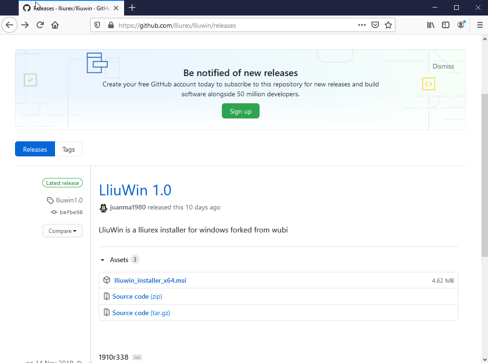{ width=450px }

Una vegada descarregat, executem l'instal·lador. Si ens apareix un misstge de protecció de Windows semblant al següent, triarem *Ejecutar de todas formas*, que ens apareix quan fem clic en *Más información*.

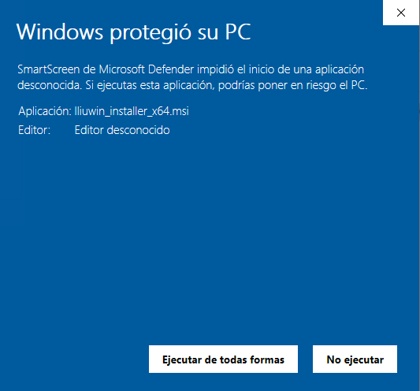{ width=300px }

Ara deixem que el programa realitze canvis a l'equip:

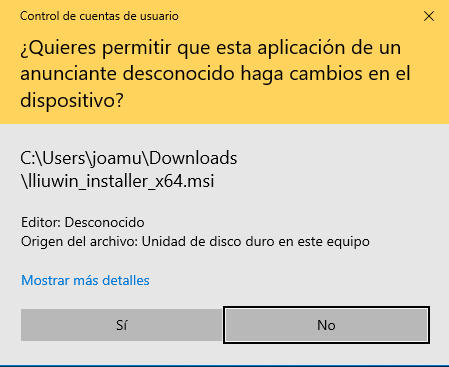{ width=300px }

I ens apareixerà la següent icona a l'escriptori (i també al menú d'aplicacions):

{ width=100px }

Amb açò tindrem instal·lat *LliuWin Installer*, que ens permetrà instal·lar LliureX sobre Windows.

### Descàrrega i instal·lació de LliureX amb LliuWin Installer

Per tal d'iniciar l'instal·lador, fem doble clic a l'accés directe de LliuWin, i seleccionem, quan ens pregunte, que volem permetre que l'aplicació realize canvis al dispositiu:

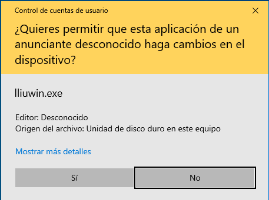{ width=300px }

La finestra principal de l'instal·lador ens mostrarà algunes opcions sobre la instal·lació de LliureX, com són la unitat de disc sobre la que volem descarregar la imatge (al nostre cas `C:`), l'idioma en què volem LliureX, que ocupa la instal·lació, i quin entorn d'escriptori volem (LliureX)

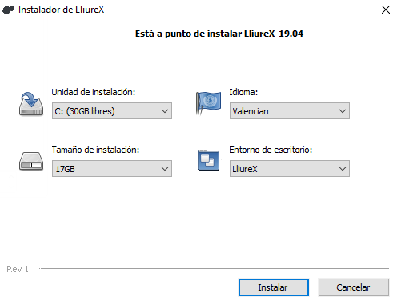{ width=400px }

Farem clic en instal·lar per començar la instal·lació. Aquest procés pot ser bastant lent, ja que ha de descarrgar tot el sistema. 

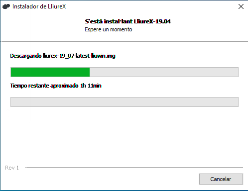{ width=300px }

Quan acabe la descàrrega haurem de reiniciar per finalitzar l'assistent de configuració:

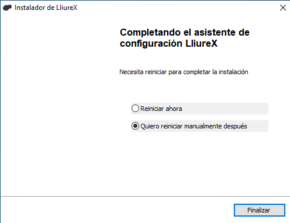{ width=300px }

I quan arranquem Windows, ens demanarà quin dels dos sistemes arrancar:

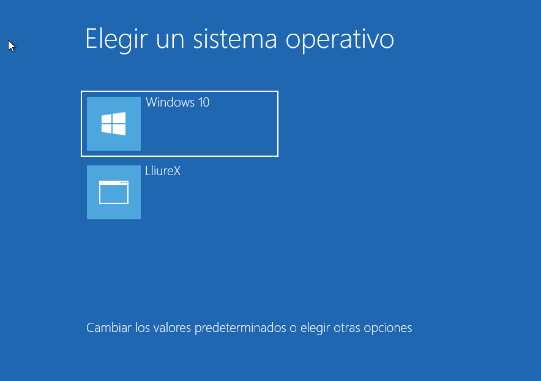{ width=400px }

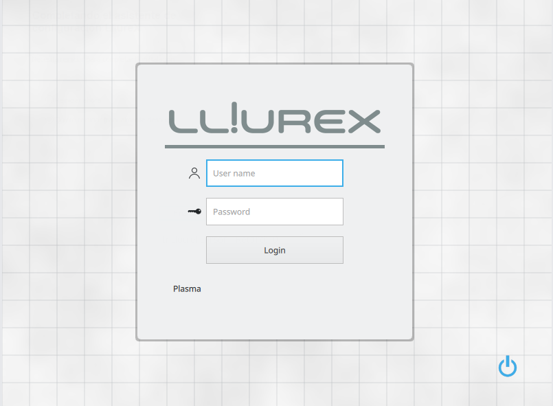{ width=400px }

Amb açò hem aconseguit realitzar una instal·lació de LliureX sobre un ordinador sense necessitat de fer particions del disc dur, com si es tractara d'una aplicació més. En el moment en què vulguem desinstal·lar-lo, ho férem d'igual manera com si es tractara d'una aplicació Windows.

# Un passeig per l'entorn de LliureX

Des de la versió 19 de LliureX, s'utilitza l'entorn d'escriptori Plasma, de KDE en lloc de Mate o Gnome que s'ha utilitzat en versions anteriors. Es tracta d'un escriptori que respecta els recursos del sistema i li dóna un aspecte més modern i útil.

Tot i que no entrarem a veure'l en detall, anem a fer una breu passejada per l'escriptori per tal de conéixer, quin serà el nostre entorn de treball.


## L'escriptiori

A la Wiki de LliureX teniu disponible [l'article Primers passos en el nou entorn de LliureX 19](https://wiki.edu.gva.es/lliurex/tiki-index.php?page=Primers-passos-en-el-nou-entorn-de-LliureX-19) on se us parla més extensament de l'escriptori de LliureX 19. En aquest apartat anem a fer-ne un resum, **basant-nos en la configuració d'escriptori per defecte** i posant atenció a aquells aspectes que més ens interessaran per al desenvolupament del curs.

Quan iniciem sessió, l'aspecte del nostre escriptori és el que es mostra a la imatge següent, on podem distingir tres àrees ben diferenciades:

* L'**Escriptori**, 
* La **barra superior** o **barra de menú**,
* El ***Dock*** inferior o **barra de tasques**.

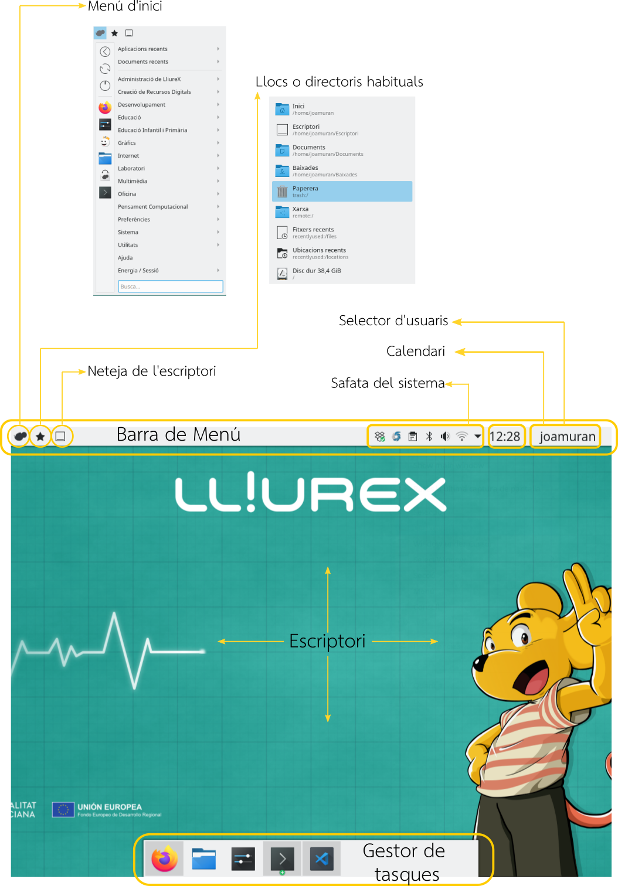{ width=500px }

Com podem veure, la barra de menú consta de diverses parts:

* El **Menú d'inici**, a través del qual podrem accedir a les aplicacions, organitzades per categories, o buscar-les a través del quadre de cerca, així com gestionar la sessió i l'aturada de l'ordinador a través de l'opció *Energia/Sessió*. A més, a la part esquerra disposarem d'una barra de *Preferits*, amb accessos directes a les aplicacions més importants, tals com el navegador Firefox, el centre de control, el Zero Center, el gestor de fitxers Dolphin, la LliureX Store o la terminal. A la part superior d'aquesta barra d'accessos directes tindrem també tres accessos per eixir de la sessió, reiniciar l'equip o apagar-lo.
* **Llocs** o **Directoris Habituals**, ens mostrarà aquelles ubicacions més usuals del nostre equip, com la nostra carpeta personal (*Inici*), la carpeta de l'Escriptori, els Documents o les Baixades, entre d'altres.
* Botó per **Netejar l'esriptori**, minimitzant totes les finestres de les aplicacions que tinguem en execució,
* La **Safata del Sistema**, que mostra els *ginys* o *widgets* d'aplicacions que tinguen bé notificacions disponibles (com per exemple què hi ha actualitzacions disponibles), o accés a algunes funcionalitats, com gestionar el volum, la xarxa, el Bluetooth o el porta-retalls. Si passem el ratolí sobre els ginys, ens mostrarà la informació sobre aquest. Alguns d'aquests *ginys* ens permeten també realitzar certes accions, en fer clic sobre elles. 
* El **Calendari**, on per defecte es mostra l'hora del sisema, i ens mostra el calendari complet si fem clic sobre ell.
* El **Selector d'usuari**, on se'ns mostra el nostre nom d'usuari. Si fem clic sobre ell, se'ns mostraran opcions per iniciar una nova sessió, bloquejar la pantalla, o eixir de la sessió actual.

Per la seua banda, a la part inferior es troba el *Dock* o *Gestor de tasques*, a través del qual podrem accedir de manera ràpida a les diferents aplicacions que tinguem en execució. Aquesta barra també disposa d'alguns accessos directes a les aplicacions més comunes, com el Firefox, el gestor de fitxers o les preferències del sistema. Si volem afegir alguna aplicació a aquesta barra, per tal d'iniciar-la amb un sol clic des de l'escriptori, només hem de localitzar-la al menú i arrossegar-la fins aci.

## On estan les meues coses?

Els nostres documents, i fitxers en general es guarden a la nostra carpeta d'usuari. És convenient conéixer com s'organitza aquesta per tal de mantenir una organització coherent, i saber on guardem tot allò que fem.

### El sistema de fitxers de LliureX

Com sabem, tant els documents com els programes s'emmagatzemen a una partició del disc dur, i dins d'aquesta, s'organitzen el que es coneix com a *directoris*, o més habitualment ***carpetes***. Aquests directoris s'organitzen de forma jeràrquica, és a dir, unes carpetes dins d'altres. Anem a veure en general com s'organitzen estes carpetes a nivell de sistema, i després com ho fan en la nostra carpeta d'usuari.

A escala de sistema, existeix un directori (carpeta), anomenat *directori arrel* a partir del qual *pengen* la resta de directoris. És a dir, és la *carpeta* que conté la resta de carpetes. LliureX segueix l'estructura de carpetes recomanada per l'estàndard FHS (*Filesystem Hierarchy Standard*), una norma que defineix els directoris principals i els seus continguts en el sistema operatiu GNU/Linux. 

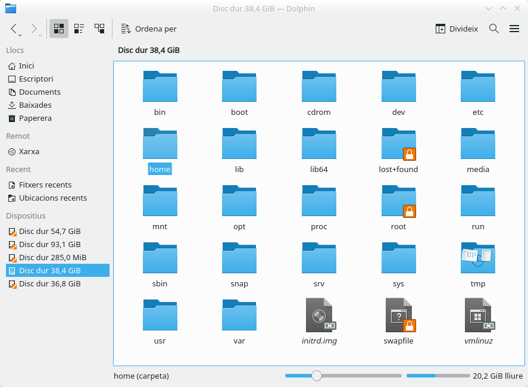{ width=400px }

Algunes de les carpetes més importants d'aquesta organització són:

*  **/bin**: Amb els programes essencials de la línia d'ordres necessaris per a una sessió d'usuari (còpia de fitxers, llistar directoris, etc.)
*  **/boot**: Encarregada de la posada en marxa del sistema,
*  **/etc**: Que conté fitxers de configuració del sistema,
*  **/home**: Amb les carpetes de treball dels usuaris. Dins aquesta carpeta hi haurà una carpeta de treball per a cada usuari del sistema. 
*  **/media**: Carpeta on es *muntaran* els dispositius que connectem a l'ordinador, com puguen ser les memòries USB. Els sistemes Linux, a diferència de Windows, no generen una nova unitat (D:, E:, etc.) quan connectem un dispositiu, sinó que afigen carpetes dins aquesta carpeta. Els accessos que hi tindrem a *Dispositius*, faran referència a aquestes carpetes.
*  **/opt**: Carpeta amb programes opcionals que tenen una configuració personalitzada pera cada usuari.
* **/root**: Carpeta personal de l'administrador del sistema. Per motius de seguretat, aquesta no es troba dins el directori */home*.
* **/sbin**: Amb els programes essencials de la línia d'ordres que només pot utilitzar l'usuari administrador,
* **/usr**: Amb la majoria d'aplicacions i utilitats multiusuari del sistema.

Com hem comentat, hi ha més carpetes a l'arrel del sistema, però amb les què hem comentat ens és suficient per fer-nos una idea de les més importants.

### La carpeta d'Inici

Ens centrem ara al directori */home*, que contindrà una carpeta amb el nom de cada usuari. Aquesta serà la carpeta que, des del punt de vista del nostre usuari se'ns mostrarà com la carpeta d'*Inici*:

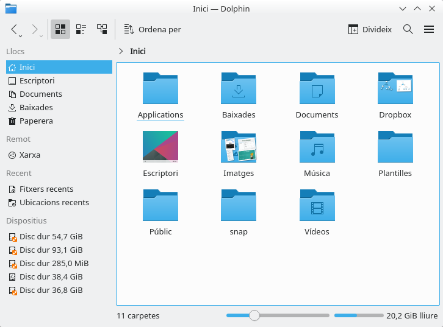{ width=400px }

La finestra anterior mostra l'aplicació *Dolphin*, que és l'explorador de fitxers de l'entorn KDE. Per accedir a ella, ho hem fet a través de l'accés directe que hi ha a la barra de tasques inferior, amb la icona d'una carpeta. També hi podem accedir a través del *menú d'inici* i la seua barra lateral de *Preferits*, o bé a través dels *Directoris Habituals* o *Llocs*.

Com veiem, aquesta carpeta d'inici conté altres carpetes, tals com:

* **Baixades**, on es guardaran de forma predeterminada els fitxers que descarreguem des del navegador o altres aplicacions,
* **Documents**, on es guarden de forma predeterminada els documents,
* **Escriptori**, que conté els fitxers que tenim al nostre escriptori, és a dir, els fitxers i carpetes que deixem a l'escriptori, s'emmagatzemarà realment en aquesta carpeta.
* **Imatges**, on es guarden de forma predeterminada les nostres imatges,
* **Música**, on es guardaran els fitxers d'àudio de forma predeterminada,
* **Vídeos**, on es guarden els nostres vídeos.

Dins aquesta carpeta personal, podem crear tantes carpetes i fitxers com desitgem, però convé mantenir una mínima organització per saber al cap del temps on tenim els nostres fitxers.

El sistema operatiu i les aplicacions també emmagatzemen algunes carpetes dins la nostra carpeta d'inici, amb informació personalitzada per al nostre usuari. Aquestes carpetes i fitxers començaran per un punt (.), i seran *invisibles* al Dolphin.

> ***La carpeta d'Inici al model de centre***
> 
> Quan treballem amb el model de centre, cal tindre en compte que tant la carpeta de ***Documents*** com la d'***Escriptori***, s'emmagatzemen al servidor, i són enllaçades a la nostra carpeta d'Inici quan iniciem sessió. D'aquesta manera, ens ubiquem a l'ordinador què ens ubiquem, tindrem sempre disponible el contingut del nostre escriptori i els nostres documents. Per altra banda, ni les descàrregues, ni les imatges ni altres carpetes que creem a la nostra carpeta d'inici es guardaran al servidor. Per tant, tot allò que desitgem conservar i tenir accessible en cada ordinador on seiem haurà de guardar-se bé a l'escriptori o bé a la carpeta de Documents.

Tot seguit, podem veure, de forma gràfica la relació entre tots els elements que acabem de comentar, així com la seua relació amb el menú de *Llocs* o *Directoris Habituals*:

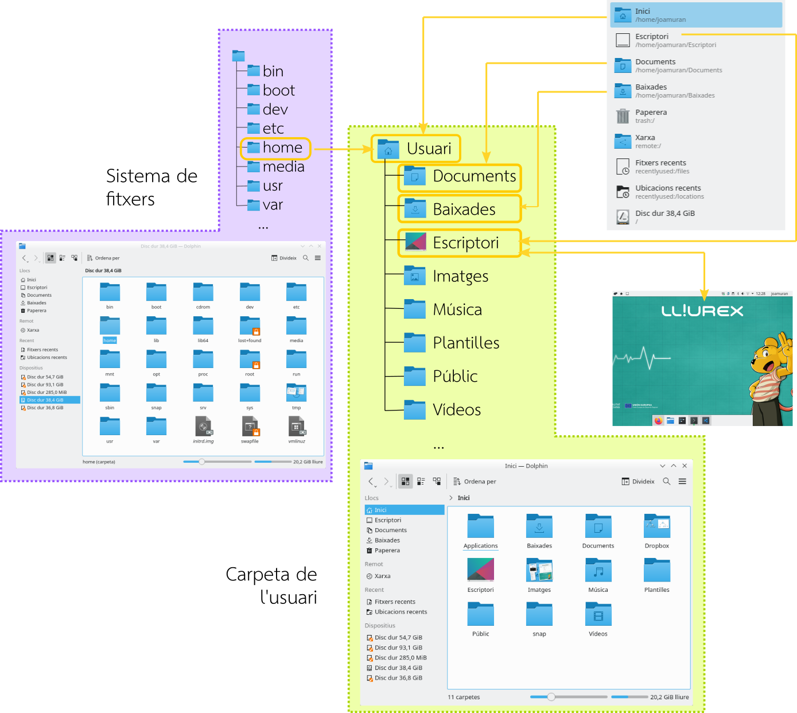{ width=500px }


# Gestió de programari

Les aplicacions es componen de diversos fitxers, tant executables com de configuració o recursos, com puguen ser les imatges, icones, o documents. Quan instal·lem una aplicació, tots aquests recursos s'ubiquen al seu lloc respectiu dins el sistema.

La forma que tenen els sistemes GNU/Linux de distribuir i gestionar les aplicacions és mitjançant el que es coneixen com ***paquets***. Un paquet és un fitxer comprimit, que conté, a més dels fitxers necessaris informació sobre aquest (versió, desenvolupador, web, etc.).

El sistema de paquets utilitzats de forma natural en Ubuntu i per tant en LliureX és del format *Debian*, un fitxer comprimit amb extensió `.deb`, que conté tota aquesta informació i els fitxers.

Als últims anys, s'han incorporat altres sistemes de distribució de paquets, com el format *Snap* o *Appimage*, que presenten menys problemes pel que fa a dependències amb altres paquets, però que poden tindre un pes considerablement superior als *.deb*.

## Com obtenim el programari?

Si recordem, una de les llibertats del programari era la llibertat de distribuir i compartir el programari. Això possibilita la creació de grans *magatzems* de programari lliure, als quals podem accedir a través d'una aplicació i buscar tot allò que necessitem. Aquests magatzems reben el nom de *repositoris* o *Dipòsits* de programari.

Al nostre sistema tindrem diverses eines per tal d'obtenir programari dels repositoris. Algunes d'elles per línia d'ordres i altres amb interfície gràfica. Anem a veure les principals eines que tenim disponibles amb interfície gràfica.

### Abans de començar: LliureX Up

LliureX Up és l'actualitzador de LliureX, pel que no és en sí una eina per obtenir programari nou, sinó per actualitzar el que ja tenim.

Quan hi ha actualitzacions disponibles, LliureX Up ens ho indicarà a la *safata del sistema*, i ens permetrà descarregar i instal·lar totes les noves versions del programari que ja tenim instal·lat.

És una bona pràctica mantenir actualitzat el nostre sistema, tant per les actualitzacions de seguretat que resolen problemes del programari que tenim instal·lat, com per noves funcionalitats.


Per tal d'accedir al LliureX Up, ho farem a través del menú d'*Inici* > *Administració de LliureX* > *Actualitzador de LliureX*:

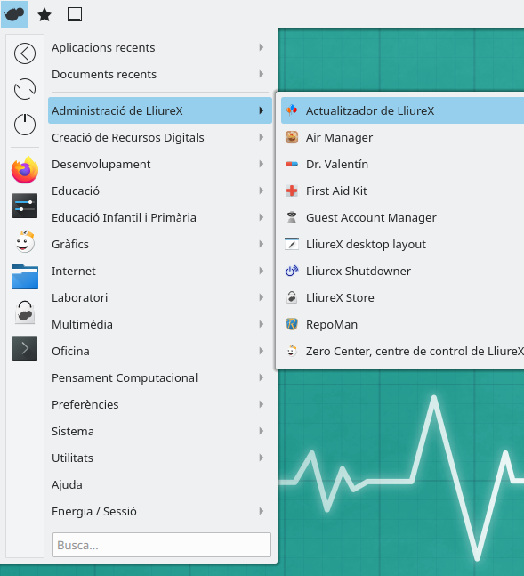{ width=250px }

Només llançar l'actualitzador, es realitzaran diverses accions per tal de *refrescar* totes les llistes de paquets disponibles als repositoris. El sistema de paquets, manté unes llistes amb tot el programari disponible als repositoris, i el primer que fa LliureX Up en iniciar-se és actualitzar aquestes llistes. Després compara les aplicacions que tenim instal·lades amb aquestes llistes, per detectar si hi ha versions noves per instal·lar. 

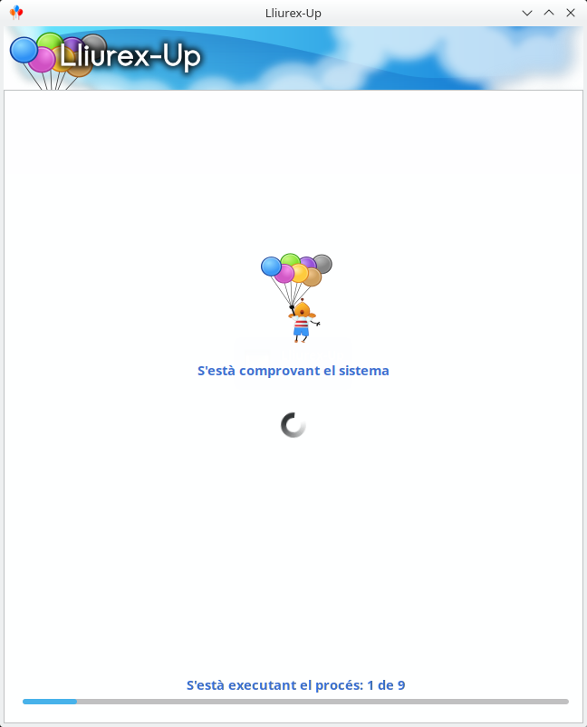{ width=250px }

En cas que el sistema estiga actualitzat ens ho indicarà:

{ width=250px }

Si tenim alguna actualització disponible, el sistema ens mostrarà la versió actual de LliureX (cada actualització de qualsevol paquet als repositoris de LliureX implica un canvi en la versió general). A la següent imatge podem veure que tenim la versió 19.200727, però està disponible la 19.200731.1. També ens diu que tenim 4 paquets per actualitzar (podem veure quins són amb el botó *Visualitza els paquets*) i la grandària d'aquesta actualització. 

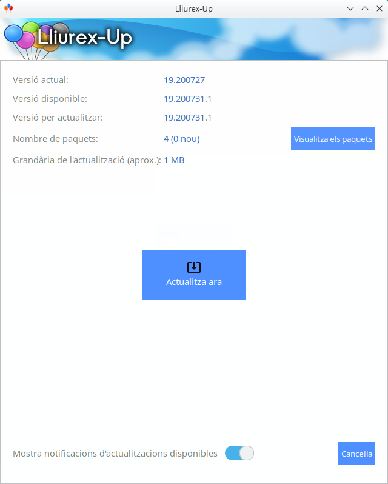{ width=250px }

Quan fem clic al botó *Actualitza ara*, començarà l'actualització dels paquets, i ens avisarà quan acabe:

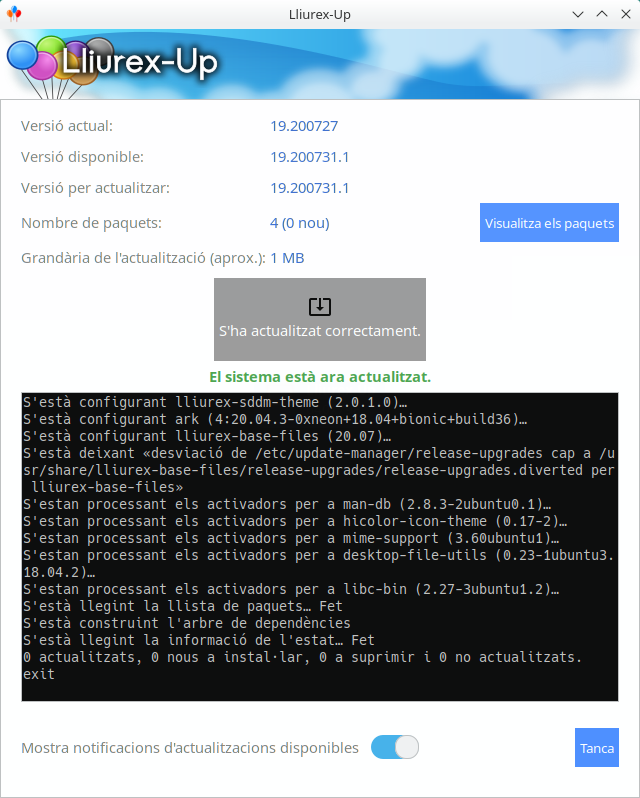{ width=250px }

Ara ja només ens queda tancar la finestra i ja tindrem el nostre sistema i la llista de paquets completament actualitzada.

Ara sí, passem a continuació a veure les diferents eines que tenim per tal de descarregar programari a LliureX.

### Synaptic

L'eina Synaptic ens permet buscar i instal·lar paquets en format *.deb*, i ha estat una de les principals eines d'instal·lació de programari a LliureX des dels inicis.

Per tal d'iniciar el Synaptic, ho farem a través del menú d'*Inici* > *Sistema* > *Gestor de Paquets Synaptic*.

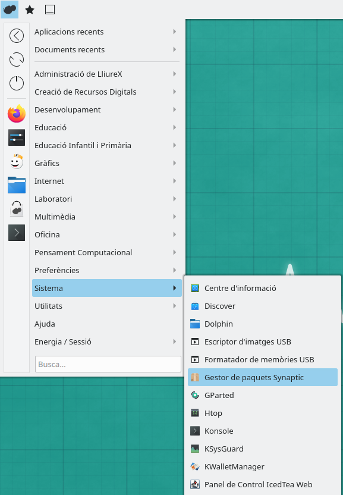{ width=250px }

Només obrir l'aplicació ens demanarà que introduïm la nostra contrasenya, per assegurar-se que som un administrador del sistema (ja que només l'administrador podrà instal·lar programes al sistema):

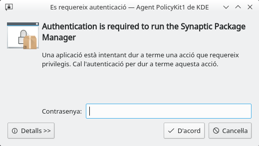{ width=300px }

Una vegada introduïm la nostra contrasenya, se'ns mostrarà la finestra principal de Synaptic:

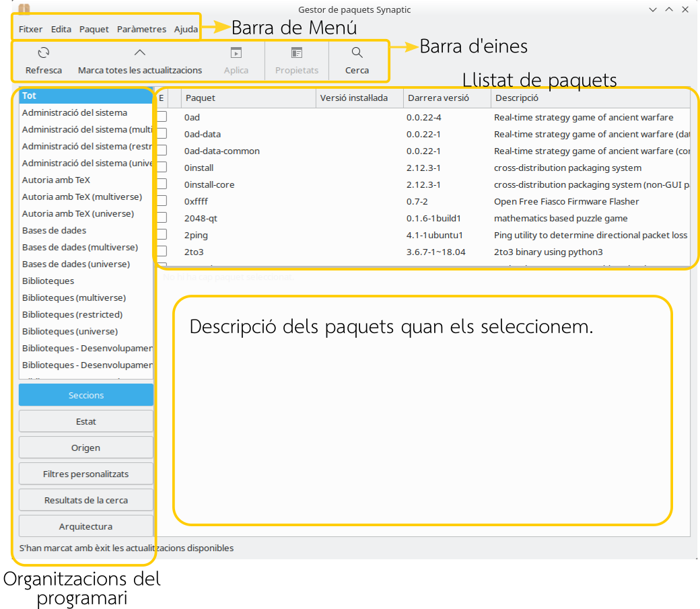{ width=500px }

Come es mostra a la imatge, disposem de diverses seccions a l'aplicació. Les que més útils ens seran serà la *barra d'eines* i la *llista de paquets*.

Si ens fixem en la *Barra d'eines*, el primer botó que apareix és el de *Refresca*. Aquest botó realitza una operació que ja coneixem, i és que actualitza la llista de paquets disponibles (el primer dels passos que fa el LliureX Up). 

Des d'aquesta eina, podem també actualitzar les aplicacions gestionades en format *.deb*. Si volguérem fer una actualització, faríem clic al botó *Marca les actualitzacions*, de manera que Synaptic marcarà per actualitzar totes les aplicacions que estiguen desactualitzades. Si només volem actualitzar des del Synaptic, farem clic en *Aplica* i el nostre sistema s'actualitzarà.

Finalment, ens centrem en el botó *Cerca* de la barra d'eines. Si fem clic en ell, se'ns obrirà un diàleg on podrem introduir el nom o alguna paraula de la descripció del paquet que estem buscant:

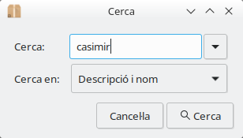{ width=300px }

A la imatge de l'exemple hem escrit el text "Casimir", per buscar l'editor de text *Casimir Editor*, per a alumnes amb problemes de dislèxia (Veurem aquesta aplicació a la pròxima unitat). 

Si fem clic en Cerca, ens apareixerà la llista de paquets que coincideixen amb els criteris indicats, i fent doble clic a l'aplicació, ens permetrà marcar-la per instal·lar-la. 

Una vegada marcades totes les aplicacions a instal·lar o actualitzar, recordeu que cal fer clic en *Aplica* per tal de fer la instal·lació i/o actualització.

### Discover

L'eina Discover és el gestor de programari per defecte de l'escriptori Plasma de KDE, i ens permet instal·lar les aplicacions *catalogades* en aquest escriptori.

Per tal d'obrir el Discover, ho fem també a través del menú d'*Inici* > *Sistema* > *Discover*

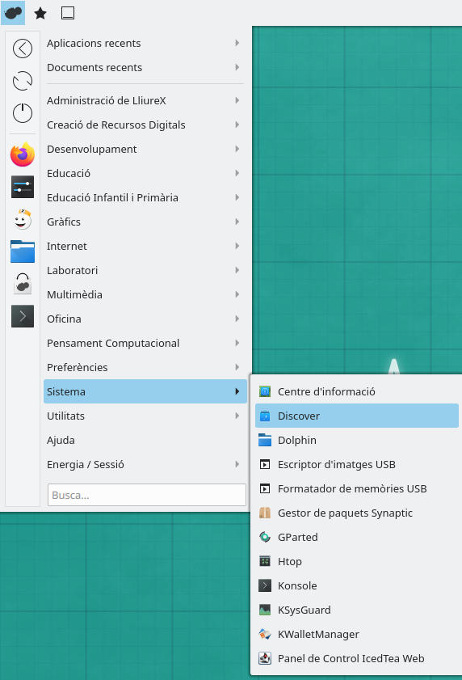{ width=300px }

La interfície del Discover és una miqueta més senzilla que la del Synaptic, i en ella podem distingir:

* Una **barra de cerca** per introduir directament el nom o part de la descripció per buscar una aplicació,
* Un **cercador d'aplicacions**, organitzades per categories, on també se'ns permet buscar ***complements d'aplicacions***, com puguen ser paquets de personalització o temàtica d'aplicacions, o bé ***Complements de Plasma***, com puguen ser nous estris, temes, etc.

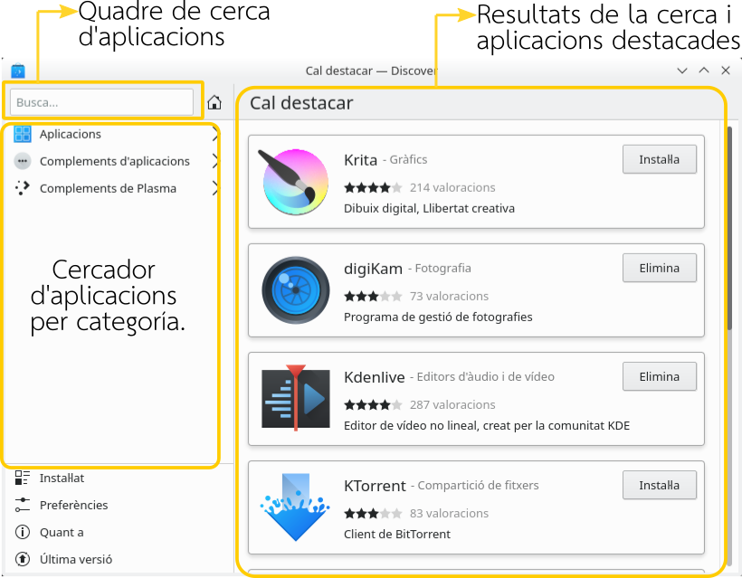{ width=400px }

Tinguem en compte que el Discover té accés als repositoris catalogats pel propi *Plasma*. Si busquem, per exemple *Casimir* a la barra de cerca, veurem que ara no ens troba l'aplicació, ja que aquesta no està catalogada per KDE.

Amb el Discover, una vegada hem trobat l'aplicació que volem, només caldrà fer clic al botó *Instal·lar* per descarregar-la i instal·lar-la al nostre equip.

### LliureX Store

La LliureX Store facilita la instal·lació d'aplicacions de diferents origes i formats (*.deb*, Snap, Appimage)

Per accedir a la LliureX Store ho farem a través del Menú d'*Inici*, bé a través de l'accés directe de la barra de favorits de l'esquerra, o bé a través del submenú *Administració de LliureX* > *LliureX Store*:

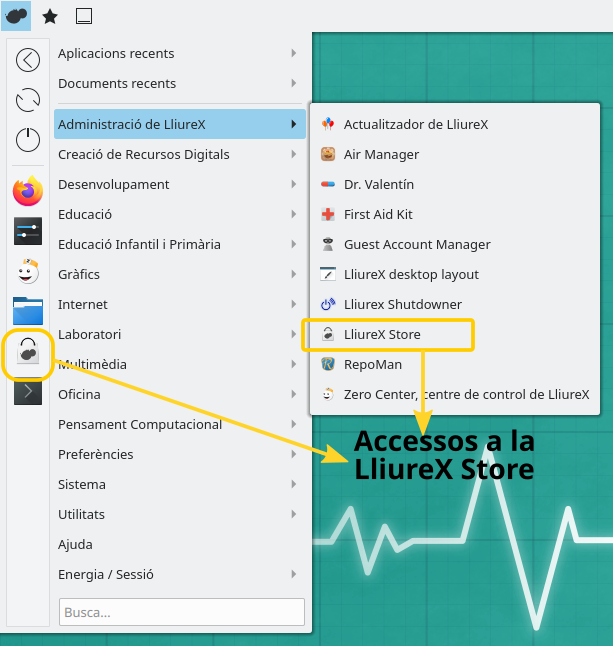{ width=300px }

Al següent gràfic veiem les diferents vistes que se'ns poden presentar a la LliureX Store:

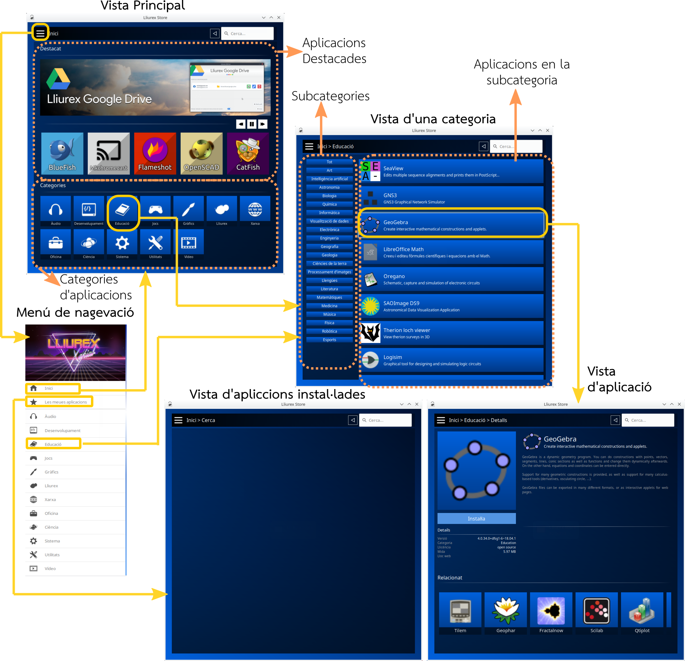{ width=500px }

* Disposem d'una **Vista Principal**, on se'ns mostra:
  * Una barra superior amb el *menú desplegable de navegació*, i un quadre per buscar aplicacions, 
  * Una secció d'**aplicacions destacades**, 
  * Una secció amb les diferents **Categories** en què es troba organitzat el programari.

* Si fem click al desplegable del **Menú de navegació**, se'ns mostrarà aquest menú, amb accessos a la *Vista d'Inici*, per si estem en altra finestra, a *Les nostres aplicacions*, amb les aplicacions instal·lades al sistema, i una llista amb les *Categories de programari*, equivalent a les que ens apareixen a la vista principal.
* Quan fem clic amb el ratolí sobre una categoria, tant des del *Menú de Navegació* com des de la vista principal, accedirem a la **Vista de la Categoría** en qüestió, la qual ens mostrarà:
  * Un menú a l'esquerra amb les subcategories, i
  * Una llista d'aplicacions corresponents a la categoria.

* Quan fem clic en una aplicació, se'ns obrirà una *Vista d'aplicació*, amb una descripció d'aquesta (sovint en anglès), i els detalls de la instal·lació (versió, categoria, llicència i mida), així com, a la part inferior una llista d'aplicacions relacionades amb ella.  També veurem un botó per tal d'instal·lar l'aplicació, prèvia autenticació com a administradors. En cas que es tracte d'una aplicació ja instal·lada se'ns donarà l'opció d'obrir l'aplicació o desinstal·lar-la.
 
A l'apartat final *Més Informació* disposeu d'enllaços a la wiki amb més detalls sobre la LliureX Store.

### Programari al zero-center

L'aplicació Zero Center és una eina què ens permet configurar certs aspectes de LliureX, respecte a la seua configuració i funcionalitat. Es tracta d'una eina molt potent i amb moltes funcionalitats, però ara ens centrarem només en la possibilitat d'instal·lació de programari i recursos.

Per tal d'accedir al *Zero Center*, podem fer-ho a través del menú d'inici, tant des del seu accés directe a la barra de *Favorits* com des del submenú *Administració de LliureX* > *Zero Center, centre de control de LliureX*:

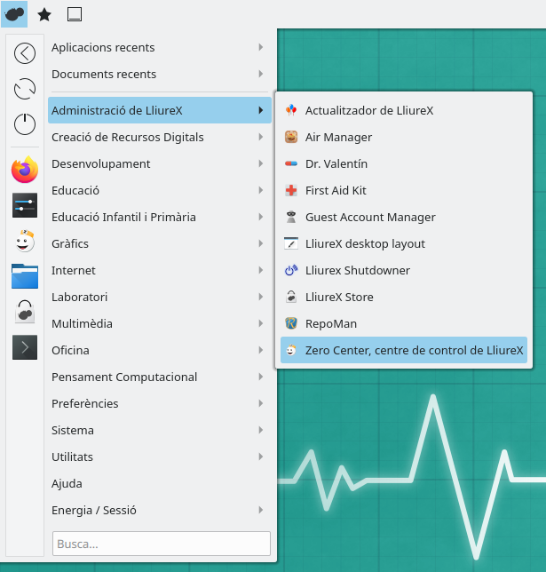{ width=300px }

Existeixen certes aplicacions, que no es distribueixen de forma estàndard, o que no es troben a cap *repositori* o *dipòsit de programari*, sinó que cal accedir a la seua web i descarregar-la, o que requereixen realitzar certes adaptacions del sistema perquè funcionen correctament.

D'entre les diferents categories (Sistema, Configuració, Suport, Programari, Internet i Recursos), la que ens interessa ara per ara és la de *Programari*.

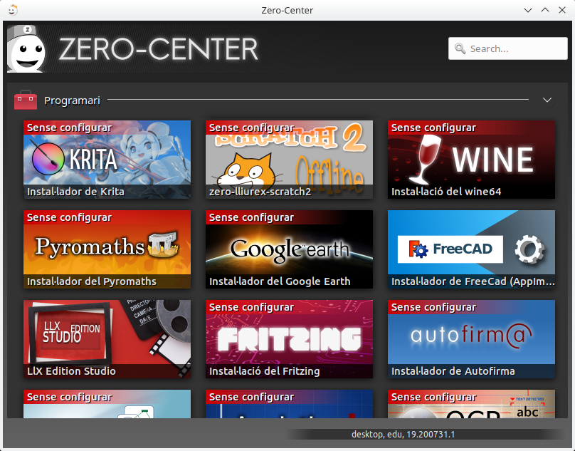{ width=400px }

En ell podrem veure les diverses aplicacions que és capaç d'instal·lar. Entre elles podem trobar aplicacions com l'instal·lador d'Adobe Flash, Google Earth, o la que utilitzarem en unitats posteriors, l'*AraSuite*.

Si ens fixem, a sobre del *banner* de cada aplicació hi apareix un indicador dient si l'aplicació està instal·lada (configurat) o no ho està (Sense configurar). Quan passem el ratolí per sobre cada aplicació, veuem també una breu descripció d'aquesta:

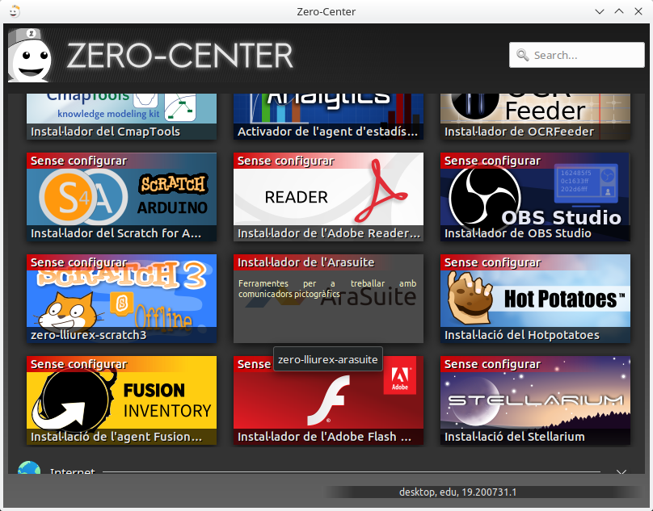{ width=400px }

Si volem instal·lar-la, només caldrà fer clic per obrir l'instal·lador EPI (*Easy Package Installer*) que s'encarregarà de la instal·lació:

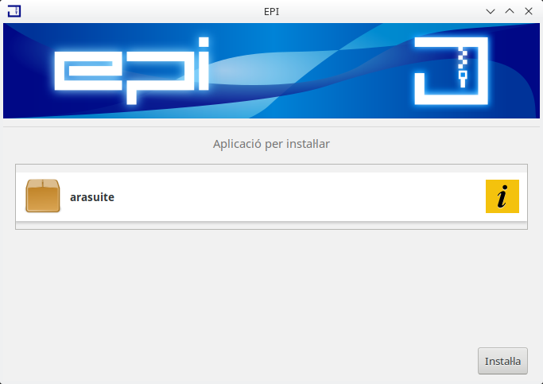{ width=300px }

### Gestió dels repositoris d'APT: Repoman

Finalment, anem a veure l'eina Repoman (**Repo**sitory **Man**ager). Aquesta no és una eina per instal·lar paques, sinó per gestionar els diferents repositoris o dipòsits de programari configurats al nostre ordinador.

Al nostre sistema, podem tindre tants repositoris configurats com desitgem. De manera predeterminada, a LliureX només tindrem configurats els dipòsits de programari de LliureX, però podem configurar tots els què desitgem.

Per tal d'accedir a l'eina, ho fem a través del menú d'*Inici* > *Administració de LliureX* > *RepoMan*, o directament buscant-lo a la barra de cerca del menú d'inici.

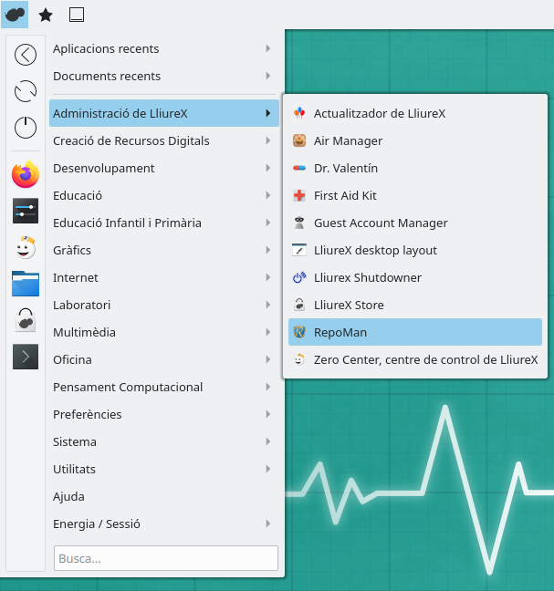{ width=300px }

La primera pantalla que ens mostra l'eina és la d'**Opcions**, amb enllaços a les diferents seccions, les quals també se'ns mostren al quadre de l'esquerra. Les diferents opcions disponibles que tenim són:

* Gestionar els **repositoris per defecte**, on podrem:
  * Activar o desactivar els ***repositoris de LliureX des d'Internet*** (de manera predeterminada en la versió d'escriptori estan activats)
  * Activar o desactivar els ***repositoris de LliureX des d'un Mirror*** o Rèplica del centre. Si treballem en un model de centre i disposem d'una rèplica dels repositoris de LliureX al servidor, aquesta seria l'opció més adequada.
  * Activar o desactivar els ***repositoris d'Ubuntu***. De manera predeterminada estan desactivats, i podem activar-los si necessitem programari d'Ubuntu que no estiga a LliureX. **En cas que un paquet estiga tant als repositoris d'Ubuntu com als de LliureX, tindrà preferència el del repositori de LliureX, encara que hi haja una versió més actualitzada a Ubuntu.**

* **Gestionar repositoris personalitzats**, on podrem configurar altres repositoris externs a LliureX i a Ubuntu. Per afegir un nou repositori fem clic al botó que hi ha a sobre el requadre dels repositoris, i afegim la seua adreça web, junt amb el nom i una descripció. En principi, no haurem d'afegir cap repositori extern, ja que les aplicacions amb què treballarem es troben als repositoris per defecte. De tota manera, si ho necessitàrem en algun moment, explicaríem en detall com fer-ho.

* **Eines del sistema**, des d'on podrem actualitzar les llistes de programari, llançar l'actualitzador LliureX Up o la LliureX Store.


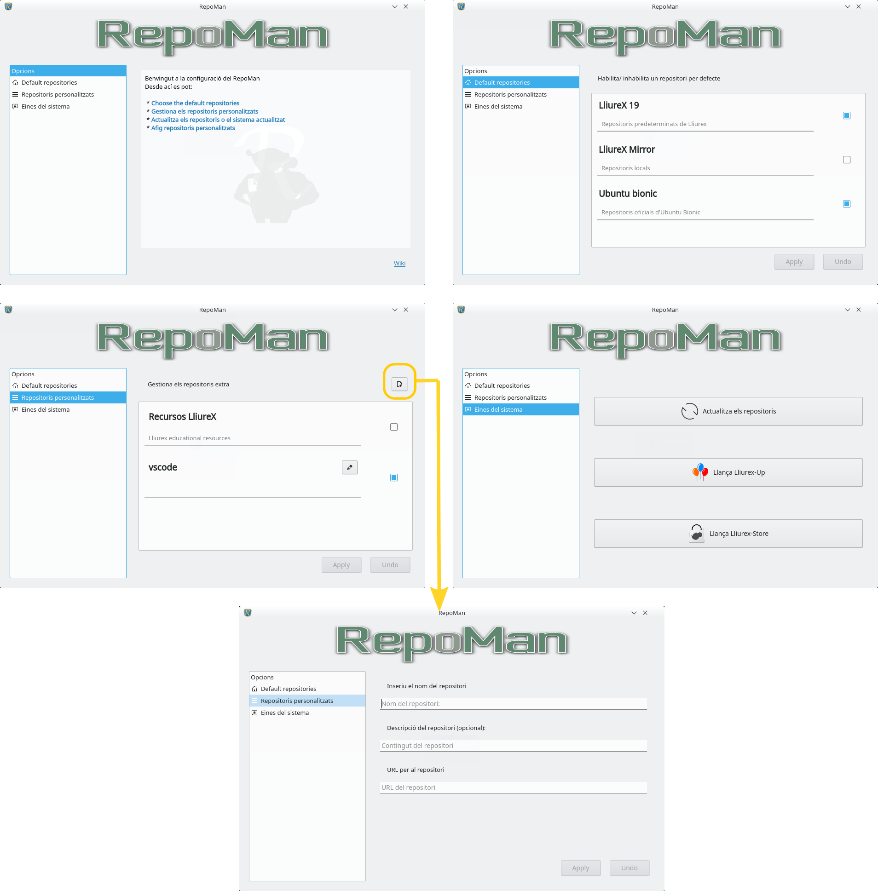{ width=500px }


### Més informació

Com hem comentat al principi, la Wiki és la millor font d'informació que podem trobar-nos sobre LliureX. Respecte a la instal·lació de programari què hem vist en aquest apartat, podeu consultar els següents articles, que tot i basar-se en versions prèvies de LliureX, ens poden ser de gran utilitat.

* [Cerca i gestió de programes](https://wiki.edu.gva.es/lliurex/tiki-index.php?page=Cerca%2Bi%2Bgesti%25C3%25B3%2Bde%2Bprogrames), per a LliureX 15.05, però totalment vàlida la part de Synaptic i l'eina `apt` de línia d'ordres.
* [Gestió de Repositoris](https://wiki.edu.gva.es/lliurex/tiki-index.php?page=repoman).
* [Guía de la LliureX Store](https://wiki.edu.gva.es/lliurex/tiki-index.php?page=LliureX%2BStore_va&highlight=lliurex%20store), per a la versió 16.
* [Videotutorial de la LliureX Store](https://wiki.edu.gva.es/lliurex/tiki-index.php?page=LliureX+Store_va+videoguia&highlight=lliurex+store), per a LliureX 16.
* [Aplicacions AppImage en LliureX](https://wiki.edu.gva.es/lliurex/tiki-index.php?page=Aplicacions-AppImage-al-LliureX&highlight=lliurex+store)
* [Zero Center](https://wiki.edu.gva.es/lliurex/tiki-index.php?page=Zero%2Bcenter_va&highlight=zero%20center)

