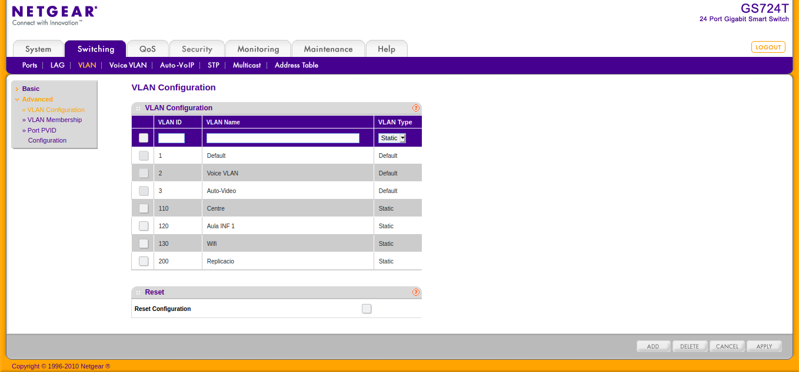
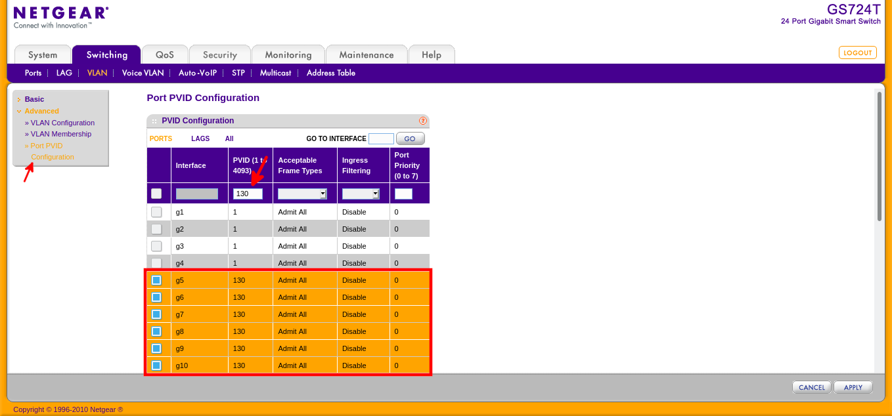
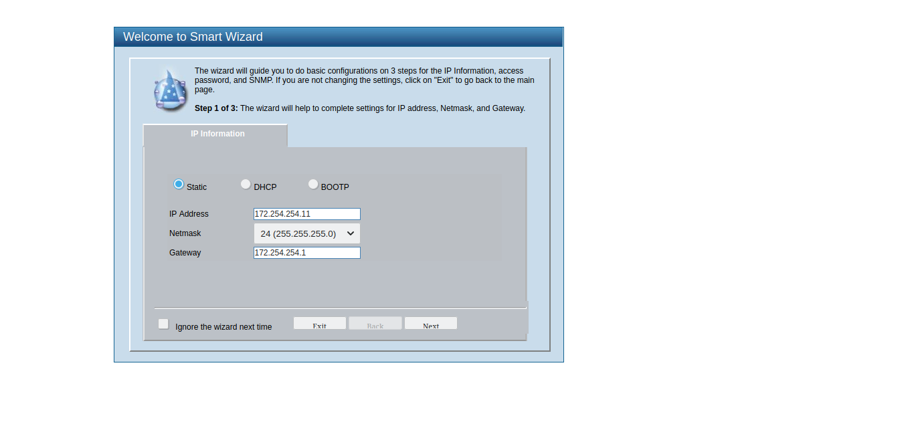
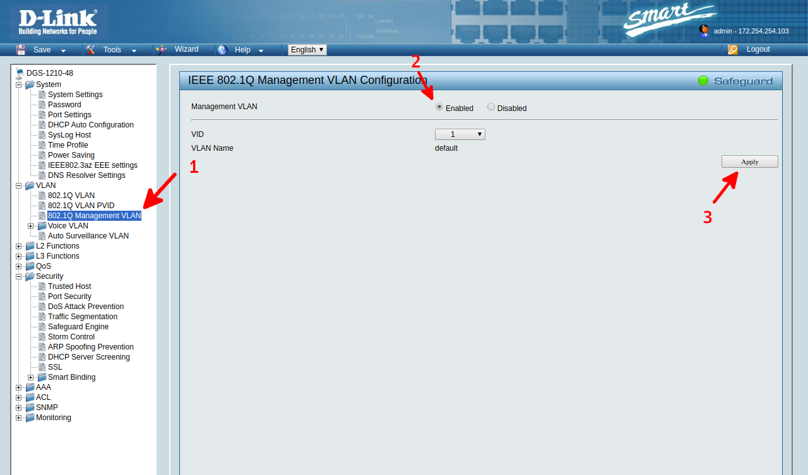
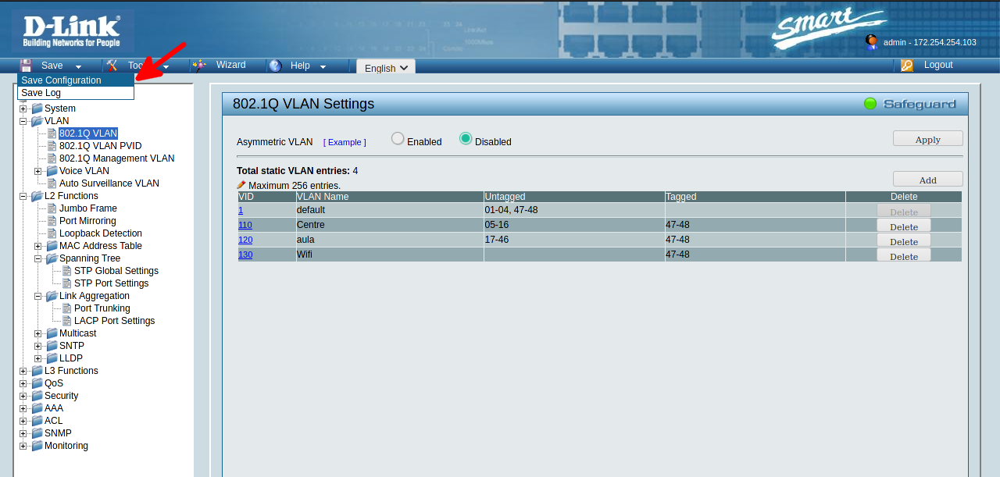

---
title: "CONFIGURACIÓN DE RED"
author: [Alfredo Rafael Vicente Boix i Javier Estellés Dasi]
dato: "2020-11-25"
subject: "Proxmox"
keywords: [Red, Instalación]
subtitle: "Ejemplo de esquema de red en el modelo de centro"
lang: "can"
page-background: "background10.pdf"
titlepage: true,
titlepage-rule-color: "360049"
titlepage-background: "background10.pdf"
colorlinks: true
header-includes:
- |
  ```{=latex}
  \usepackage{awesomebox}
  ```
pandoc-latex-environment:
  noteblock: [noto]
  tipblock: [tip]
  warningblock: [warning]
  cautionblock: [caution]
  importantblock: [importando]
...

<!-- \awesomebox[violet]{2pt}{\faRocket}{violet}{Lorem ipsum…} -->

# Introducción

Hasta ahora hemos visto que en el modelo clásico de centro existía un servidor en cada una de las aulas de informática. Por lo tanto, para gestionarlo había que ir al aula de informática, o conectarse bueno vía ssh o por vnc. 
Con el nuevo modelo de centro cambiamos el paradigma y tendremos todos los servidores virtualitzats en un hipervisor o en un cluster de hipervisors.
A modo de ejemplo tenemos el siguiente esquema de modelo clásico.

 

Y tenemos que pasar al siguiente al nuevo esquema.


Por lo tanto, es necesario que cada ordenador bien sea del centro, del aula de informática o la wifi sepa cuál es su red y/o su servidor. Para conseguirlo utilizaremos Redes virtuales (VLAN).

:::info
La VLAN que utilizaremos en se una VLAN de nivel 1 o por puerto, existen otros tipos de VLAN, por mac, subred, protocolo... Que pueden tener interés en un entorno empresarial o sea necesaria la movilidad del puesto de trabajo.
:::

# Conceptos de red

En esta unidad configuraremos un esquema de red modo con dos switchs a tipo de ejemplo. Conociendo como se configuran dos swiths, configurar'n más se hace de manera similar. Pero antes vayamos a ver un poco de terminología y tecnología que vayamos a utilizar.

:::warning
Se presupone cierta pericia en tema de redes como saber qué es una IP, un switch o un router, como se conectan los ordenadores en red o configurar una estación de trabajo en una red.
:::

## VLAN y LAG

Trataremos de hacer una breve explicación para entender las VLANS sin entrar en detalles técnicos que no corresponden a este curso. En las redes virtuales por puerto, tal y como dice el nombre, tenemos que configurar cada uno de los puertos según la red virtual que nosotros queremos tener. Se pueden configurar tantas VLANS como lo switch lo permita. En nuestro caso, la cantidad máxima es de 256, más que suficiente para el que vayamos a hacer. A modo de ejemplo podríamos tener el siguiente switch donde cada puerto pertenece a una o más VLANS.


Tenemos que tener en cuenta que:

* Tenemos que configurar cada uno de los puertos del switch con la VLAN correspondiente. Es por eso que se necesario tener **switchs gestionables** para poder configurar la red.
* Si  fijamos en la VLAN 110 en rojo, podemos ver que la VLAN que entra es la 110 y la que sale es la misma.
* En cambio, al puerto 12 podemos ver como la VLAN que sale es la 60 y la 110, puesto que el puerto está configurado para pertenecer a 2 VLANS.
* Al puerto 16 pasa el mismo pero con 4 VLANS, los puerto de la zona naranja están configurados para tener 4 VLANS.
* Si a un puerto llega una conexión sin jefe VLAN y el puerto está configurado con la VLAN 10, la conexión que sale es de la VLAN 10.

Para haceros una idea sencilla simplemente tenéis que tener en cuenta cada uno de los cuadrados. Cuando pensáis en la VLAN 110, pensáis en los puerto que pertenecen a esa VLAN. Pero ahora se nos plantea la siguiente cuestión.

### Cómo sabe un ordenador con diferentes VLANS qué red tiene que escoger?

Si el ordenador soporta VLANS que no es lo más habitual, se deberá de configurar al archivo correspondiente. Pero como normalmente se trata de una máquina de trabajo, le diremos al puerto del switch donde va a conectarse el ordenador que va a conectarse una máquina que no entiende de VLANS. A esta opción lo denominamos **UNTAGGED**.
Si en lugar de un ordenador conectamos un switch (que sí entiende de VLANS). Entenderá que la VLAN untagged es para él (por ejemplo un DHCP que le ofrece una ip, o la red para poder acceder para gestionarlo) y las **TAGGED** serán aquellas que pasarán a los puertos configurados con las respectivas VLANS.
A modo de ejemplo podemos ver.


Esta es la situación que nos encontraremos normalmente en el centros. En este caso podemos ver que, llegan 4 VLANS, la 1 llega untagged, el que significa que el switch tendrá que tener una ip de la VLAN 1. La VLAN 2+3+4 como estàn tagged, estarán conectadas en la red 2,3 y 4 respectivamente. Como que vayamos a conectar un ordenador a ese puerto las hemos posado unttagged.
Podemos ver cómo sería la conexión entre dos ordenador conectados a la misma VLAN:


:::caution
Esta explicación no pretende ser técnica ya este curso no va dirigido únicamente a gente con una formación técnica, sino de generar una idea sobre cómo funcionan las VLANs sin entrar en cómo se marcan las VLANS a nivel de conexión. Hay mucha información al respecto a la web. Eso sí, es importante tener una idea de cómo funciona. A medida que practicáis con algún switch iréis cogiendo soltura.
:::

## Bonding/Link Aggregation

El bonding es una manera de poder ampliar la velocidad de conexión entre dos máquinas, pueden ser bueno dos ordenadores, dos switchs, o un ordenador y un switch, etc...


Las ventajas y consideraciones que tiene hacer un bonding entre dos máquinas son:

* Aumentas la velocidad.
* Si un cable deja de funcionar, la conexión se mantiene.
* Utilizando el protocolo **LACP** aumenta la compatibilidad entre diferentes máquinas.
* Simplifica las conexiones. 


:::caution
Del mismo modo que el apartado anterior esta explicación no pretende ser técnica sino dar una idea. Hay que incidir que para el caso que estamos tratando y en función de marcas, muchas veces se utilizan indistintamente los términos, **bonding**, **trunking**, **LAG**, **bundling** o **channeling**. Y seguro que se utilizan otras terminologías que no conozcamos.
:::


# Modelo de ejemplo

Partiremos del ejemplo del siguiente modelo. Para poder hacerlo hemos utilizado:

| Dispositivo | Características |
| -- | -- |
| Dlink DGS-12-10-48 | Switch de 48 puertos a 1Gb |
| Netgear GS724T | Switch de 24 puertos a 1 Gb |
| Servidor SEH1 | Ordenador de 32 Gb y procesador i7 | 

El esquema se quedaría de la seqüent manera. Una vez tengamos diseñado el esquema de nuestro centro podemos pasar a configurar cada uno del switchs.


## Configuración de los switchs

Antes de empezar hace falta que nos creamos una mesa para definir, las direcciones ip de los switch y qué puertos van a tener cada una de las VLANs. El rango del centro ficticio que tenemos creado a nuestro ejemplo es el 172.254.254.X

Las direcciones IP de los switchs serán:

| Switch | Dirección |
| -- | -- |
| Dlink DGS-12-10-48 | 172.254.254.11 |
| Netgear GS724T | 172.254.254.10 |


### Configuración de Switch principal con el Netgear GS724T

Basándonos en el ejemplo que este siguiendo el esquema del switch quedaría de la siguiente manera:

| Puertos | VLAN | Bond |
| -- | -- | -- |
| P1 a P4 | 1 | No |
| P5 a P10 | 110 | No |
| P11 a P12 | 1,110,120,130 | Si LAG1 |
| P13 a P16 | 1,110,120,130 | Si LAG4 |
| P17 a P20 | 1,110,120,130 | Si LAG3 |
| P21 a P24 | 1,110,120,130 | Si LAG2 |

\* LAG = Link Aggregation group. Es el que nosotros estamos denominando **bond**. 

Aunque para configurar el switch es mejor sacarte un esquema de la siguiente manera:

| VLANs | Puertos | 
| -- | -- | 
| 1 | U-P1, U-P2, U-P3, U-P4, U-LAG1, T-LAG2, T-LAG3, T-LAG4| 
| 110 | U-P5, U-P6, U-P7, U-P8, U-P9, U-P10 T-LAG1, T-LAG2, T-LAG3, T-LAG4 | 
| 120 | T-LAG1, T-LAG2, T-LAG3, T-LAG4 | 
| 130 | T-LAG1, T-LAG2, T-LAG3, T-LAG4 | 
| 200 | T-LAG2, T-LAG3, T-LAG4 |

La VLAN 200 lo utilizamos para la *red de replicación de LliureX**.  Concepto que trataremos en la última unidad.

:::info
Es posible que os preguntéis el porqué del T2 y T3. Hemos dejado preparado lo switch por sí queremos crear un cluster con otros hipervisors.
:::

Antes de que nada para acceder al switch tenemos que tenerlo dentro de la misma red. Si lo switch ya está configurado y conozcamos la dirección ip y la contraseña nos podemos votar el siguiente paso.

#### Reinicializar switch

Para reinicializar el switch tenemos que utilizar un clip y mantener durante 10 según el clip al botón de la imagen. La dirección por defecto para acceder es la 192.168.0.139 (depende siempre de marcas y modelos)


:::warning
*Tengo en cuenta** que si lo switch ya está conectado en una red este cogerá una dirección por DHCP.
:::

Si lo switch ha cogido una dirección por DHCP puedes tratar de averiguar su ip con el mando:

```tcsh
sudo nmap -sP 172.254.254.
``` 

Utilizamos **sudo** puesto que ente un poco más de información.

#### Acceder a switch

Para poder acceder al switch tienes que tener configurada la red del ordenador dentro del mismo rango que lo switch. Podemos configurar la red de la siguiente manera:
Vamos al panel de herramientas y clickem sobre el icono del pc.


Allí cambiamos la configuración. Podemos crear una nueva haciendo click sobre el más. En este caso hemos configurado la dirección 10.90.90.100, pero para el switch Netgear sería la 192.168.0.100, o cualquier que no sea la 192.168.0.239.


:::caution
Una vez cambiada la configuración tenéis que desconectaros y volveros a conectar sino no os cambiará la ip.
:::

#### Configuración del Switch

Una vez ya tenéis la ip al mismo rango, ya podéis acceder al switch a través del navegador:


Lo primero que habría que hacer se acceder al switch para cambiar su ip y posarla dentro del rango de nuestra red de Aulas.


Una vez actualizada la IP del switch recuerda cambiar la IP de tu ordenador para poder volver a acceder. Después vayamos a la sección de LAG, para configurar cada uno de los LAG según la imagen.


Cuando tenemos definidos todos los LAGs, vamos a LAG membership y añadimos los puertos a los cuales pertenecen cada uno de los switchs.


Nos tiene que quedar una cosa así:


Después tenemos que definir las VLANS, vamos a la pestaña de VLAN y configuramos nuestras VLAN.


Nos tiene que quedar una cosa así:



Y añadimos los puertos untagged de cada una de los VLAN en el apartado VLAN membership.


Después cambiamos del menú VLAN ID cada una de las VLAN y vamos configurándolas una a una. 

:::warning
Recuerda darle al botón Apply cada una de las veces que acabas la configuración de una VLAN.
:::


El mismo con la VLAN 120.


La 130.


Y la de replicación.


:::warning
Finalmente y es muy importante, a los switchs Netgear (no con los otros marcas) es necesario cambiar el parámetro PVID, por el que hay que ir al apartado PVID configuration y cambiarlo en aquellos puertos untagged al valor que hemos dado untagged. Otras marcas este paso se hacen automáticamente.
:::




### Configuración de Switch de Aula D-LINK DGS1210-48

Hay que decir que, a pesar de que denominamos este switch, switch de Aula, podría ser perfectamente unos witch que da servicio en las aulas del alrededor y al aula de informática. La configuración de este switch quedaría de la siguiente manera:

| VLANs | Puertos | 
| -- | -- | 
| 1 | U-P1, U-P2, U-P3, U-P4, U-LAG1 (U-P47,U-P48) | 
| 110 | U-P5 a U-P16 T-LAG1 (T-P47,T-P48) | 
| 120 | U-P17 a U-P46 T-LAG1 (T-P47,T-P48) | 
| 130 | T-LAG1 (T-P47,T-P48) | 

Hemos indicado los puertos entre paréntesis, puesto que, al contrario en el Netgear, en este switch sí que tienes que configurar los puertos pertenecientes al LAG.

#### Reinicializar switch

Para reinicializar el switch D-link hay que proceder de manera similar al Netgear, hace falta polsar el botón *reset* durando 10s aproximadamente.


:::warning
*Tengo en cuenta** que, al igual que el Netgear si lo switch ya está conectado en una red este cogerá una dirección por DHCP. Para hacer el reset es recomendable no tener ningún cable conectado al switch.
:::

Si lo switch ha cogido una dirección por DHCP puedes tratar de averiguar su ip con el mando:

```tcsh
sudo nmap -sP 172.254.254.
``` 
#### Configuración del Switch

Una vez tengas la ip al mismo rango, ya puedes acceder a él, la ip por defecto del switch D-link es 10.90.90.90, por lo tanto cambiaremos la ip de nuestro ordenador y accederemos a él. Igualmente podemos utilizar la terminal para crear un alias. Dependiendo de si tienes instalado lo ifconfig o no puedes utilizar cualquier de los siguientes mandos

```tcsh
sudo ip addr addr add 10.90.90.100/24 dev eth0 labelo eth0:1
```

```tcsh
sudo ifconfig eth0:1 10.90.90.100 netmask 255.255.255.0 up
```
Después ya podemos entrar al switch, la contraseña para poder entrar es *admin*. 


Posteriormente configuramos la IP del switch.



Y cambiamos la contraseña genérica


Si vayamos a gestionar el switch a través de SNMP habrá que habilitar esta opción.


También se puede cambiar la configuración de la ip desde las opciones de configuración.


Para configurar el LAG basura el siguiente procedimiento.


Hay que configurar el switch para la VLAN de gestión. En nuestro caso se la 1.



Habilitamos el Spanning tree.

:::info
Lo spanning tree se un protocolo que detecta bucles en la red y puede desactivar puertos si  detecta alguno.
:::


Ahora se cuando tenemos que configurar las VLAN, a la imagen podemos ver ya todas las VLAN configuradas. En un principio solo nos aparecerá la VLAN 1, a la cual es necesario entrar puesto que todos los puertos están configurados en esa VLAN. Se procederá a pasarlos a *Not member* puesto que no te permitirá asignarlos a otra VLAN si ya están configurados.
Para añadir nuevas VLAN tenemos que darle al botón Add.


Una vez hemos dado al botón Add, configuramos la VID y la VLAN Name, seleccionamos los puertos que pertenecen a esa VLAN y le damos a Apply.


:::caution
Finalmente, y en algunos switchs es de vital importancia, hay que salvar la configuración puesto que, si hay un corte de suministro eléctrico lo switch vuelve a la configuración de antes. En este caso, dado que tenemos un switch con un LAG, probablemente provocaríamos un bucle en la red y dejaría de funcionar todo el centro. Por lo tanto hay que ir mucho con cuenta en estos detalles.
:::

Procedemos a salvar la configuración:




Ahora en estos momentos ya tenemos todos los switch preparados para posar en funcionamiento nuestro centro. Al próximo tema instalaremos el Proxmox de las diferentes maneras posibles y configuraremos los parámetros del servidor.

<!-- 


És important tenir clar els següents conceptes abans de començar la instal·lació.

* *AMT** funciona com un sistema independent, per tant tindrà la seua pròpia ip.
* Els suports físics cada vegada s'utilitzen menys. Recorda quan va ser última vegada que utilitzares un CD-ROM.
* Anem a fer una instal·lació de proxmox. No és necessari tenir accés a la consola de Proxmox en cap moment, per tant si ja tens l'hipervisor muntat al rack, no el desmuntes.
* Les IPs utilitzades no corresponen amb les indicades al que recomana el SAI. És la tasca que se vos manarà!


\newpage

# Posada a punt del servidor

Per a posar a punt el servidor, és recomanable, encara que no imprescindible habilitar el AMT, per a posteriorment utilitzar la ferramenta meshcomander per a fer una instal·lació remota.

## Habilitar AMT de Intel

Els servidors distribuïts als centres disposen de la ferramenta AMT de Intel per a poder connectar-se remotament, no sols ens permetrà arrancar l'hipervisor sinó que també ens permetrà configurar certes funcionalitats bàsiques. Però abans que res, caldrà entrar a la BIOS.
Per a accedir a la BIOS (Model SEH1) polsem F2 en el setup de l'ordinador.


\newpage

Una vegada dins anem a la pestanya Advanced*.


\newpage

I seleccionem AMT Configuration*.


\newpage

Canviem MEBx Mode* i seleccionem l'opció Enter MEBx Setup


\newpage

Finalment salvem els paràmetres i reiniciem.


## Configuració del AMT

Una vegada hem habilitat el AMT, entrem en la configuració del mateix i configurem els següents paràmetres.

::: tip
*Info**: Per obvis motius de seguretat no es permet entrar a la configuració del AMT per VNC, pel que algunes de les següents imatges están fotografiades de la pantalla.
:::

Quan entren a la ferramenta de configuració del AMT, hem de logar-nos. La contrasenya d'administrador és *admin**. Posteriorment ens demanarà que canviem la contrasenya per una nova.

::: warning
*Contrasenya**: Hem de respectar la política de contrasenyes, amb majúscula, minúscula i caràcter especial.
:::


Hem d'accedir a les següents opcions per a fer una configuració bàsica.

| Opció | Funcionalitat |
| -- | -- |
| *User Consent** | Ens permetrà poder connectar-nos al servidor per VNC sense donar permís |
| *Network Setup** | Per a configurar les opcions de xarxa |
| *Activate Network Access** | Hem de fer click sobre aquesta opció per a poder accedir a l'hipervisor |


Dins de la opció de *User Content** hem de canviar l'opció assenyalada a NONE*.


Per a configurar la xarxa anem a l'opció de Network Setup. 


Després anem a *TCP/IP Settings*


Y configuramos la AMT según los siguientes parámetros

::: caution
*Ten cuidado**: La dirección de la AMT es diferente a la dirección de la hipervisor. Además tienes que tener en cuenta que el AMT no tiene el ICMP actividad, por el que si haces un *ping* no te dará respuesta.
:::

Los parámetros que muestramos son unos parámetros de ejemplo que vayamos a utilizar dentro de nuestro banco de pruebas.

| Opción | IP |
| -- | -- |
| IP | 172.x.y.2 – 172.x.y.254 |
| Máscara | 255.255.255.0 |
| Puerta de Enlace | 172.x.y.1 |
| DNS | 172.27.111.5 y 172.27.111.6 |


::: importante
*Acceso**: Una vez ya tengas funcionando lo AMT, podrás acceder a través del navegador con la dirección http://172.x.y.238:16992 ó https://172.x.y.238:16993. Tendrás que cambiar la dirección según la que hayas escogido.
:::

# Meshcomander

> En este punto tenemos que tener en cuenta que tenemos que utilizar Windows. Si alguien conoce algún software que permita servir una imagen .iso a través de IDE-R en LliureX sería muy interesante que lo comentara a los foros.

El AMT nos permitirá tener el servidor montado dentro del rack principal sin necesidad de tener ni un monitor ni un teclado conectado. A pesar de que se una herramienta tremendamente útil. Esta no está disponible para ninguna distribución de linux, o al menos, no una versión que dispone de todas las funcionalidades que nos ofrece AMT de Intel como el IDE-R.

::: note
**Info**: IDE Redirect (IDE-R) permite montar una imagen ISO remotamente desde un cliente. Esta opción es muy interesante puesto que evita que necesariamente estemos físicamente presentes a de instalar o reinstalar el Proxmox. Podéis encontrar más información [aquí](https://software.intel.com/content/www/us/en/develop/blogs/meshcommander-javascript-ider.html).
:::

Tenemos que descargar el software de su [página web](https://www.meshcommander.com/meshcommander) y hacer la instalación.


::: caution
*Ten cuidado**: Recuerda que tienes que estar en la misma red que la hipervisor (la red de Aulas en nuestro caso). El hipervisor no tiene el porqué de estar encendido para poder acceder.
:::

Una vez instalado y funcionando lo mesh comander veremos una cosa como la siguiente.


Haremos click sobre *Add computer...* Y configuraremos el servidor con los parámetros del AMT que hemos configurado previamente. Podemos acceder de dos maneras:

* Con TLS, por el que utilizaremos el puerto *16993*
* Sin seguridad, utilizaremos el puerto *16992*


Una vez configurado el servidor veremos la pantalla de la siguiente manera. Ya solo  hace falta, dar a **connect** y podremos acceder a la configuración de nuestro servidor de manera remota.


Si has escogido la conexión con TLS, probablemente te aparecerá una advertencia.


Una vez conectado veremos la siguiente pantalla. No vayamos a parar a explicar todas las funcionalidades que dispones, sino que nos centraremos en la instalación remota. Para lo cual hay que ir a Serial-over-LAN.


En este punto tenemos que descargar la ISO de Proxmox desde la suya [página web](https://proxmox.com/en/downloads).


Aquí haremos click sobre la opción **IDER** y seleccionaremos la imagen descargada.


Una vez seleccionada la opción de Proxmox iremos  **Remote Desktop** y seleccionaremos la opción de **Power Actions**. Allí, tenemos que escoger la opción de *Power donde tono IDE-R CDROM*. Veremos que el hipervisor se reinicia y empezará la instalación.


Finalmente veremos como empieza la instalación de Proxmox.


:::importando
Es altamente recomendable tener una conexión al menos de 1Gb, puesto que sino la instalación se puede hacer muy pesada y pueden aparecer errores de *timeout*.
:::

# Instalación de Proxmox

Para instalar Proxmox podemos utilizar la opción explicada. Es la más recomendable si ya tenso el servidor montado al rack. De todas maneras, también se puede instalar con una memoria usb.


## Creación de usb de arrancada de proxmox

Para hacer la instalación de la iso de proxmox, la mejor opción es utilizar **dd**. Para detectar donde está montado lo usb podemos ejecutar antes y después lsblk y podemos ver donde se ha montado la partición.

```tcsh
lsblk
```

En nuestro ejemplo (puesto que tenemos un disco llevar m² no sata, se ha montado en sda). Por lo tanto nuestro mando seria:

```tcsh
dd if=./proxmox-viene_6.2-1.iso of=/dev/sda status=progress
```

\awesomebox[violet]{2pt}{\faUsb}{violet}{Se recomienda huir de de aquellas opciones que crean un usb de manera gráfica. Puesto que no suelen crear bien las particiones. Utilizáis siempre dd.}

## Instalación de proxmox

Una vez tenemos creado el disco usb de arrancada e iniciamos con el usb, o a través de IDER. Veremos la siguiente imagen. Polsem entero* y continuamos. 


Todos sabemos que es importante leerse la licencia :smirk:.


Esta es una de las partes más delicadas y depende del que vullgueu tener montado en vuestro centro, también depende de la cantidad de discos duros que tengáis instalados y de si queréis invertir dinero en una cabina de discos duros.


Si queréis dejarlo en ext4. Y utilizar un único disco para utilizar Proxmox y las máquinas virtuales no va a dar males resultados. El otro disco llevar lo podéis utilizar para hacer copias de seguridad.

:::info
Proxmox utiliza ZFS que es una combinación de administrador de volúmenes y sistema de ficheros.
:::


Las opciones que tenemos son las siguientes:

| Sistema | Características  |
| -- | -- |
| RAID0 | La capacidad de tal volumen es la suma de las capacidades de los discos. El fallo de una unidad hace el volumen inservible. |
| RAID1 | El dato es escrito idénticamente a todos los discos. Este modo requiere como mínimo 2 discos con la misma medida. |
| RAID10 | Una combinación de RAID0 y RAID1. Requiere como mínimo 4 discos. |
| RAIDZ-1 | Una variación de RAID-5, paridad sola. Requiere como mínimo 3 discos. |
| RAIDZ-2 | Una variación de RAID-5, paridad doble. Requiere como mínimo 4 discos. |
| RAIDZ-3 | Una variación encima RAID-5, paridad triple. Requiere como mínimo 5 discos |

:::warning
Si habéis optado para adquirir una tarjeta controladora para montar el RAID, esta opción no lo tenéis que usar. Siempre y cuando la tarjeta sea reconocida por Proxmox, se verá como un único disco. Las opciones que estamos configurando es RAID por vía software.
:::

La opción más nivelada entre todos los parámetros a tener en cuenta sería la opción de RAID1.


Configuramos la zona geográfica.


Configuramos el password y la contraseña.

:::caution
Si estás haciendo la instalación por IDER utiliza la arroba del campo de texto puesto que es posible que no la puedas escribir con Alto Gr+2.
:::


Configura la red según los parámetros de tu centro. El ejemplo dado no es el correspondiente al que deberías de utilizar.


Comprobamos que todos los parámetros que hemos configurado son los correctos y le damos a Install. Enseguida empezará la instalación que suele ser bastante rápida.


Una vez finalizada la instalación. Reiniciamos el sistema y pasaremos a la siguiente unidad. Configuración del Proxmox.


 -->


# Bibliografía y referencias

(@) https://se.wikipedia.org/wiki/VLAN
