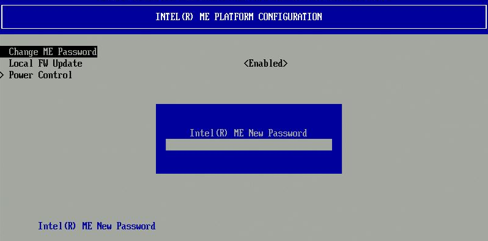
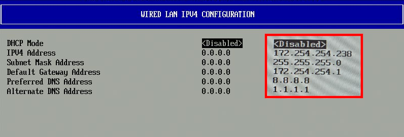
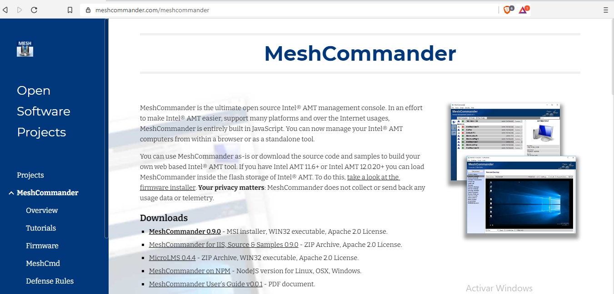
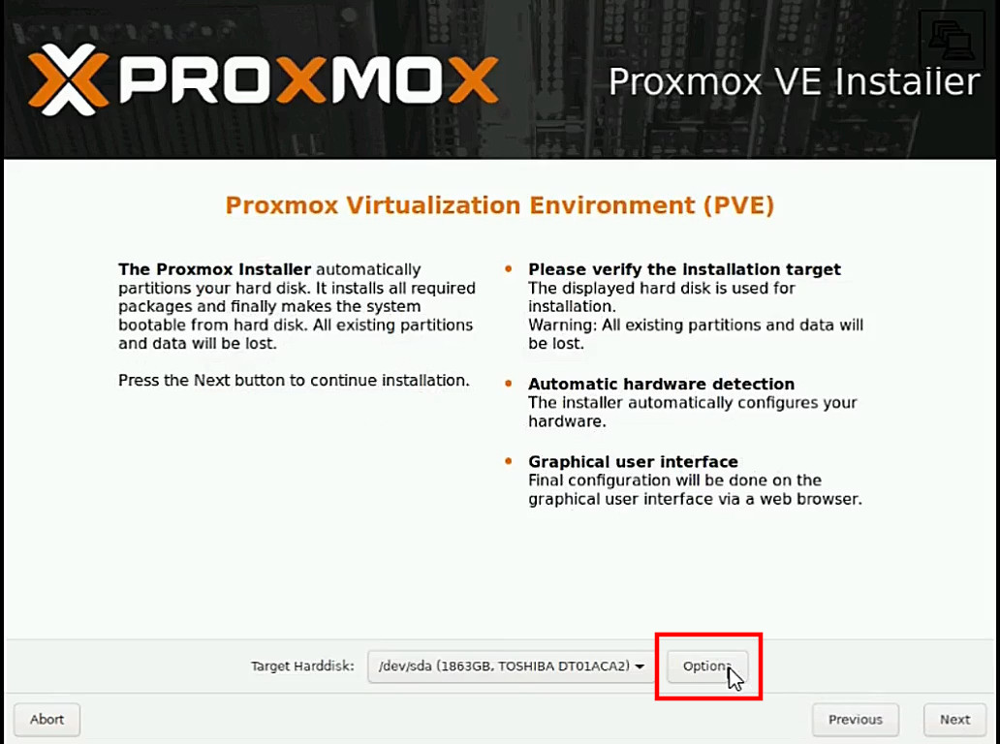
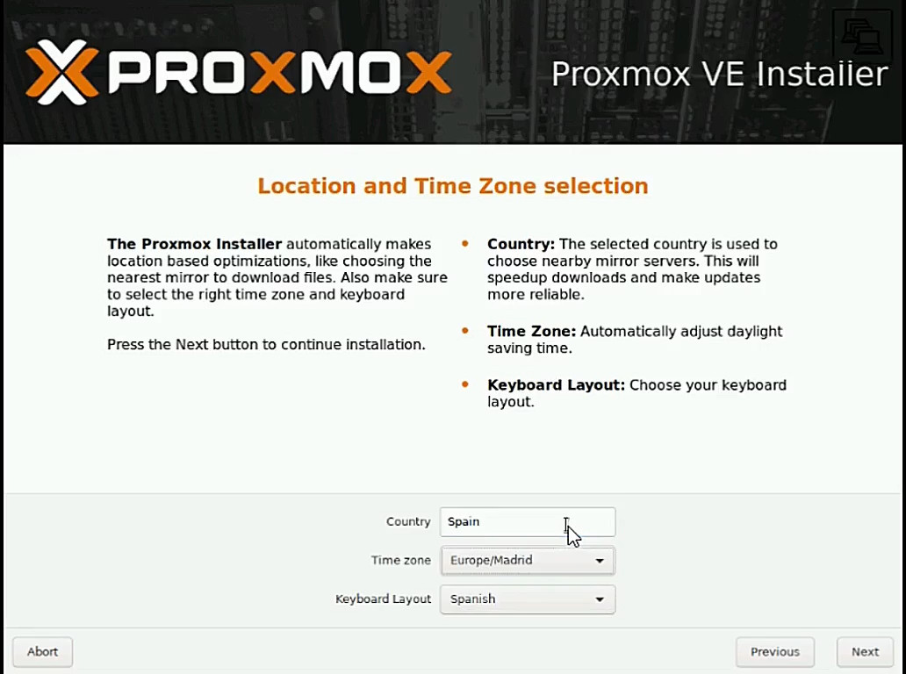

---
title: "INSTALACIÓN DE PROXMOX"
author: [Alfredo Rafael Vicente Boix y Javier Estellés Dasi]
dato: "2020-11-25"
subject: "Proxmox"
keywords: [Proxmox, Instalación]
subtitle: "Primer paso para instalar el modelo de aula LliureX"
lang: "can"
page-background: "background10.pdf"
titlepage: true,
titlepage-rule-color: "360049"
titlepage-background: "background10.pdf"
colorlinks: true
header-includes:
- |
  ```{=latex}
  \usepackage{awesomebox}
  ```
pandoc-latex-environment:
  noteblock: [noto]
  tipblock: [tip]
  warningblock: [warning]
  cautionblock: [caution]
  importantblock: [importando]
...

<!-- \awesomebox[violet]{2pt}{\faRocket}{violet}{Lorem ipsum…} -->

# Introducción

En esta unidad trataremos la instalación de Proxmox. Pero al primer capítulo veremos como nos puede resultar útil la herramienta [meshcomander](https://www.meshcommander.com/meshcommander).


Es importante tener claro los siguientes conceptos antes de empezar la instalación.

* **AMT** funciona como un sistema independiente, por lo tanto tendrá su propia ip.
* Los apoyos físicos cada vez se utilizan menos. Recuerda cuando fue última vez que utilizaste un CD-ROM.
* Vamos a hacer una instalación de proxmox. No es necesario tener acceso a la consola de Proxmox en ningún momento, por lo tanto si ya tenso lo hipervisor montado al rack, no lo desmontas.
* Las IPs utilizadas no corresponden con las indicadas al que recomienda lo SAI. Es la tarea que se os mandará!


\newpage

# Puesta a punto del servidor

Para posar a punto el servidor, es recomendable, aunque no imprescindible habilitar lo AMT, para posteriormente utilizar la herramienta meshcomander para hacer una instalación remota.

## Habilitar AMT de Intel

Los servidores distribuidos en los centros disponen de la herramienta AMT de Intel para poder conectarse remotamente, no solo nos permitirá arrancar lo hipervisor sino que también nos permitirá configurar ciertas funcionalidades básicas. Pero antes de que nada, habrá que entrar a la BIOS.
Para acceder a la BIOS (Modelo SEH1) polsem F2  lo setup del ordenador.


\newpage

Una vez dentro vayamos a la pestaña *Advanced*.


\newpage

Y seleccionamos *AMT Configuration*.


\newpage

Cambiamos *MEBx Modo* y seleccionamos la opción Entero MEBx Setup


\newpage

Finalmente salvamos los parámetros y reiniciamos.


## Configuración del AMT

Una vez hemos habilitado lo AMT, entramos en la configuración del mismo y configuramos los siguientes parámetros.

::: tip
**Info**: Por obvios motivos de seguridad no se permite entrar a la configuración del AMT por VNC, por el que algunas de las siguientes imágenes están fotografiadas de la pantalla.
:::

Cuando entran a la herramienta de configuración del AMT, tenemos que logar-noes. La contraseña de administrador es **admin**. Posteriormente nos pedirá que cambiemos la contraseña por una nueva.

::: warning
*Contraseña**: Tenemos que respetar la política de contraseñas, con mayúscula, minúscula y carácter especial.
:::




Tenemos que acceder a las siguientes opciones para hacer una configuración básica.

| Opción | Funcionalidad |
| -- | -- |
| **User Consiente** | Conectarnos al servidor por VNC sin permiso |
| **Network Setup** | Para configurar las opciones de red |
| **Activate Network Access** | Para poder acceder a lo hipervisor |


Dentro de la opción de **User Contento** tenemos que cambiar la opción señalada a *NONE*.


Para configurar la red vayamos a la opción de Network Setup. 


Después vamos a **TCP/IP Settings*


Y configuramos la AMT según los siguientes parámetros

::: caution
*Ten cuidado**: La dirección de lo AMT es diferente a la dirección de lo hipervisor. Además tienes que tener en cuenta que lo AMT no tiene lo ICMP actividad, por el que si haces uno *ping* no te dará respuesta.
:::

Los parámetros que muestramos son unos parámetros de ejemplo que vayamos a utilizar dentro de nuestro banco de pruebas.

| Opción | IP |
| -- | -- |
| IP | 172.x.y.2 – 172.x.y.254 |
| Máscara | 255.255.255.0 |
| Puerta de Enlace | 172.x.y.1 |
| DNS | 172.27.111.5 y 172.27.111.6 |



::: importante
*Acceso**: Una vez ya tengas funcionando lo AMT, podrás acceder a través del navegador con la dirección http://172.x.y.238:16992 ó https://172.x.y.238:16993. Tendrás que cambiar la dirección según la que hayas escogido.
:::

# Meshcomander

> En este punto tenemos que tener en cuenta que tenemos que utilizar Windows. Si alguien conoce algún software que permita servir una imagen .iso a través de IDE-R  LliureX sería muy interesante que lo comentara a los foros.

Lo AMT nos permitirá tener el servidor montado dentro del rack principal sin necesidad de tener ni un monitor ni un teclado conectado. A pesar de que se una herramienta tremendamente útil. Esta no está disponible para ninguna distribución de linux, o al menos, no una versión que dispone de todas las funcionalidades que nos ofrece AMT de Intel como lo IDE-R.

::: noto
**Info**: IDE Redirect (IDE-R) permite montar una imagen ISO remotamente desde un cliente. Esta opción es muy interesante puesto que evita que necesariamente estemos físicamente presentes a de instalar o reinstalar lo Proxmox. Podéis encontrar más información [aquí](https://software.intel.com/content/www/us/en/develop/blogs/meshcommander-javascript-ider.html).
:::

Tenemos que descargar el software de su [página web](https://www.meshcommander.com/meshcommander) y hacer la instalación.



::: caution
*Ten cuidado**: Recuerda que tienes que estar en la misma red que lo hipervisor (la red de Aulas en nuestro caso). Lo hipervisor no tiene el porqué de estar encendido para poder acceder.
:::

Una vez instalado y funcionando lo mesh comander veremos una cosa como la siguiente.


Haremos click sobre *Add computer...* Y configuraremos el servidor con los parámetros del AMT que hemos configurado previamente. Podemos acceder de dos maneras:

* Con TLS, por el que utilizaremos el puerto *16993*
* Sin seguridad, utilizaremos el puerto *16992*


Una vez configurado el servidor veremos la pantalla de la siguiente manera. Ya solo  hace falta, dar a **connect** y podremos acceder a la configuración de nuestro servidor de manera remota.


Si has escogido la conexión con TLS, probablemente te aparecerá una advertencia.


Una vez conectado veremos la siguiente pantalla. No vayamos a parar a explicar todas las funcionalidades que dispones, sino que nos centraremos en la instalación remota. Para lo cual hay que ir a Serial-over-LAN.


En este punto tenemos que descargar la ISO de Proxmox desde la suya [página web](https://proxmox.com/en/downloads).


Aquí haremos click sobre la opción **IDER** y seleccionaremos la imagen descargada.


Una vez seleccionada la opción de Proxmox iremos  **Remote Desktop** y seleccionaremos la opción de **Power Actions**. Allí, tenemos que escoger la opción de *Power donde tono IDE-R CDROM*. Veremos que lo hipervisor se reinicia y empezará la instalación.


Finalmente veremos como empieza la instalación de Proxmox.


:::importando
Es altamente recomendable tener una conexión al menos de 1Gb, puesto que sino la instalación se puede hacer muy pesada y pueden aparecer errores de *timeout*.
:::

# Instalación de Proxmox

Para instalar Proxmox podemos utilizar la opción explicada. Es la más recomendable si ya tenso el servidor montado al rack. De todas maneras, también se puede instalar con una memoria usb.


## Creación de usb de arrancada de proxmox

Para hacer la instalación de la iso de proxmox, la mejor opción es utilizar **dd**. Para detectar donde está montado lo usb podemos ejecutar antes y después lsblk y podemos ver donde se ha montado la partición.

```tcsh
lsblk
```

En nuestro ejemplo (puesto que tenemos un disco llevar m² no sata, se ha montado  sda). Por lo tanto nuestro mando sería:

```tcsh
dd if=./proxmox-viene_6.2-1.iso of=/dev/sda status=progress
```

\awesomebox[violet]{2pt}{\faUsb}{violet}{Se recomienda huir de de aquellas opciones que crean uno usb de manera gráfica. Puesto que no suelen crear bien las particiones. Utilizáis siempre dd.}

## Instalación de proxmox

Una vez tenemos creado el disco usb de arrancada e iniciamos con lo usb, o a través de IDER. Veremos la siguiente imagen. Polsem entero* y continuamos. 


Todos sabemos que es importante leerse la licencia :smirk:.


Esta es una de las partes más delicadas y depende del que vullgueu tener montado en vuestro centro, también depende de la cantidad de discos duros que tengáis instalados y de si queréis invertir dinero en una cabina de discos duros.



Si queréis dejarlo  ext4. Y utilizar un único disco para utilizar Proxmox y las máquinas virtuales no va a dar males resultados. El otro disco llevar lo podéis utilizar para hacer copias de seguridad.

:::info
Proxmox utiliza ZFS que es una combinación de administrador de volúmenes y sistema de ficheros.
:::


Las opciones que tenemos son las siguientes:

| Sistema | Características  |
| -- | -- |
| RAID0 | Suma capacidades de los discos. Si falla una unidad es inservible. |
| RAID1 | Dato escrito idénticamente. Mínimo 2 discos de la misma medida. |
| RAID10 | Una combinación de RAID0 y RAID1. Mínimo 4 discos. |
| RAIDZ-1 | Variación de RAID-5, paridad sola. Mínimo 3 discos. |
| RAIDZ-2 | Variación de RAID-5, paridad doble. Mínimo 4 discos. |
| RAIDZ-3 | Variación encima RAID-5, paridad triple. Mínimo 5 discos |

:::warning
Si habéis optado para adquirir una tarjeta controladora para montar lo RAID, esta opción no lo tenéis que usar. Siempre y cuando la tarjeta sea reconocida por Proxmox, se verá como un único disco. Las opciones que estamos configurando es RAID por vía software.
:::

La opción más nivelada entre todos los parámetros a tener en cuenta sería la opción de RAID1.


Configuramos la zona geográfica.



Configuramos el password y la contraseña.

:::caution
Si estás haciendo la instalación por IDER utiliza la arroba del campo de texto puesto que es posible que no la puedas escribir con Alto Gr+2.
:::


Configura la red según los parámetros de tu centro. El ejemplo dado no es el correspondiente al que deberías de utilizar.


Comprobamos que todos los parámetros que hemos configurado son los correctos y le damos a Install. Enseguida empezará la instalación que suele ser bastante rápida.


Una vez finalizada la instalación. Reiniciamos el sistema y pasaremos a la siguiente unidad. Configuración del Proxmox.


# Bibliografía y referencias

(@) https://pve.proxmox.com/wiki/zfs_on_linux
(@) https://www.meshcommander.com/meshcommander
(@) https://wiki.edu.gva.es/lliurex/tiki-index.php
(@) https://proxmox.com/en/