---
title: "INSTAL·LACIÓ DE PROXMOX"
author: [Alfredo Rafael Vicente Boix i Javier Estellés Dasi]
date: "2020-11-25"
subject: "Proxmox"
keywords: [Proxmox, Instal·lació]
subtitle: "Primer pas per a instal·lar el model de aula LliureX"
lang: "ca"
page-background: "background10.pdf"
titlepage: true,
titlepage-rule-color: "360049"
titlepage-background: "background10.pdf"
colorlinks: true
header-includes:
- |
  ```{=latex}
  \usepackage{awesomebox}
  ```
pandoc-latex-environment:
  noteblock: [note]
  tipblock: [tip]
  warningblock: [warning]
  cautionblock: [caution]
  importantblock: [important]
...

<!-- \awesomebox[violet]{2pt}{\faRocket}{violet}{Lorem ipsum…} -->

# Introducció

En aquesta unitat tractarem la instal·lació de Proxmox. Però al primer capítol veurem com ens pot resultar útil la ferramenta [meshcomander](https://www.meshcommander.com/meshcommander).


És important tenir clar els següents conceptes abans de començar la instal·lació.

* **AMT** funciona com un sistema independent, per tant tindrà la seua pròpia ip.
* Els suports físics cada vegada s'utilitzen menys. Recorda quan va ser última vegada que utilitzares un CD-ROM.
* Anem a fer una instal·lació de proxmox. No és necessari tenir accés a la consola de Proxmox en cap moment, per tant si ja tens l'hipervisor muntat al rack, no el desmuntes.
* Les IPs utilitzades no corresponen amb les indicades al que recomana el SAI. És la tasca que se vos manarà!

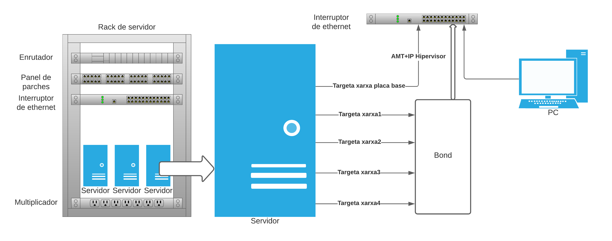

\newpage

# Posada a punt del servidor

Per a posar a punt el servidor, és recomanable, encara que no imprescindible habilitar el AMT, per a posteriorment utilitzar la ferramenta meshcomander per a fer una instal·lació remota.

## Habilitar AMT de Intel

Els servidors distribuïts als centres disposen de la ferramenta AMT de Intel per a poder connectar-se remotament, no sols ens permetrà arrancar l'hipervisor sinó que també ens permetrà configurar certes funcionalitats bàsiques. Però abans que res, caldrà entrar a la BIOS.
Per a accedir a la BIOS (Model SEH1) polsem F2 en el setup de l'ordinador.


\newpage

Una vegada dins anem a la pestanya *Advanced*.

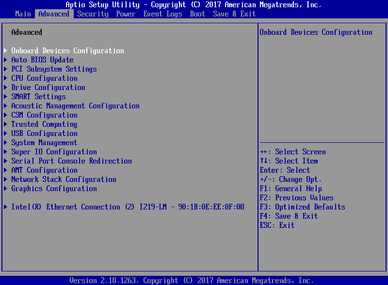

\newpage

I seleccionem *AMT Configuration*.

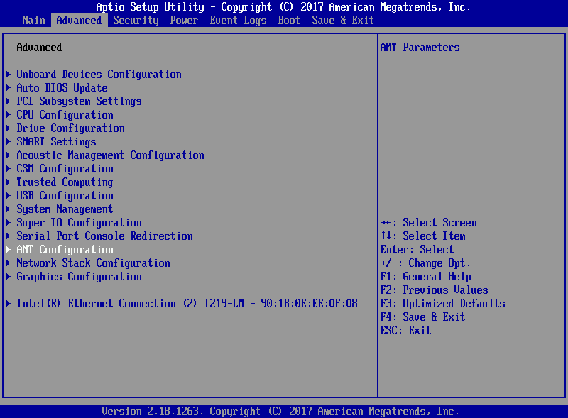

\newpage

Canviem *MEBx Mode* i seleccionem l'opció Enter MEBx Setup

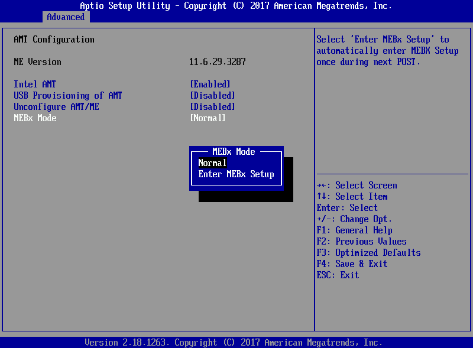

\newpage

Finalment salvem els paràmetres i reiniciem.

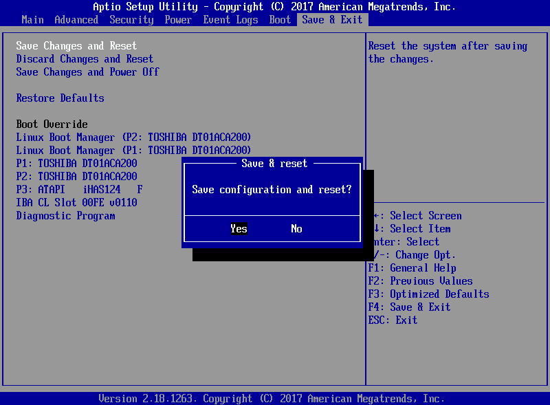

## Configuració del AMT

Una vegada hem habilitat el AMT, entrem en la configuració del mateix i configurem els següents paràmetres.

::: tip
**Info**: Per obvis motius de seguretat no es permet entrar a la configuració del AMT per VNC, pel que algunes de les següents imatges están fotografiades de la pantalla.
:::

Quan entren a la ferramenta de configuració del AMT, hem de logar-nos. La contrasenya d'administrador és **admin**. Posteriorment ens demanarà que canviem la contrasenya per una nova.

::: warning
**Contrasenya**: Hem de respectar la política de contrasenyes, amb majúscula, minúscula i caràcter especial.
:::

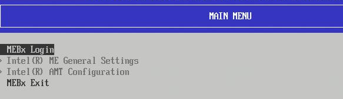

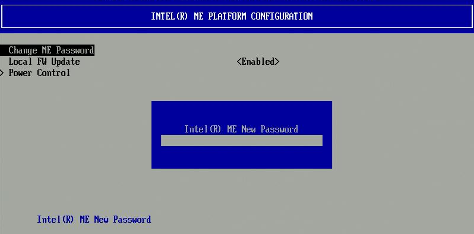

Hem d'accedir a les següents opcions per a fer una configuració bàsica.

| Opció | Funcionalitat |
| -- | -- |
| **User Consent** | Ens permetrà poder connectar-nos al servidor per VNC sense donar permís |
| **Network Setup** | Per a configurar les opcions de xarxa |
| **Activate Network Access** | Hem de fer click sobre aquesta opció per a poder accedir a l'hipervisor |

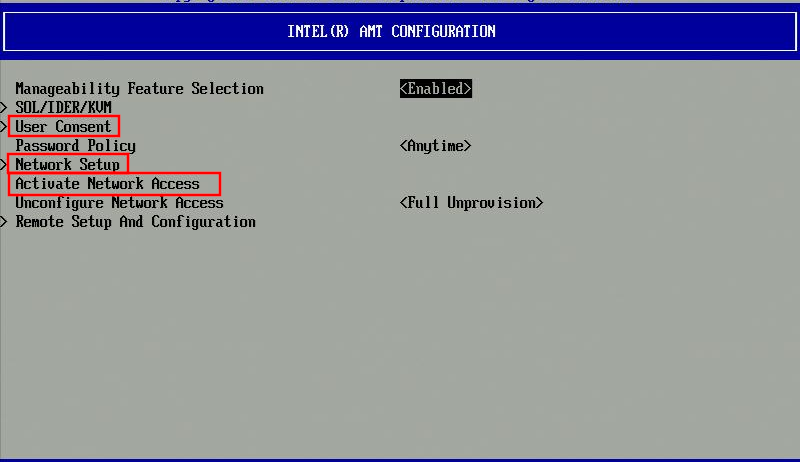

Dins de la opció de **User Content** hem de canviar l'opció assenyalada a *NONE*.

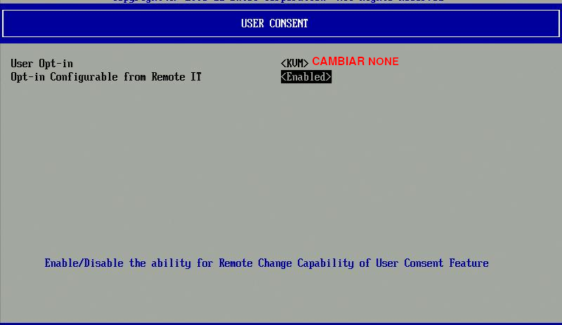

Per a configurar la xarxa anem a l'opció de Network Setup. 

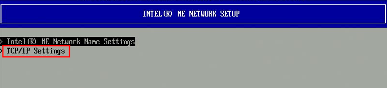

Després anem a **TCP/IP Settings**

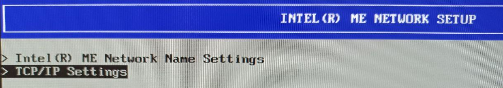

I configurem la AMT segons els següents paràmetres

::: caution
**Vés amb compte**: L'adreça de l'AMT és diferent a l'adreça de l'hipervisor. A més has de tenir en compte que el AMT no té el ICMP activitat, pel que si fas un *ping* no et donarà resposta.
:::

Els paràmetres que mostrem són uns paràmetres d'exemple que anem a utilitzar dins del nostre banc de proves.

| Opció | IP |
| -- | -- |
| IP | 172.x.y.2 – 172.x.y.254 |
| Máscara | 255.255.255.0 |
| Puerta de Enlace | 172.x.y.1 |
| DNS | 172.27.111.5 y 172.27.111.6 |

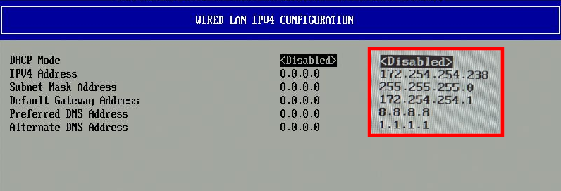

::: important
**Accés**: Una vegada ja tingues funcionant el AMT, podràs accedir a través del navegador amb l'adreça http://172.x.y.238:16992 ó https://172.x.y.238:16993. Hauràs de canviar l'adreça segons la que hages escollit.
:::

# Meshcomander

> En aquest punt hem de tenir en compte que hem d'utilitzar Windows. Si algú coneix algun programari que permeta servir una imatge .iso a través de IDE-R en LliureX seria molt interessant que ho comentara als fòrums.

El AMT ens permetrà tenir el servidor muntat dins del rack principal sense necessitat de tenir ni un monitor ni un teclat connectat. Tot i que es una ferramenta tremendament útil. Aquesta no està disponible per a cap distribució de linux, o al menys, no una versió que disposa de totes les funcionalitats que ens oferix AMT de Intel com el IDE-R.

::: note
**Info**: IDE Redirect (IDE-R) permet muntar una imatge ISO remotament des d'un client. Aquesta opció és molt interessant ja que evita que necessàriament estiguem físicament presents a d'instal·lar o reinstal·lar el Proxmox. Podeu trobar més informació [ací](https://software.intel.com/content/www/us/en/develop/blogs/meshcommander-javascript-ider.html).
:::

Hem de descarregar el programari de la seua [pàgina web](https://www.meshcommander.com/meshcommander) i fer la instal·lació.

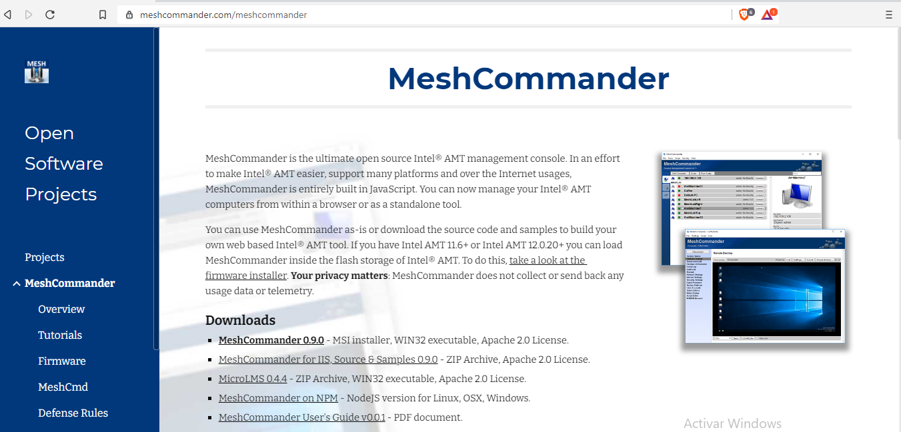

::: caution
**Vés amb compte**: Recorda que has d'estar a la mateixa xarxa que l'hipervisor (la xarxa d'Aules en el nostre cas). L'hipervisor no té el perquè d'estar encés per a poder accedir.
:::

Una vegada instal·lat i funcionant el mesh comander veurem una cosa com la següent.

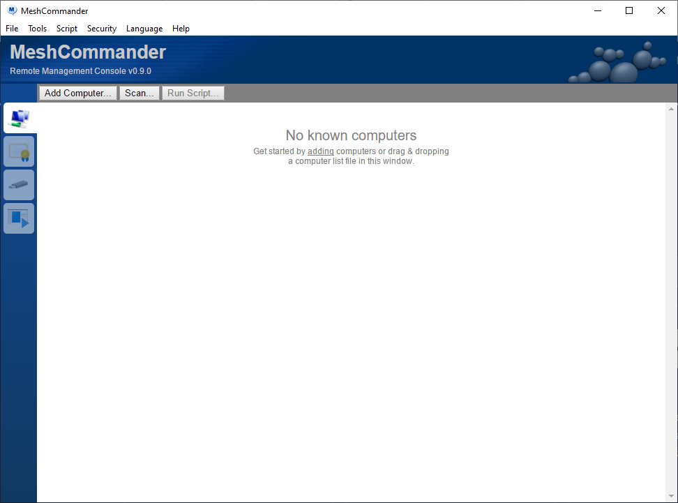

Farem click sobre *Add computer...* I configurarem el servidor amb els paràmetres del AMT que hem configurat prèviament. Podem accedir de dues maneres:

* Amb TLS, pel que utilitzarem el port **16993**
* Sense seguretat, utilitzarem el port **16992**


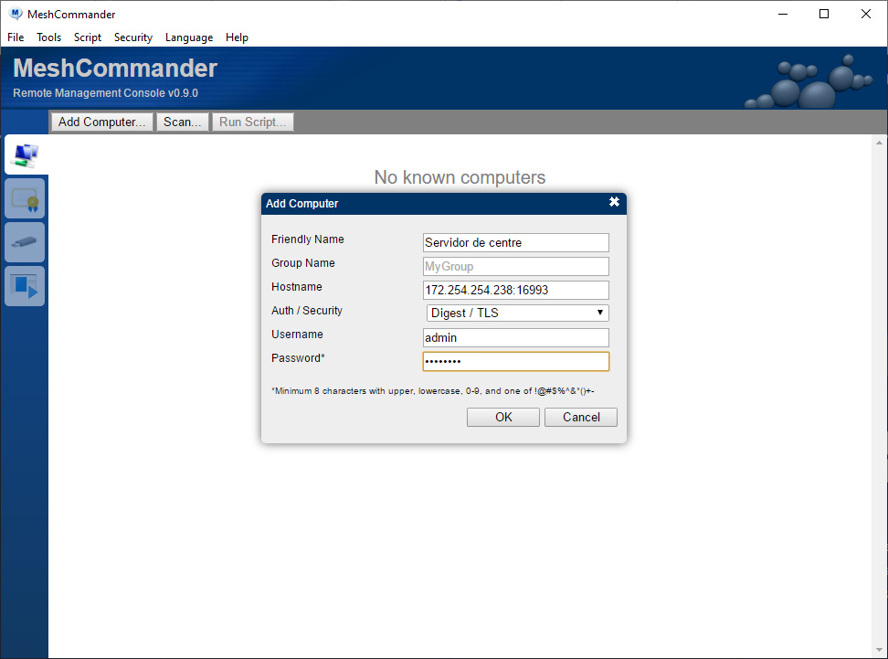

Una vegada configurat el servidor veurem la pantalla de la següent manera. Ja només en cal, donar a **connect** i podrem accedir a la configuració del nostre servidor de manera remota.

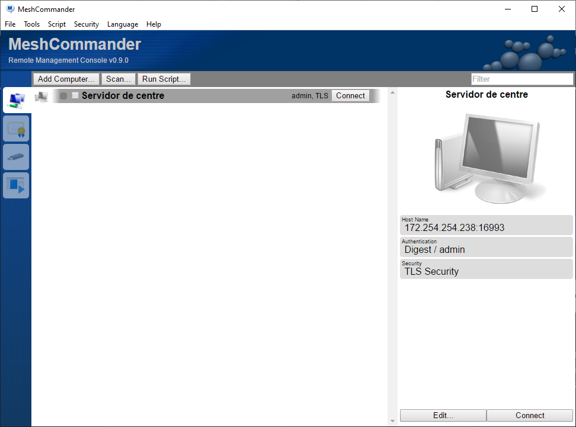

Si has escollit la connexió amb TLS, probablement t'apareixerà una advertència.

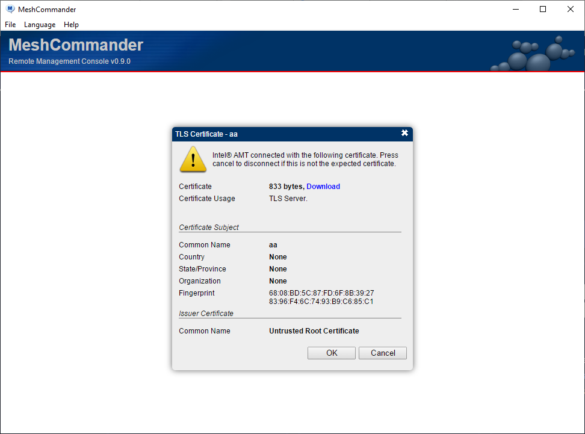

Una vegada connectat veurem la següent pantalla. No anem a parar a explicar totes les funcionalitats que disposes, sinó que ens centrarem en la instal·lació remota. Per a això cal anar a Serial-over-LAN.

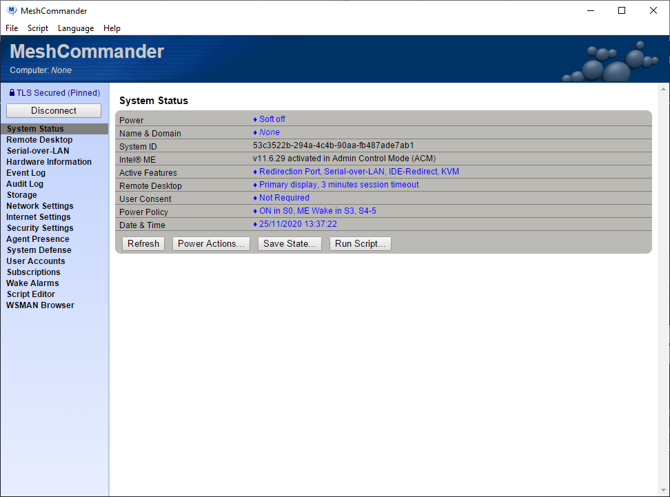

En aquest punt hem de descarregar la ISO de Proxmox desde la seua [pàgina web](https://proxmox.com/en/downloads).

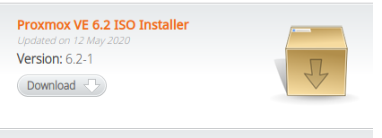

Aquí farem click sobre l'opció **IDER** i seleccionarem la imatge descarregada.

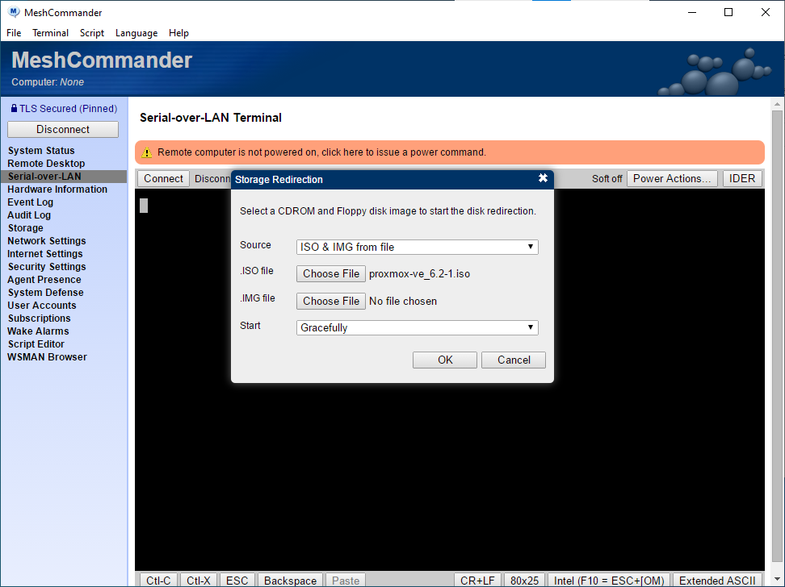

Una vegada seleccionada l'opció de Proxmox anirem  **Remote Desktop** i seleccionarem l'opció de **Power Actions**. Allí, hem d'escollir l'opció de *Power on to IDE-R CDROM*. Veurem que l'hipervisor es reinicia i començarà la instal·lació.

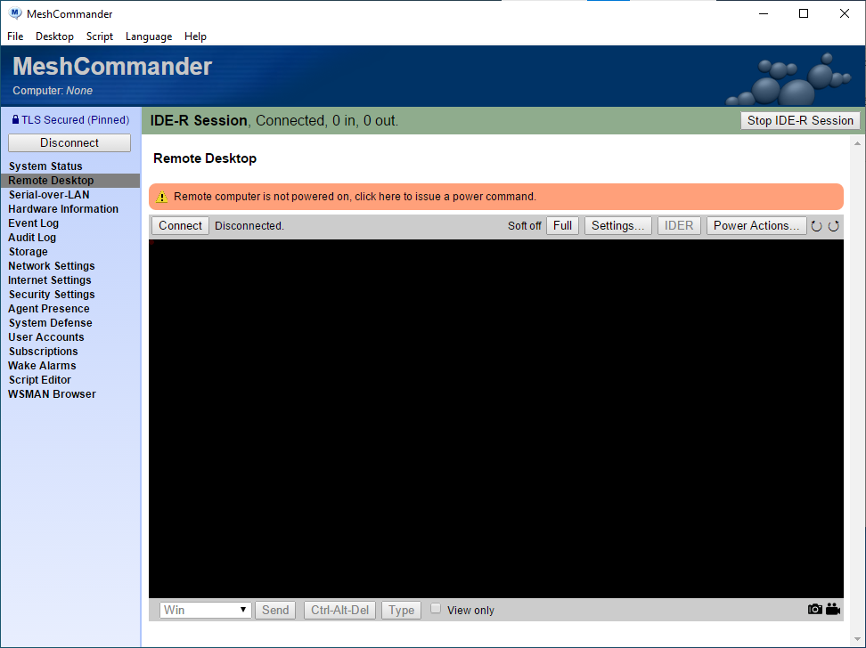


Finalment veurem com comença la instal·lació de Proxmox.

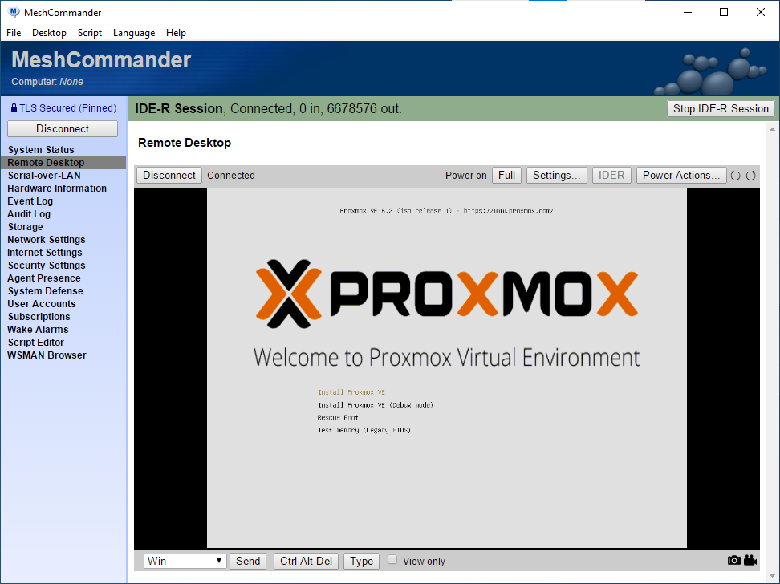

:::important
És altament recomanable tenir una connexió al menys de 1Gb, ja que sinó la instal·lació es pot fer molt pesada i poden aparèixer errades de *timeout*.
:::

# Instal·lació de Proxmox

Per a instal·lar Proxmox podem utilitzar l'opció explicada. És la més recomanable si ja tens el servidor muntat al rack. De tota manera, també es pot instal·lar amb una memòria usb.


## Creació de usb d'arrancada de proxmox

Per a fer la instal·lació de la iso de proxmox, la millor opció és utilitzar **dd**. Per a detectar on està muntat el usb podem executar abans i després lsblk i podem veure on s'ha muntat la partició.

```tcsh
lsblk
```

En el nostre exemple (ja que tenim un disc dur m2 no sata, s'ha muntat en sda). Per tant el nostre comandament seria:

```tcsh
dd if=./proxmox-ve_6.2-1.iso of=/dev/sda status=progress
```

\awesomebox[violet]{2pt}{\faUsb}{violet}{Es recomana fugir de d'aquelles opcions que creen un usb de manera gràfica. Ja que no solen crear bé les particions. Utilitzeu sempre dd.}

## Instal·lació de proxmox

Una vegada tenim creat el disc usb d'arrancada i iniciem amb l'usb, o a través de IDER. Veurem la següent imatge. Polsem *enter* i continuem. 

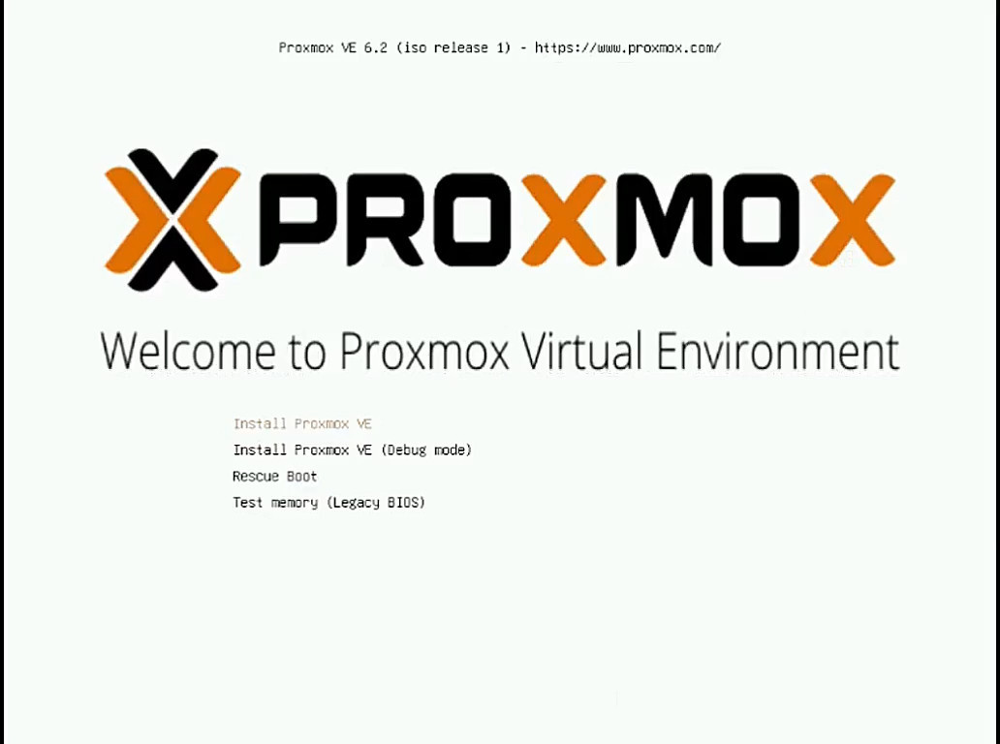

Tots sabem que és important llegir-se la llicència :smirk:.

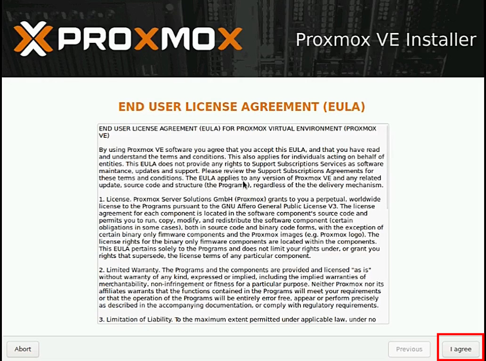

Aquesta és una de les parts més delicades i depèn del que vullgueu tenir muntat al vostre centre, també depèn de la quantitat de discs durs que tingueu instal·lats i de si voleu invertir diners en una cabina de discs durs.

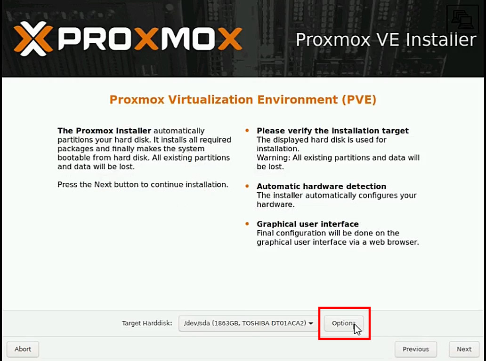

Si voleu deixar-ho en ext4. I utilitzar un únic disc per a utilitzar Proxmox i les màquines virtuals no va a donar mals resultats. L'altre disc dur el podeu utilitzar per a fer còpies de seguretat.

:::info
Proxmox utilitza ZFS que és una combinació d'administrador de volums i sistema de fitxers.
:::

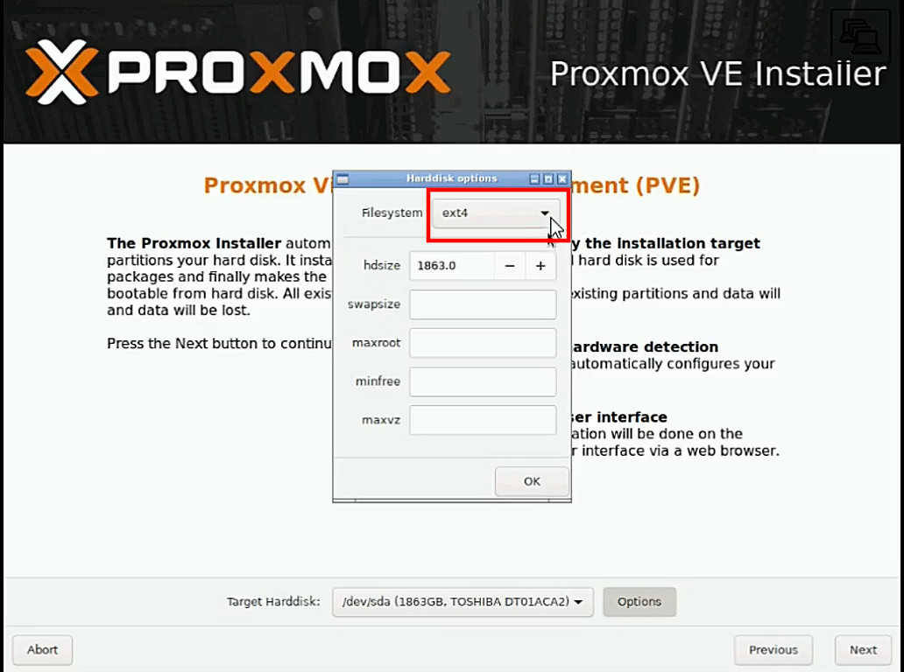

Les opcions que tenim són les següents:

| Sistema | Característiques  |
| -- | -- |
| RAID0 | La capacitat de tal volum és la suma de les capacitats dels discos. La fallada d'una unitat fa el volum inservible. |
| RAID1 | La dada és escrita idènticament a tots els discos. Aquest mode requereix com a mínim 2 discos amb la mateixa mida. |
| RAID10 | Una combinació de RAID0 i RAID1. Requereix com a mínim 4 discos. |
| RAIDZ-1 | Una variació de RAID-5, paritat sola. Requereix com a mínim 3 discos. |
| RAIDZ-2 | Una variació de RAID-5, paritat doble. Requereix com a mínim 4 discos. |
| RAIDZ-3 | Una variació damunt RAID-5, paritat triple. Requereix com a mínim 5 discos |

:::warning
Si heu optat per adquirir una targeta controladora per a muntar el RAID, aquesta opció no l'heu de fer servir. Sempre i quan la targeta siga reconeguda per Proxmox, es veurà com un únic disc. Les opcions que estem configurant és RAID per via software.
:::

L'opció més anivellada entre tots els paràmetres a tenir en compte seria l'opció de RAID1.

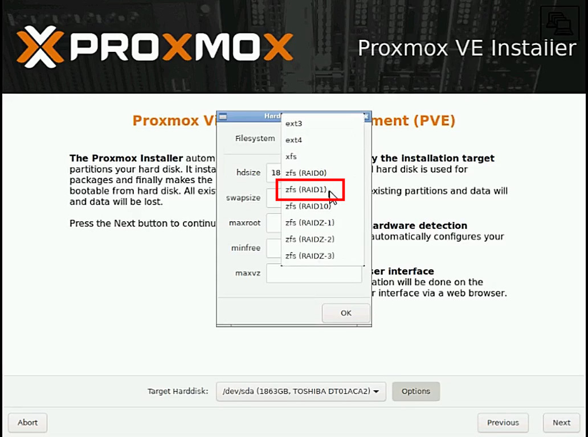

Configurem la zona geogràfica.

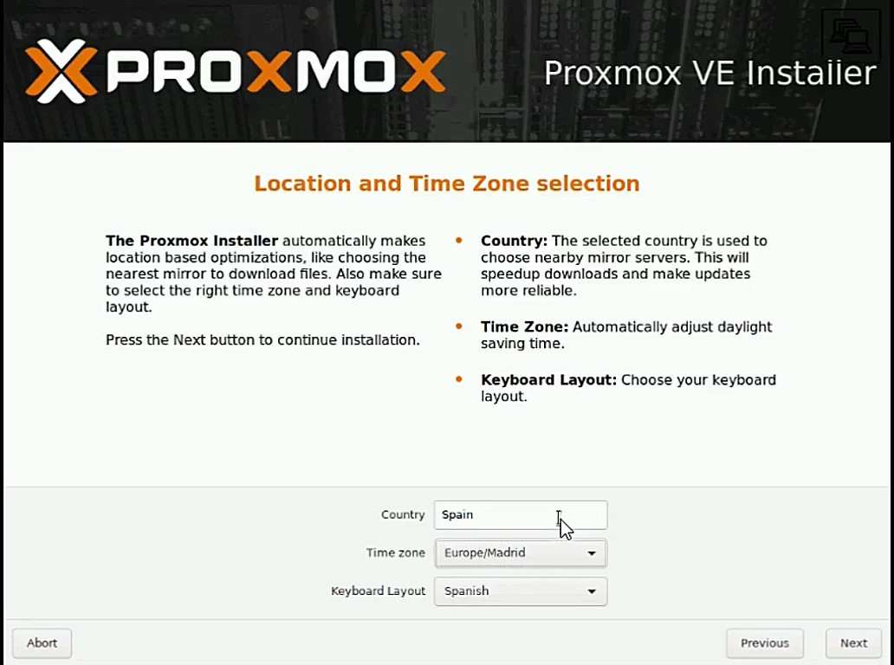

Configurem el password i la contrasenya.

:::caution
Si estàs fent la instal·lació per IDER utilitza la arroba del camp de text ja que és possible que no la pugues escriure amb Alt Gr+2.
:::

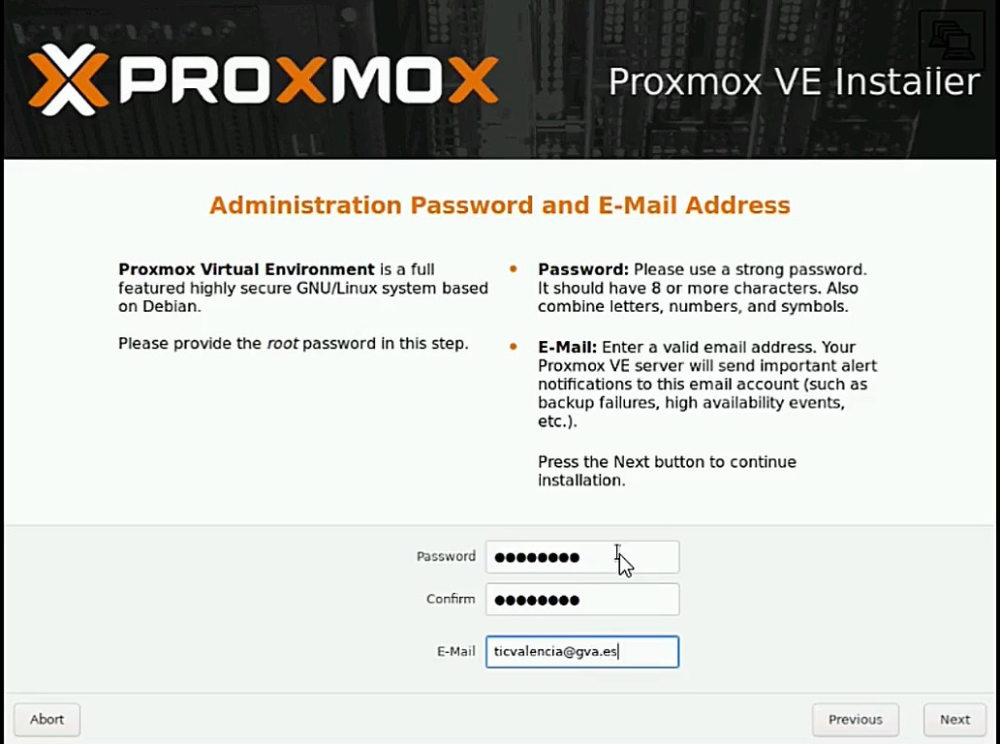

Configura la xarxa segons els paràmetres del teu centre. L'exemple donat no és el corresponent al que deuries utilitzar.


Comprovem que tots els paràmetres que hem configurat són els correctes i li donem a Install. De seguida començarà la instal·lació que sol ser bastant ràpida.

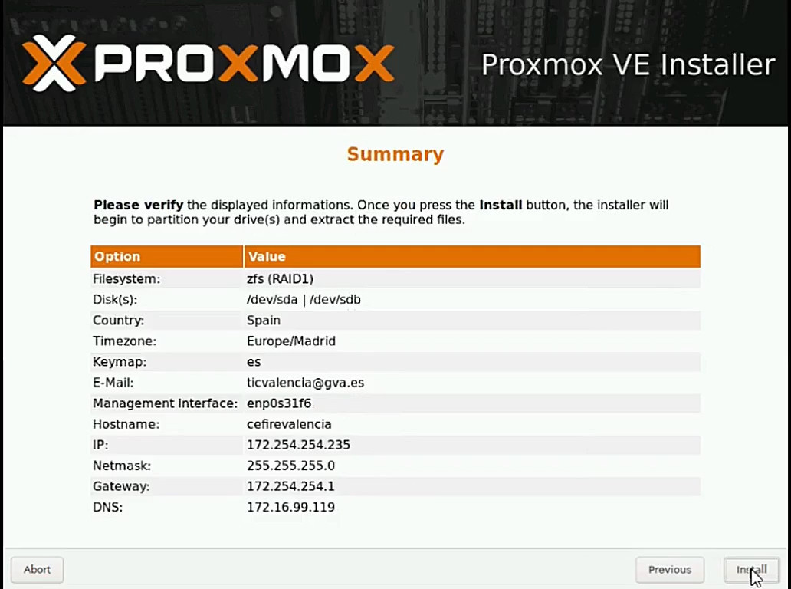

Una vegada finalitzada la instal·lació. Reiniciem el sistema i passarem a la següent unitat. Configuració del Proxmox.


# Bibliografia i referències

(@) https://pve.proxmox.com/wiki/ZFS_on_Linux
(@) https://www.meshcommander.com/meshcommander
(@) https://wiki.edu.gva.es/lliurex/tiki-index.php
(@) https://proxmox.com/en/


