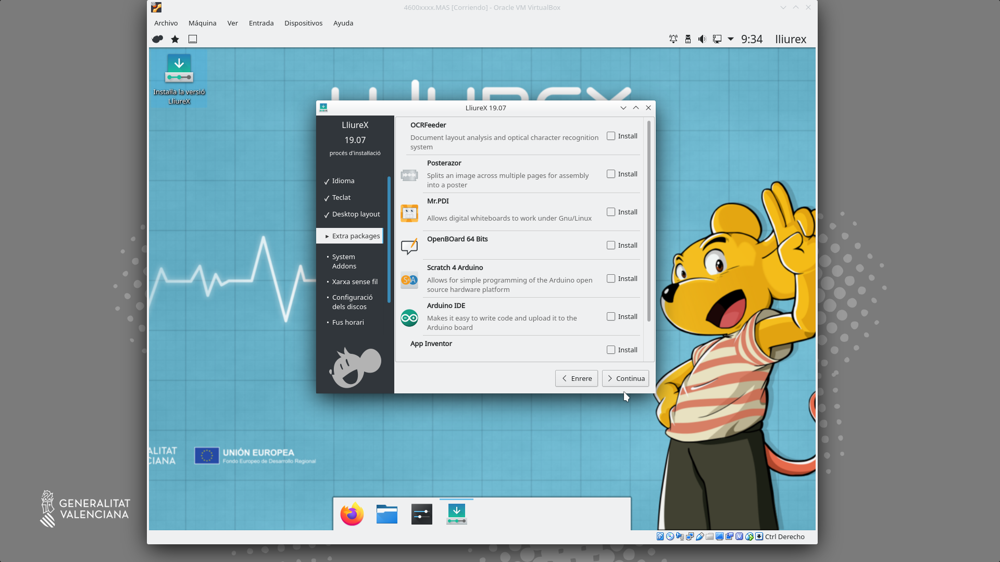
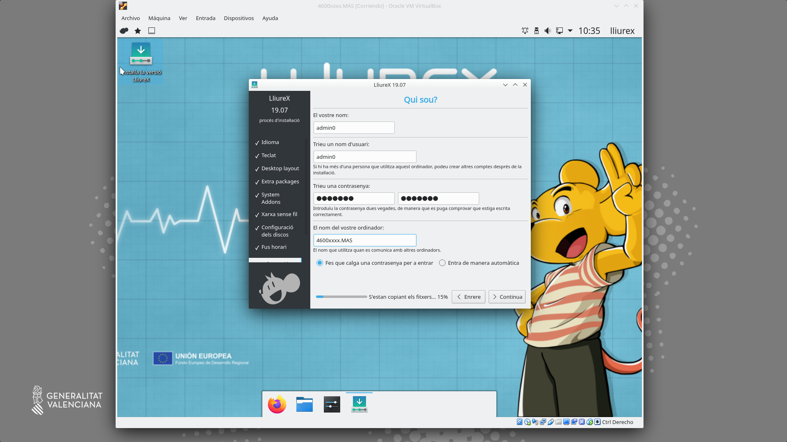
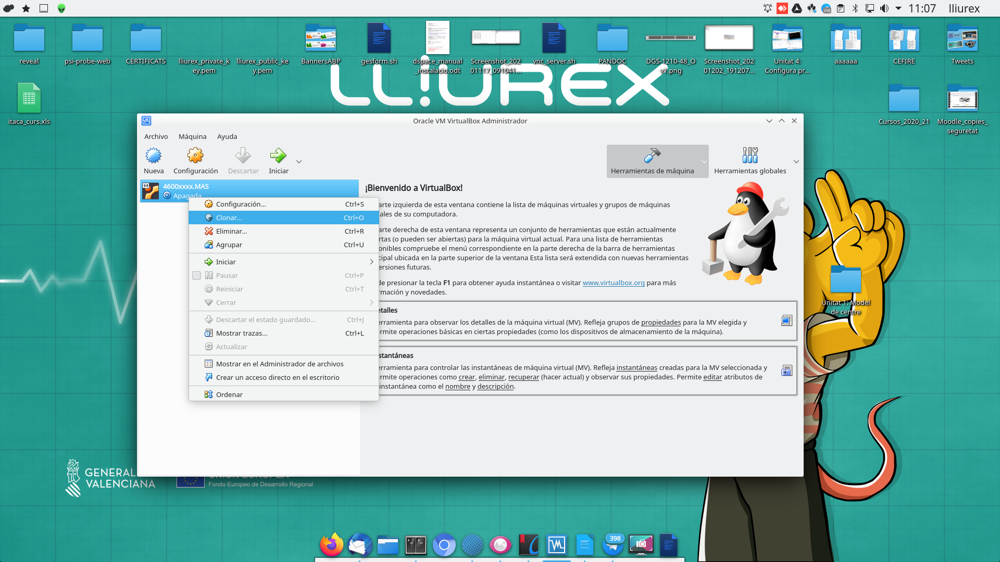
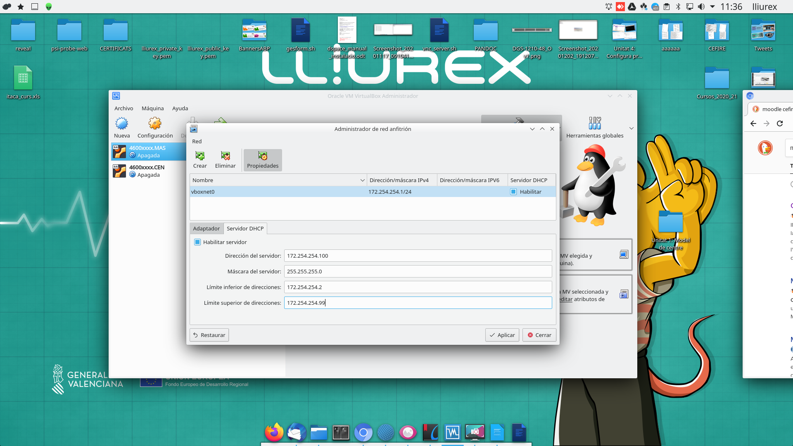
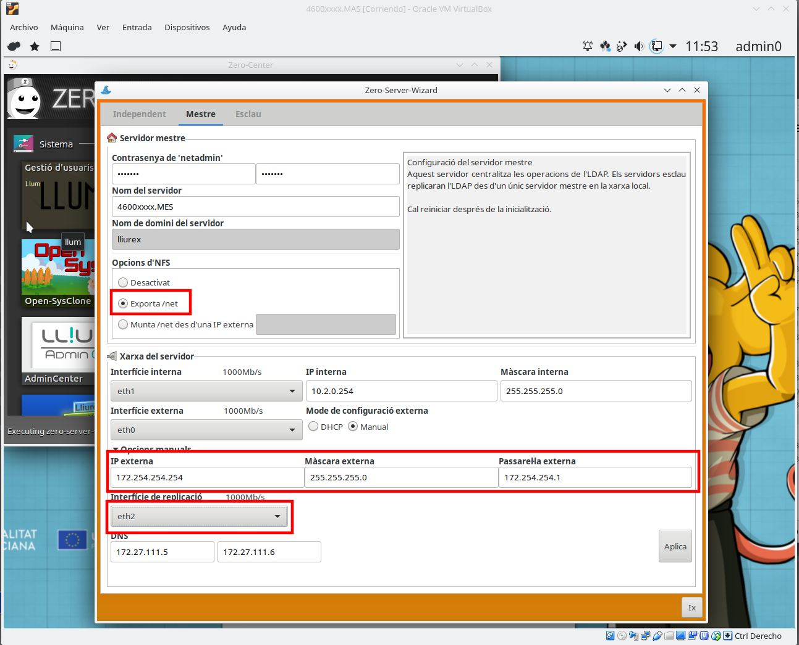
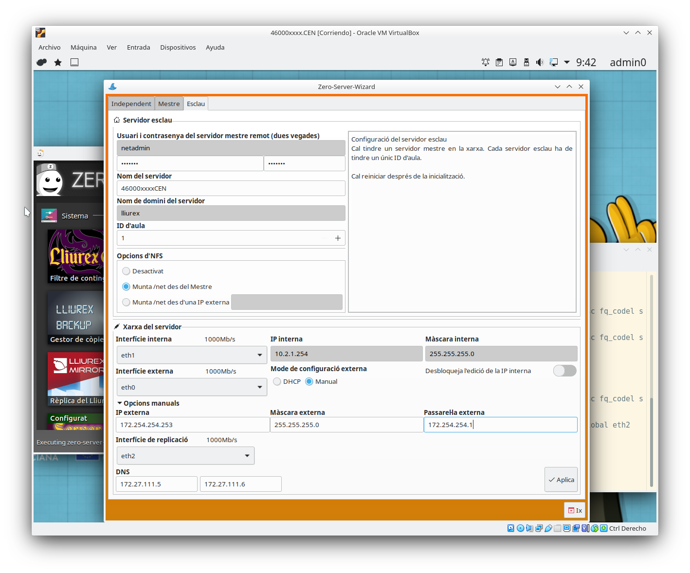
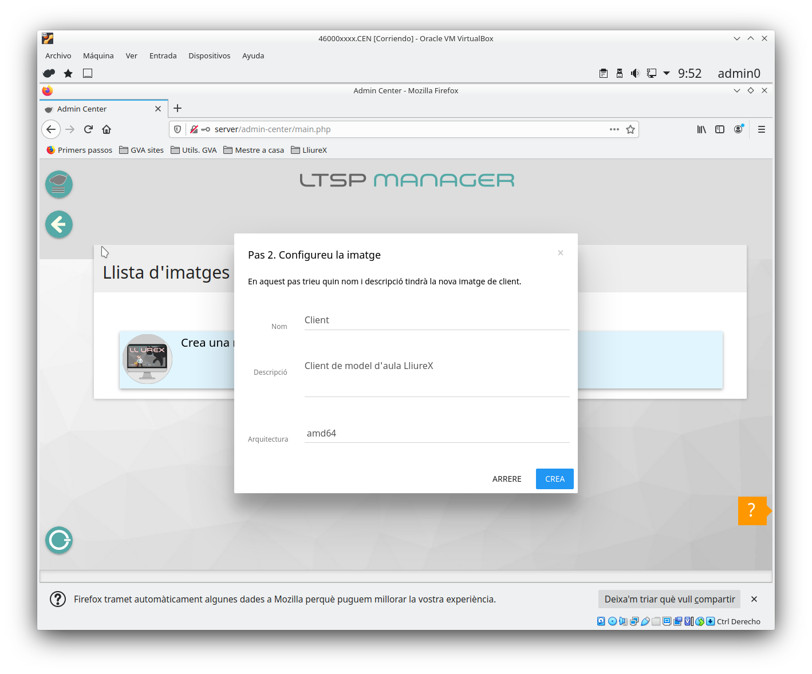
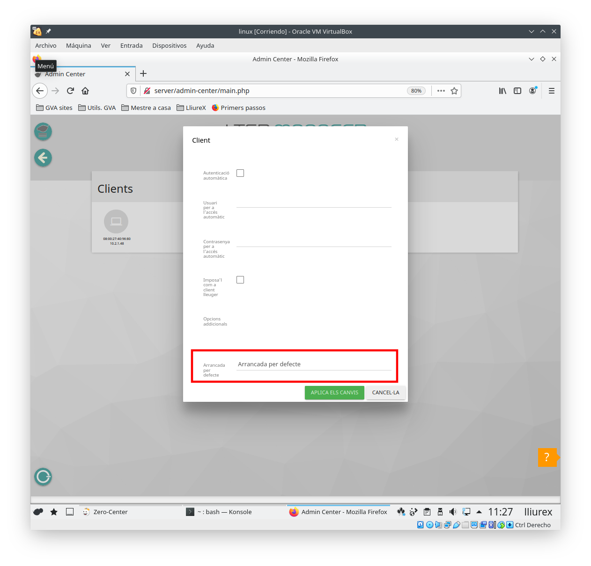
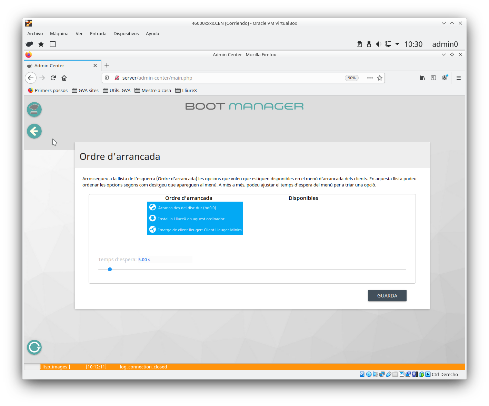

---
title: "CONFIGURACIÓ DE XARXA"
author: [Alfredo Rafael Vicente Boix i Javier Estellés Dasi]
date: "2020-11-25"
subject: "Proxmox"
keywords: [Xarxa, Instal·lació]
subtitle: "Exemple d'esquema de xarxa en el model de centre"
lang: "es"
page-background: "background10.pdf"
titlepage: true,
titlepage-rule-color: "360049"
titlepage-background: "background10.pdf"
colorlinks: true
header-includes:
- |
  ```{=latex}
  \usepackage{awesomebox}
  \usepackage{caption}
  \usepackage{array}
  \usepackage{tabularx}
  \usepackage{ragged2e}
  \usepackage{multirow}


  ```
pandoc-latex-environment:
  noteblock: [note]
  tipblock: [tip]
  warningblock: [warning]
  cautionblock: [caution]
  importantblock: [important]
...

<!-- \awesomebox[violet]{2pt}{\faRocket}{violet}{Lorem ipsum…} -->

# Introducció

En aquesta unitat veurem com muntar el model de centre virtualitzat. Això ens servirà per a entendre com funciona el model de centre de LliureX, què és un servidor mestre.

# Model de centre

El model de centre es un configuració que combina xarxa i servidors per a donar uns serveis a tots els ordinadors dins del centre. Entre altres coses el model de centre pot donar els següents serveis de xarxa:

- Pàgines web internet del centres
- Jitsi per a reunions a la intranet
- Moodle per a sessions internes
- Videoconferències
- LDAP per a autentificar-se els usuaris a qualsevol ordinador del centre
- Carpetes compartides a tot el centre
- Mirror compartit per tots els servidors
- Servidor d'imatges per a clients lleugers
- Nextcloud per a compartir fitxers a la intranet
- DHCP per a cada aula

A banda de totes aquestes característiques, LliureX presenta nombroses ferramentes que faciliten la instal·lació i configuració del programari.

Però el principal avantatge de tot és que LliureX permet configurar-ho tot sense tocar la terminal i sense tenir coneixements avançats d'informàtica. La posada a punt del model de centre és ràpida i senzilla.
Per entendre millor el model de centre parlarem de cada element per separat.

# Sabors de LliureX

LliureX es presenta en varios sabors i cadascú té les seues característiques diferenciades. Dins del model de centre tenim dos sabors principals:

| Sabor | Característiques |
| -- | -- |
| Servidor | Porta tot els paquets per a muntar el model de centre |
| Client | És la versió que hem d'instal·lar als ordinadors que es connectaran al Servidor |
| Escriptori | Pot funcionar de manera independent, no s'integra en el model de centre |

Els sabors música, infantil, fp, etc... són una versió d'escriptori amb paquets característics de cadascuna de les especialitats.

# Servidor

El servidor de LliureX pot treballar de 3 maneres.

| Servidor | Característiques |
| -- | -- |
| Independent | El servidor treballa de manera independent |
| Mestre | Dona serveis als esclaus |
| Esclau | Pot treballar de manera independent, es sincronitza amb el mestre |

El servidor té com a mínim 2 targetes de xarxa:

- La xarxa interna: a aquesta targeta es connectarà un switch on es connectaran els clients.
- La xarxa externa: es connectarà directament a la xarxa de Aules del router (antiga macrolan).

Per a que el servidor funcione dins del model de centre cal configurar-lo i inicialitzar-lo amb el **zero-server-wizard** que vorem més avant.


## Esquema de xarxa

Un esquema bastant habitual que ens trobem als centres és el següent:


En aquest esquema ens trobem 3 servidors, on el servidor mestre guarda la base de de dades per a autentificar-se tots els usuaris (LDAP), i pot donar servei a la xarxa de professorat.

Un esquema més adient seria aquest:


Hem de tenir en compte els següent elements. Cadascun dels servidor ha de tenir com a mínim 3 targetes de xarxa:

 | Targeta | Característiques |
 | -- | -- |
 | eth0 | Targeta interna que dona DHCP a l'aula |
 | eth1 | Targeta externa que es connecta a la xarxa d'Aules |
 | eth2 | Targeta de replicació de serveis comuns |

# Instal·lació del model de centre

Anem a realitzar el muntatge d'un model de centre pas a pas amb totes les seues funcionalitats, per a tenir clar els seus conceptes. En aquesta unitat utilitzarem el programari de Virtualbox per a muntar el model de centre.

:::warning
Heu de tenir en compte que ací no parlarem de tot el programari que ve amb LliureX, com el harvester, libreoffice, programes de disseny, etc... En aquest curs ens centrarem exclusivament en el muntatge i configuració del model de centre
::: 

## Instal·lació de Lliurex

:::note
Podeu trobar l'última ISO per a descarregar [ací](http://releases.lliurex.net/isos/19.07_64bits/lliurex-servidor_64bits_19_latest.iso).
:::

Podeu instal·lar virtualbox amb:

```
sudo apt install virtualbox-dkms virtualbox virtualbox-ext-pack virtualbox-guest-additions-iso
```

Una vegada teniu instal·lat el virtualbox, l'executeu i vos apareixerà la següent pantalla:


Clickem sobre **Nueva** i seguim el següent exemple:


Ara clickem sobre configuració i name a la secció d'emmagatzemament (almacenamiento), clickem sobre "Vacío" i seleccionem la iso de LliureX 19 descarregada (des de el requadre roig)


Després anem a la secció de xarxa i seleccionem 3 adaptadors:


Després anem a pantalla i seleccionem 128Mb de memòria de vídeo.


I li donem a Iniciar:


Després fem click sobre **Instal·la versió de LliureX**





Emplenem els següents paràmetres:

| Paràmetre | Opció |
| -- | -- |
| Nom | admin0 |
| Contrasenya | Una segura, no lliurex |
| Nom de l'ordinador | 4600xxxx.MAS |



I es procedix a la instal·lació:


Podem fer click en Reinicia o apagar l'ordinador amb el menú aturar:


Una vegada tenim l'ordinador apagat podem clonar la màquina:



Li donem el nom a la màquina: 46000xxxx.CEN:


I seleccionem clonació completa:


:::warning
Tot i que ací s'explica la clonació completa. NO és recomanable fer-la, ja que després va a requerir unes tasques de manteniment en la carpeta /etc/netplan per a assegurar-te que no es dupliquen ips. Si es fa la clonació completa s'ha de tractar de fer sempre abans de inicialitzar el servidor i reiniciar les macs.
:::

L'adaptador 2 el canviem a centre en lloc de mestre:


Per a simular la xarxa del centre en virtualbox anem a fer ús de l'administrador de xarxa de virtualbox. Anema a **Archivo > Administrador de red anfitrión** i omplim els paràmetres com els de la figura (podeu utilitzar la xarxa del vostre centre)


Emularem també el DHCP del router tot i que no em fem ús:



:::warning
El router de Telefónica que tenim als centres ens proporciona DHCP i la sortida a internet, si volem emular el centre com cal, podríem instal·lar dnsmasq al nostre ordinador (el host de virtualbox). Però com es tracta només de provar coses, deixem que el virtualbox done DHCP a través de la 172.254.254.100 (encara que no és necessari ja que anem a donar adreces estàtiques). I utilitzem l'adreça 172.254.254.1 per al nostre ordinador (host), per a poder connectar-nos remotament si fos necessari.
:::

Si voleu tenir accés a internet des dels servidors de virtualbox heu de fer el següent:

```
sysctl net.ipv4.ip_forward
// Si es 0 llavors cal aplicar la següent línia
sudo sysctl -w net.ipv4.ip_forward=1

sudo iptables -t nat -A POSTROUTING -o eth0 -j MASQUERADE

sudo iptables -A FORWARD -i vboxnet0 -j ACCEPT
```

# Inicialització del servidor

Per a poder tenir el model de centre és important inicialitzar el servidor, depenent de la configuració que volem tenir hem de fer-ho d'una manera o altra.

* Si només volem un servidor d'aula, el servidor s'inicia com a **independent**. 
* Si volem tenir un servidor **mestre** on es fa l'autentificació (LDAP), el mirror, les carpetes d'usuari i tots els serveis que vullguem donar cal configurar el mestre i els servidor que es connecten a ell, com **esclaus**.

Esta última és la configuració que més ens interessa. Per a poder iniciar el servidor farem ús del programa **zero-server-wizard**. Podem iniciar-lo bés des de la terminal amb:

```
zero-server-wizard
```
:::info
El zero-center és un apartat exclusiu de lliurex on es pot trobar tot aquell programari específic de la distribució o instal·ladors de programari que bé perquè requereixen configuracions especials o bé perquè són complicats d'instal·lar, faciliten la tasca enormement.
:::

On amem al **zero-center** i busquem el zero-server-wizard:


Iniciem el zero-server-wizard


En el nostre cas, anem a iniciar aquest servidor com a mestre. Hem de tenir especial cura en incloure **exporta el /net**, per  tenir només un mirror. La **IP interna** ens interessa tenir-la controlada per a saber quin és cada servidor. I la interfície de replicació que és per on es muntarà el /net entre els servidors.



:::caution
Si estàs fent proves al virtualbox en ta casa has de tenir en compte que no estàs connectat a la xarxa d'Aules, per tant has de posar uns DNS diferents. Es poden utilitzat a mode d'exemple 1.1.1.1 i 8.8.8.8.
:::

## Inicialització del servidor esclau

Una vegada iniciem el servidor mestre, els esclaus els iniciem de la mateixa manera, però tenint en compte que la ip serà diferent i muntarem el mirror del servidor mestre.



Després de reiniciar tornem al zero-center (recorda que sempre al servidor esclau) i executem el **lliurex-mirror-redirect**.


Escrivim el nostre usuari i contrasenya. La última entrada la deixem en blanc.


I activem l'opció del lliurex-mirror-redirect. Pots anar després a la carpeta **/net/mirror** o escriure a la terminal **mount | grep mirror** per a assegurar-te que està muntat.


# Instal·lació de clients

De fa un temps Conselleria ha decidit prescindir dels clients lleuger, i ja no es realitzen compres dels mateixos. Encara que als centres hi han molts i LliureX continuarà donant suport.

## Clients lleugers

Per a utilitzar clients lleugers utilitzarem **l'admin-center** que podem trobar tan en el zero-center com en la pàgina d'inici del firefox. Al entrar a l'admin-center ens trobarem aquest menú.


Farem click sobre LliureX LTSP i veurem el menú de Gestió de Clients LTSP, farem click sobre Gestió d'Imatges de client.


 Una vegada ahí Crearem una nova imatge.
 
:::info
Pots tenir tantes imatges com vullgues. Si tens diferents models de clients lleugers, tal vegada t'interese tenir-ne varies. A més, si tens una pissarra digital, és convenient tenir una imatge per a l'ordinador en pissarra i altra per a la resta d'ordinadors.
:::


Escollim l'opció de client ja que aquesta és la que ens permet logar-nos amb LDAP del servidor del servidor mestre.




### Associar client a imatge

Podem associar la imatge d'un client per a que s'inicie sempre amb eixa imatge. Aquesta situació ens interesarà principalment a l'ordinador del professor si té una pissarra digital. Anem a Gestió de client de l'aula:


Per a poder vore els clients és necessari que s'hagen engegat al menys una vegada i siga el mateix servidor qui els haja donat una ip (Les ips s'agafan de la taula del dnsmasq).


Fas doble click sobre un ordinador (aquestos venen identificats amb la ip i la MAC). I ens apareixerà el següent menú:



A l'últim apartat podem veure un menú desplegable per a escollir la imatge amb la qual volem arrancar.

:::info
Cal actualitzat la pàgina de l'admin-center una vegada s'han detectat els clients per a que funcione la finestra de paràmetres.
:::

## Instal·lar nou programari en una imatge


## Clients pesats

Per a instal·lar clients pesats la millor opció és habilitar la instal·lació per xarxa. Per tant, anem  a LliureX Netinstall i configurem els paràmetres per a fer una instal·lació desatesa. 


Exemple d'intal·lació.


## Boot Manager

Per a escollir la imatge que s'executa per defecte podem anar al menú principal a **Boot Manager** i canviar quines opcions per defecte volem per a iniciar el servidor.



# Creació d'usuaris amb llum

Llum és al ferramenta que ens va a permetre gestionar els usuaris del nostre centre. Podem accedir al llum des del zero-center. Podem crear tots els usuaris del centre important els usuaris de Ítaca, per a fer això cal anar a la pestanya de "Centre" i escollir la entrada "Importació/Exportación" on seleccionarem l'opció Aula LliureX.


I després iniciem llum:


Una vegada hem inciat Llum anem a l'opció d'importar/exportar d'Ítaca i importem els usuaris.


