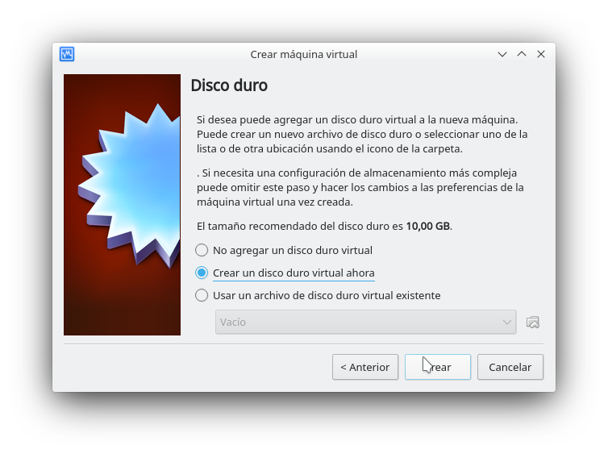
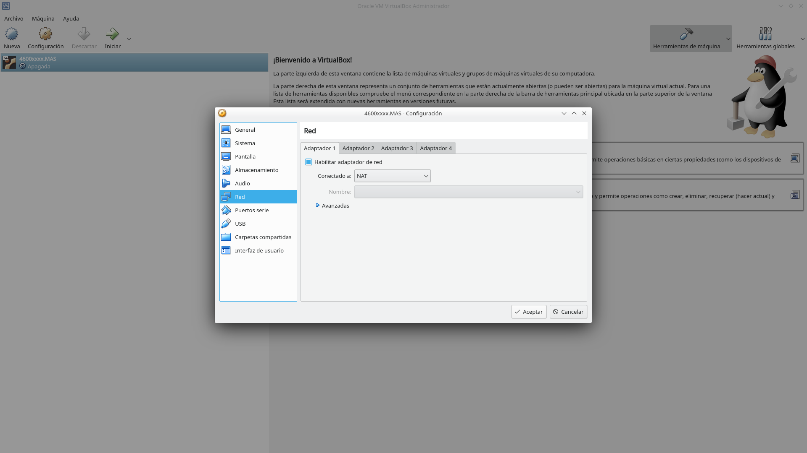
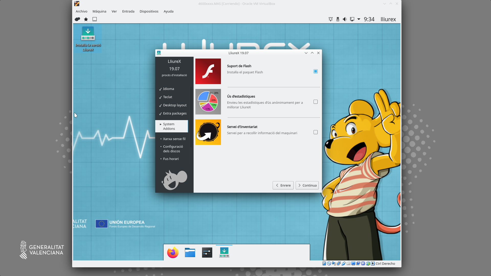
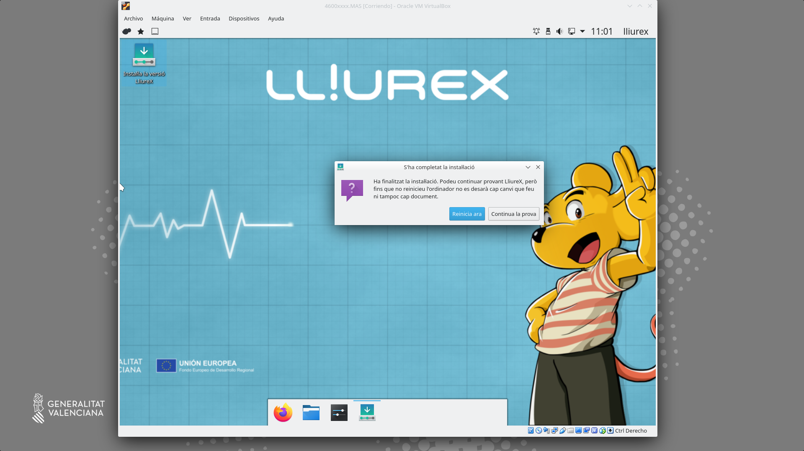

---
title: "CONFIGURACIÓ DE XARXA"
author: [Alfredo Rafael Vicente Boix i Javier Estellés Dasi]
date: "2020-11-25"
subject: "Proxmox"
keywords: [Xarxa, Instal·lació]
subtitle: "Exemple d'esquema de xarxa en el model de centre"
lang: "es"
page-background: "background10.pdf"
titlepage: true,
titlepage-rule-color: "360049"
titlepage-background: "background10.pdf"
colorlinks: true
header-includes:
- |
  ```{=latex}
  \usepackage{awesomebox}
  \usepackage{caption}
  \usepackage{array}
  \usepackage{tabularx}
  \usepackage{ragged2e}
  \usepackage{multirow}


  ```
pandoc-latex-environment:
  noteblock: [note]
  tipblock: [tip]
  warningblock: [warning]
  cautionblock: [caution]
  importantblock: [important]
...

<!-- \awesomebox[violet]{2pt}{\faRocket}{violet}{Lorem ipsum…} -->

# Introducció

En aquesta unitat veurem com muntar el model de centre virtualitzat. Això ens servirà per a entendre com funciona el model de centre de LliureX, què és un servidor mestre.

# Model de centre

El model de centre es un configuració que combina xarxa i servidors per a donar uns serveis a tots els ordinadors dins del centre. Entre altres coses el model de centre pot donar els següents serveis de xarxa:

- Pàgines web internet del centres
- Jitsi per a reunions a la intranet
- Moodle per a sessions internes
- Videoconferències
- LDAP per a autentificar-se els usuaris a qualsevol ordinador del centre
- Carpetes compartides a tot el centre
- Mirror compartit per tots els servidors
- Servidor d'imatges per a clients lleugers
- Nextcloud per a compartir fitxers a la intranet
- DHCP per a cada aula

A banda de totes aquestes característiques, LliureX presenta nombroses ferramentes que faciliten la instal·lació i configuració del programari.

Però el principal avantatge de tot és que LliureX permet configurar-ho tot sense tocar la terminal i sense tenir coneixements avançats d'informàtica. La posada a punt del model de centre és ràpida i senzilla.
Per entendre millor el model de centre parlarem de cada element per separat.

# Sabors de LliureX

LliureX es presenta en varios sabors i cadascú té les seues característiques diferenciades. Dins del model de centre tenim dos sabors principals:

| Sabor | Característiques |
| -- | -- |
| Servidor | Porta tot els paquets per a muntar el model de centre |
| Client | És la versió que hem d'instal·lar als ordinadors que es connectaran al Servidor |
| Escriptori | Pot funcionar de manera independent, no s'integra en el model de centre |

Els sabors música, infantil, fp, etc... són una versió d'escriptori amb paquets característics de cadascuna de les especialitats.

# Servidor

El servidor de LliureX pot treballar de 3 maneres.

| Servidor | Característiques |
| -- | -- |
| Independent | El servidor treballa de manera independent |
| Mestre | Dona serveis als esclaus |
| Esclau | Pot treballar de manera independent, es sincronitza amb el mestre |

El servidor té com a mínim 2 targetes de xarxa:

- La xarxa interna: a aquesta targeta es connectarà un switch on es connectaran els clients.
- La xarxa externa: es connectarà directament a la xarxa de Aules del router (antiga macrolan).

Per a que el servidor funcione dins del model de centre cal configurar-lo i inicialitzar-lo amb el **zero-server-wizard** que vorem més avant.


## Esquema de xarxa

Un esquema bastant habitual que ens trobem als centres és el següent:


En aquest esquema ens trobem 3 servidors, on el servidor mestre guarda la base de de dades per a autentificar-se tots els usuaris (LDAP), i pot donar servei a la xarxa de professorat.

Un esquema més adient seria aquest:


Hem de tenir en compte els següent elements. Cadascun dels servidor ha de tenir com a mínim 3 targetes de xarxa:

 | Targeta | Característiques |
 | -- | -- |
 | eth0 | Targeta interna que dona DHCP a l'aula |
 | eth1 | Targeta externa que es connecta a la xarxa d'Aules |
 | eth2 | Targeta de replicació de serveis comuns |

# Instal·lació del model de centre

Anem a realitzar el muntatge d'un model de centre pas a pas amb totes les seues funcionalitats, per a tenir clar els seus conceptes. En aquesta unitat utilitzarem el programari de Virtualbox per a muntar el model de centre.

:::warning
Heu de tenir en compte que ací no parlarem de tot el programari que ve amb LliureX, com el harvester, libreoffice, programes de disseny, etc... En aquest curs ens centrarem exclusivament en el muntatge i configuració del model de centre
::: 

## Instal·lació de Lliurex

:::note
Podeu trobar l'última ISO per a descarregar [ací](http://releases.lliurex.net/isos/19.07_64bits/lliurex-servidor_64bits_19_latest.iso).
:::

Podeu instal·lar virtualbox amb:

```
sudo apt install virtualbox-dkms virtualbox virtualbox-ext-pack virtualbox-guest-additions-iso
```

Una vegada teniu instal·lat el virtualbox, l'executeu i vos apareixerà la següent pantalla:


Clickem sobre **Nueva** i seguim el següent exemple:





Ara clickem sobre configuració i name a la secció d'emmagatzemament (almacenamiento), clickem sobre "Vacío" i seleccionem la iso de LliureX 19 descarregada (des de el requadre roig)


Després anem a la secció de xarxa i seleccionem 3 adaptadors:




Després anem a pantalla i seleccionem 128Mb de memòria de vídeo.


I li donem a Iniciar:


Després fem click sobre **Instal·la versió de LliureX**





Emplenem els següents paràmetres:

| Paràmetre | Opció |
| -- | -- |
| Nom | admin0 |
| Contrasenya | Una segura, no lliurex |
| Nom de l'ordinador | 4600xxxx.MAS |


I es procedix a la instal·lació:


Podem fer click en Reinicia o apagar l'ordinador amb el menú aturar:



Una vegada tenim l'ordinador apagat podem clonar la màquina:


Li donem el nom a la màquina: 46000xxxx.CEN:


I seleccionem clonació completa:


L'adaptador 2 el canviem a centre en lloc de mestre:


Per a simular la xarxa del centre en virtualbox anem a fer ús de l'administrador de xarxa de virtualbox. Anema a **Archivo > Administrador de red anfitrión** i omplim els paràmetres com els de la figura (podeu utilitzar la xarxa del vostre centre)


Emularem també el DHCP del router tot i que no em fem ús:


:::warning
El router de Telefónica que tenim als centres ens proporciona DHCP i la sortida a internet, si volem emular el centre com cal, podríem instal·lar dnsmasq al nostre ordinador (el host de virtualbox). Però com es tracta només de provar coses, deixem que el virtualbox done DHCP a través de la 172.254.254.100 (encara que no és necessari ja que anem a donar adreces estàtiques). I utilitzem l'adreça 172.254.254.1 per al nostre ordinador, per a poder connectar-nos remotament.
:::

Si voleu tenir accés a internet des dels servidors de virtualbox heu de fer el següent:

```
sysctl net.ipv4.ip_forward
// Si es 0 llavors cal aplicar la següent línia
sudo sysctl -w net.ipv4.ip_forward=1

sudo iptables -t nat -A POSTROUTING -o eth0 -j MASQUERADE

sudo iptables -A FORWARD -i vboxnet0 -j ACCEPT
```

# Inicialització del servidor

Per a poder tenir el model de centre és important inicialitzar el servidor, depenent de la configuració que volem tenir hem de fer-ho d'una manera o altra.

* Si només volem un servidor d'aula, el servidor s'inicia com a **independent**. 
* Si volem tenir un servidor **mestre** on es fa l'autentificació (LDAP), el mirror, les carpetes d'usuari i tots els serveis que vullguem donar cal configurar el mestre i els servidor que es connecten a ell, com **esclaus**.

Esta última és la configuració que més ens interessa. Per a poder iniciar el servidor farem ús del programa **zero-server-wizard**. Podem iniciar-lo bés des de la terminal amb:

```
zero-server-wizard
```
:::info
El zero-center és un apartat exclusiu de lliurex on es pot trobar tot aquell programari específic de la distribució o instal·ladors de programari que bé perquè requereixen configuracions especials o bé perquè són complicats d'instal·lar, faciliten la tasca enormement.
:::

On amem al **zero-center** i busquem el zero-server-wizard:


Iniciem el zero-server-wizard


En el nostre cas, anem a iniciar aquest servidor com a mestre. Hem de tenir especial cura en incloure **exporta el /net**, per  tenir només un mirror. La **IP interna** ens interessa tenir-la controlada per a saber quin és cada servidor. I la interfície de replicació que és per on es muntarà el /net entre els servidors.


## Inicialització del servidor esclau

Una vegada iniciem el servidor mestre, els esclaus el iniciem de la mateixa manera, però tenint en compte que la ip serà diferents i muntarem el mirror del servidor mestre.


<!-- En aquesta Unitat configurarem l'hipervisor amb Proxmox. Muntarem 3 servidors amb les següents característiques.

| Servidor | Característiques |
| -- | -- |
| MASTER | Tindrà el LDAP i guarda el /net |
| CENTRE | DHCP als ordinadors del centre |
| AULA1 | DHCP als ordinadors de l'aula d'informàtica |
| WIFI |No muntarem el servidor WIFI en aquesta unitat |

Donarem com a exemple dos esquemes clàssics de muntatge del centre. Ambós són totalment vàlids i funcionen perfectament.

:::info
La majoria de captures de pantalla están en anglès, ja que no tinc el costum de canviat el llenguatge original dels programes. Òbviament si algú vol configurar els paràmetres en la finestra de login al català o al español ho pot fer sense problemes.
:::

## Esquema 1

En aquest esquema que posem com a exemple dos switchs tenim 3 LAG configurats al switch principal per si volem muntar un cluster amb Proxmox fins a 3 ordinadors. Són 3 ordinadors ja que 3 ordinadors permeten ja fer un muntatge d'Alta disponibilitat, però és un tema que explicarem en cursos més avançats.
Aquest esquema és típic de centres molts grans que tenen varies sales d'informàtica i el switch principal pràcticament l'utilitzen per a redistribuir les VLANs i només que té muntats LAGs que van a cadascun dels switch del centre.

:::info
La Alta disponibilitat (HA) permet que quan un hipervisor s'espatlla els altres agafen les màquines virtuals del mateix i seguix donant servei sense que l'usuari ho note. Així permet canviar l'hipervisor o arreglar-lo i el servei no és interromput en cap moment. Per a fer això és necessari muntar un CEPH o una cabina externa amb molta fiabilitat.
:::

L'esquema seria de la següent manera:


## Esquema 2

Un dels principals avantatges del següent esquema és que no utilitza VLANs, cada targeta de de l'hipervisor va a un switch diferent. Aquest muntatge s'utilitza principalment en centre xicotets. Igualment permet el muntatge d'un cluster que podríem connectar al router del centre a les boques de la xarxa VLAN. L'equema seria de la següent manera:


## Esquema de màquines virtuals

A la fi els dos esquemes comparteixen el muntatge de les màquines virtuals ja que la configuració d'on es connecten les targetes virtuals ho fem des del proxmox. Hem respectat els noms de les targetes en ambdós casos (vmbrX), però es pot donar el nom que vullgues.


# Configuració del proxmox

Una vegada tenim instal·lat el proxmox i haja reiniciat, podrem accedir a ell. Tota la configuració del proxmox es realitza a través d'un servidor web que porta muntat. Per a accedir hem de fer-ho a través del port 8006 amb certificació ssl. Senzillament escrivim a una navegador d'una estació de treball que estiga a la mateixa xarxa el següent:

```tcsh
https://"IP_HIPERVISOR:8006
```

::: info
Este és un dels motius pels quals deixem ports en cada switch amb la VLAN 1, per a poder accedir a través d'eixos ports sempre al proxmox. També es pot fer des de qualsevol ordinador del centre o l'aula d'informàtica, però cal habilitar el NAT en cada servidor LliureX. I estos han d'estar funcionant. Per tant en aquest pas és necessari estar connectat a la xarxa del centre.
:::

## Màquines virtuals

El primer que ens demana és l'usuari i contrasenya que hem configurat quan hem fet la instal·lació:


I una vegada dins podem veure l'espai de treball del proxmox:


:::info
Els següents passos són opcionals, però aconsellables. És per a accedir a les últimes actualitzacions de proxmox.
:::

Una vegada hem accedit podem configurar la llista dels repositoris de proxmox accedint, en primer lloc al shell del hipervisor i escrivim el següent:

```tcsh
nano /etc/apt/sources.list.d/pve-enterprise.list
```
Tin en compte que has accedit com a root, així que has d'anar molt amb compte amb el que fas. Una vegada obris el fitxer canvies el repositori pel següent:

```tcsh
deb http://download.proxmox.com/debian/pve buster pve-no-subscription
```

Es quedaría així:


Ara ja pots actualitzar des de la terminal el proxmox per a tenir l'última versió:

```tcsh
apt update
apt upgrade
```

## Crear màquina virtual

Abans de crear una màquina virtual hem de pujar un iso de LliureX Server, podem descarregar-la [d'ací](http://releases.lliurex.net/isos/19.07_64bits/). Tractem de buscar l'última versió editada.

Una vegada la tenim descarrega hem de pujar-la al proxmox seleccionant l'espai **local** i fent click en upload:


Una vegada tenim fet això, ja podem crear la primera maquina virtual. Anem de fer d'exemple el servidor MASTER i els altres es fan de manera similar. Fem click sobre **Create VM**


S'obrirà una finestra per a especificar els paràmetres de configuració. En la primera finestra no cal canviar res, anem a **Next**:


En aquest punt hem de seleccionar la iso que acabem de pujar:


Posteriorment donem a next:


Escollim el disc dur a utilitzar, i opcionalment canviem la cache a write back. 

:::info
Write-back pot donar un poc més de rendiment al disc però és més propens a perdre dades si hi ha un tall. Queda a criteri de cadascú escollir.
:::


Canviem els paràmetres de la CPU, 4 cores en total és suficient, en principi per a les tasques a realitzar.


Donem 6Gb de memòria RAM. Aquest paràmetre anirà sempre en funció de la quantitat de màquines que anem a tindre.

:::caution
La suma de la memòria RAM de totes les màquines pot ser sense problemes major que la quantitat de memòria RAM disponible. Això sí, si totes les màquines comencen a demanar molta memòria, el sistema es pot tornar molt lent.
:::


Finalment, no canviem res als paràmetre de xarxa i una vegada instal·lada la màquina ja afegirem les targetes virtuals. Podem activar el checkbox de **Start after created** per a poder iniciar la màquina una vegada li donem a **Finish**.


## Instal·lació de la màquina virtual

Una vegada configurada la màquina virtual i haja arrancat podem veure com ens apareix una icona en la franja esquerra i es posa de color, podem desplegar el menú contextual i polsem sobre Console:


Podem veure com ha arrancat la màquina:


I procedim a la seua instal·lació tal i com hem vist a la Unitat 1.

De manera similar, si volem seguir tot el procés caldria instal·lar els altres dos servidors amb le mateix procediment. L'única cosa que cal canviar entre ells seria el nom de cadascún d'ells, nosaltres hem escollit la següent nomenclatura:

| Nom | Servidor |
| -- | -- |
| 4600xxxx.MAS | Servidor Master |
| 4600xxxx.CEN | Servidor de centre |
| 4600xxxx.AU1 | Servidor Aula informàtica |

I per a l'administrador de cadascun dels servidor hem escollit **admin0**. 

# Configuració de la xarxa

Una vegada tenim instal·lats tots els servidors procedim a configurar la xarxa. Per a accedir a la configuració de l'hipervisor hem de seleccionar el mateix (No la màquina virtual ni el Datacenter), i anem a les opcions **Network**.

## Esquema 1

Recordem que aquest esquema té un bond al switch. Polsem sobre **Create** i seleccionem l'opció **Linux Bond**.


S'ens obrirà la finestra següent i hem d'escriure totes les targetes on posa **Slaves**, seguides d'un espai. La configuració quedaria de las següent manera:

| Paràmetre | Opció |
| -- | -- |
| Slaves | enp1s0 enp2s0 enp3s0 enp4s0 |
| Mode | LACP |
| hash-policy | layer2+3 |

I polsem sobre **Create**.


na vegada tenim configurat el bond anem altra vegada a **Create** i seleccionem **Linux Bridge**. A l'opció **Bridge ports** hem d'escriure el bond0 seguit d'un punt i el número de VLAN que volen configurar a la connexió pont.


De manera anàloga realitzem totes les altres configuracions i ens quedaria de la següent manera:


## Esquema 2

Aquest esquema que no presenta cap VLAN es faria de manera anàloga a l'anterior, però sense configurar el bond. Agafaríem cada targeta virtual **Linux bridge** i l'enllacem a la targeta de sortida. L'esquema quedaria de la següent manera:


:::caution
Un dels problemes que presenta aquesta configuració és saber quina targeta es quina, podem anar provant i veure quina està activa amb la ferramenta **ip** per a saber quina és quina. Podem anar desconectant els cables veure que apareix **state DOWN** i associar la connexió.
:::

```tcsh
root@cefirevalencia:~# ip link show enp4s0
5: enp4s0: <NO-CARRIER,BROADCAST,MULTICAST,SLAVE,UP> mtu 1500 qdisc pfifo_fast master bond0 state DOWN mode DEFAULT group default qlen 1000
``` 

# Configuració de la xarxa en cada màquina virtual

Hem de recordar que cada servidor LliureX ha de tenir 3 targetes:

| Targeta | Característiques |
| -- | -- |
| Targeta externa | És la que es connectarà a la xarxa d'Aules |
| Targeta interna | La que dona servei als ordinadors de l'Aula o les classes |
| Targeta de replicació | Per a muntar el /net entre els servidors |

En el nostre cas recordem que les tenim configurades de la següent manera:

| Targeta | nom |
| -- | -- |
| Targeta externa | vmbr0 |
| Targeta interna | vmbr2, vmbr3, vmbr4, vmbr5 |
| Targeta de replicació | vmbr10 |

Per a configurar cada màquina virtual seleccionem la màquina i anem a les opcions de **Hardware**, fem click sobre **Add** i escollim **Network device**.


Com quan hem instal·lat la màquina virtual ja ens ha agafat la vmbr0, eixa la deixem com la externa. I configurem ja la interna.


Aquest procediment l'hem de repetir en tots els servidors. Recorda que l'esquema de xarxa és el següent:

| IP | Servidor |
| -- | -- |
| 172.X.Y.254 | Servidor Maestro |
| 172.X.Y.253 | Servidor de Centro |
| 172.X.Y.252 | Servidor de Aula 1 |
| 172.X.Y.251 | Servidor de Aula 2 |
| 172.X.Y.250 | Servidor de Aula 3 |

## Targetes virtuals

:::warning
És important que ens assegurem abans d'inicialitzar el servidor quina targeta és quina, per a que no ens confonen. El servidor podria començar a donar DHCP a través de targeta connectada a la VLAN1 o router (depenent de l'esquema) i podria deixar sense servei a tot el centre.
:::

Podem comprovar quina és cada targeta amb el comandament ip fet al servidor i comparar les MAC.


## Inicialització servidors

Quan iniciem el servidor, en aquest cas el màster, escollim les següents opcions:


:::warning
És molt important que habilites l'opció d'exportar el /net al servidor mestre.
:::

Un procediment extra que no ens ha d'oblidar en cap servidor és actualitzar-los sempre abans de fer res. I en el màster hem de configurar el lliurex mirror:


De manera similar inicialitzem els altres servidors:


:::warning
És molt important que habilites l'opció munta el /net des del mestre.
:::

# Configuracions addicionals

## Arrancar les màquines virtuals quan inicia el servidor

És important que quan es reinicie l'hipervisor les màquines virtuals arranquen automàticament per a no tindre que connectar-se al proxmox per engegar-les una a una. Per a configurar aquesta opció seleccionarem una màquina virtual i seleccionarem l'opció de configuració **Options** i canviarem els paràmetres **Start at boot** a **Yes** i **Start/Shutdown order** a 1 en el cas del servidor mestre.

:::caution
És recomanable arrancar primer el mestre i deixar un temps per a que arranque i posteriorment arrancar els esclaus. Així, als servidors esclaus afegirem un temps a **Startup delay**.
:::


Al servidor de centre i esclau les opcions quedarien de la següent manera:


## Muntatge de cabina externa (Opcional)

És possible que ens interesse l'opció d'una cabina externa. Té nombrosos avantatges, a l'espai de la cabina externa podem tindre emmagatzemat isos, discs durs de màquines virtuals, còpies de seguretat...

:::warning
Si decidiu muntar el /net a una cabina externa. Aneu amb compte amb les ACL!!!. Ja que solen donar problemes. L'opció en aquest cas més segura per a que funcione és tenir el /net en un disc dur virtual.
A més, si aneu a tenir espai emmagatzemat a una cabina, la cabina ha de tenir unes característiques adeqüades. Jo recomanaria com a mínim:
* Possibilitat de crear un bond amb 4 targetes de xarxa, o targeta de 10G (caldria un switch que ho suporte)
* Al menys 4 discs durs per muntar un RAID10
* Cache de disc SSD
D'aquesta manera es podria muntar un sistema amb Alta disponibilitat.
:::

:::info
En aquest curs no explicarem com configurar una cabina per a que funcione al model de xarxa. Les cabines no entren dins de la dotació de centre, per tant seria una adquisició pròpia del centre
:::

Una vegada tenim la cabina configurada podem afegir-la al nostre **Datacenter** seleccionant-lo i anant a l'opció de **Storage**. Fem click sobre **Add** i escollim **NFS**.


I seleccionem les diferents opcions de configuració:


## Creació de backup (Opcional)

En principi no seria necessari crear un backup de les màquines virtuals ja que hem muntat un RAID1. Però hi han varies configuracions que podem recomanar l'opció del backup. Per a configurar la còpia de seguretat seleccionem el datacenter, anem a l'opció de Backup i fem click sobre **Add**.


Ens apareixerà la següent finestra, hem de tenir en compte en quin lloc volem fer el backup (**Storage**). I seleccionem la/les màquines virtuals que volem fer còpia de seguretat, en un principi, en el nostre cas només caldria fer la còpia de seguretat del Màster, ja que és on es guarda el /net i LDAP. La còpia de seguretat queda programada per a una data determinada, en principi, en un centre, un dissabte a les 12 de la nit no hi ha cap usuari connectat.


També és pot fer una còpia de seguretat en qualsevol moment. Les còpies de seguretat porten temps, per tant no és recomanable fer-ho en hores on s'estiguen utilitzant els servidors.


Una vegada tenim la còpia de seguretat feta podem restaurar-la amb **Restore**.

:::caution
Quan es restaura la còpia de seguretat es crearà una nova màquina virtual amb les mateixes característiques que la màquina antiga i ens preguntarà en quin espai volem instal·lar la nova màquina. Hem d'anar amb compte de no tenir les dues màquines funcionant al mateix temps (després de restaurar-la) ja que crearà problemes de xarxa. També hem de recordar deshabilitar l'opció de **Start at boot**, sinó al reiniciar l'hipervisor arrancaran les dues màquines.


 -->


# Bibliografia i referències

(@) https://es.wikipedia.org/wiki/VLAN


